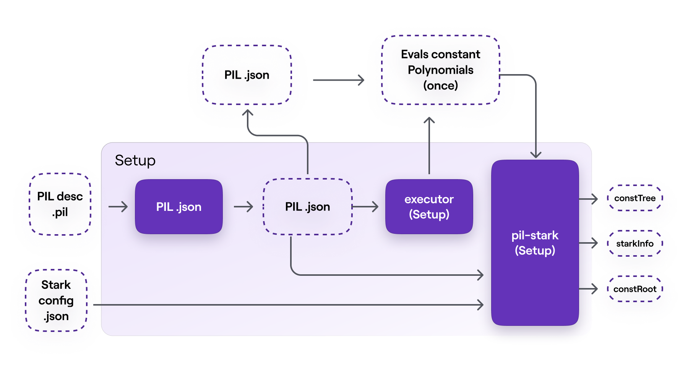
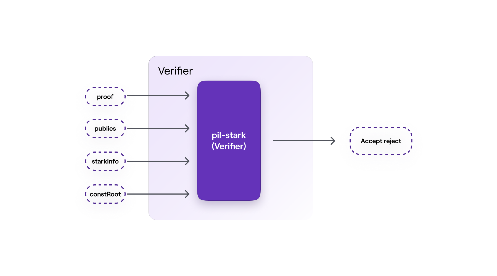

The computations involved in Ethereum such as, making payments, transferring ERC20 tokens and running smart contracts, are repeatedly carried out and are all deterministic. That is, a particular input always produces the same output. Unlike the **arithmetic circuit** model which would need loops to be unrolled and hence resulting in undesirably larger circuits, the state machine model is most suitable for iterative and **deterministic computations**.

Consider a scenario where a party called the prover, needs to prove knowledge of the initial values of the Fibonacci series used to produce a given N-th value of the series, in a verifiable manner.

These computations serve as an ideal analogy for the zkProver's role, which is to generate verifiable proofs confirming the validity of transactions submitted to the Ethereum blockchain.

The approach involves developing a state machine that enables a prover to generate and submit a verifiable proof of knowledge, which anyone can then use to verify its validity.

The process that leads to achieving such a state machine-based system takes a few steps:

-   Modeling deterministic computation as a state machine.
-   Specifying the equations that fully describe the state transitions of the state machine, known as arithmetic constraints.
-   Using established and efficient Mathematical methods to define the corresponding polynomials.
-   Expressing the previously stated arithmetic constraints into their equivalent polynomial identities.

These **polynomial identities** are equations that can be easily tested in order to verify the prover's claims. A so-called *commitment scheme* is required for facilitating the proving and the verification. Hence, in the zkProver context, a proof-verification scheme called **PIL-STARK** is used.

## PIL-STARK process

Simply put, PIL-STARK is a special STARK that enables:

-   The state machine prover (SM-prover) to generate STARK proofs for any state machine written in PIL.
-   The state machine verifier (SM-verifier) to verify STARK proofs generated by the prover.

Hence there is a PIL-STARK component in the SM-prover which is the generator of a STARK proof, and another PIL-STARK component in the SM-verifier which is the actual verifier of the STARK proof.

Since the SM-prover and the SM-verifier, who are separate and independent entities, require certain PIL-STARK parameters prior to proving and verification, the system needs some preprocessing phase. Call this phase, the setup phase.

The PIL-STARK proof-verification process therefore consists of three (3) phases, the setup, the proving, and the verification. These are outlined below

## PIL-STARK proving phase

The proving phase consists of two main components: - the  SM-prover  executor. - the PIL-STARK proof  Generator.

### SM-prover’s executor

The executor in the SM-prover’s takes as inputs; the PIL  .json  file from  PILCOM  and another  .json  file of inputs, called  input.json  . In the case of our mFibonacci SM, the inputs in  input.json  includes the initial values of the registries  A  and  B.

The SM-prover’s executor builds the values of polynomials that are to be committed. Its output is the evaluations of the committed polynomials, per proof. These evaluations of committed polynomials are actually the SM’s execution trace.

Note that the input values in the  input.json  file can be varied without altering the actual state machine. The reason the state machine remains intact is due to fact that the  .pil  file, that was initially compiled in the setup phase, is not affected by any change in the input values of the SM-prover’s executor.

PIL-STARK is, all-in-all, a specific implementation of a STARK that can be used as a generic tool for proving state machines' polynomial identities.

The actual implementation of PIL-STARK uses recursion. That is, hundreds of STARK proofs are proved with another STARK proof, and these STARK proofs of other STARK proofs are also proved with a single STARK proof. This achieves exponential scalability than it would otherwise be possible.

The code for implementing PIL-STARK is found in the zkEVM repository [here](https://github.com/0xPolygonHermez/pil-stark)