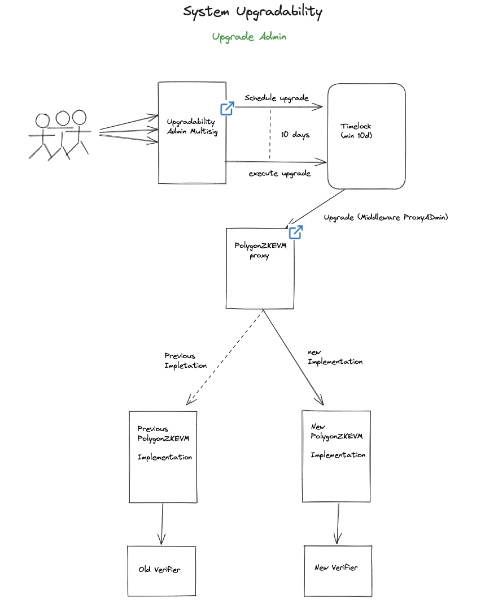

Admin role and governance
=========================

Polygon zkEVM's *Admin* consists of three (3) developers of the Polygon team, who oversee any upgrades of the zk-rollup software.

Whenever there are bug fixes or updates to be made, the Admin uses a special *Admin Multisig Contract* to approve the changes.

Approval by any two of the three Admin members (*2-out-of-3*) is required.

However, there's a minimum 10-day waiting period before the changes get executed.

The 10-day delay allows users to carefully assess the proposed changes and decide whether to exit or not.

Another smart contract called *Timelock Contract* is responsible for enabling the 10-day delay.

An outline of the *upgrade process* is outlined [here](https://docs.polygon.technology/zkEVM/architecture/protocol/upgrade-process/).

Admin contract in detail
----------------------------------------------------------------------------------------------------------------------------------------------------

The Admin owns the Ethereum account that controls the Consensus contract, and it is the only account that can call the following functions;

-   `setTrustedSequencer`
-   `setForceBatchAllowed`
-   `setTrustedSequencerURL`
-   `setTrustedAggregator`
-   `setTrustedAggregatorTimeout`
-   `setPendingStateTimeout`
-   `setMultiplierBatchFee`
-   `setVeryBatchTimeTarget`
-   `setAdmin`
-   `deactivateEmergencyState`

All **ProxyAdmin.sol** instances that can upgrade the contract implementations of the zkEVM Protocol belong to the Admin account.

Moreover, all proxies are owned by the Admin account, making it the only account (other than the Security Council Multisig) authorized to make modifications to the contracts used to implement the zkEVM Protocol.

