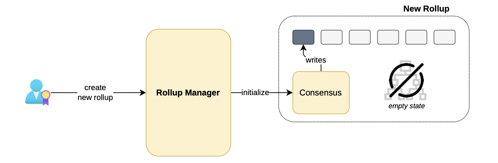

## The rollup manager

In order to achieve the afore-mentioned goal, a new smart contract called  RollupManager  has been written for the purposes of managing creation of rollups and verification of their batches.

Creation of a rollup could mean one of two things:

-   Creating and initializing a brand new rollup.
-   Incorporating an already existing rollup under the management of the  RollupManager.

## Creating new rollups

The first scenario involves newly created rollups, which have not yet been initialized, and therefore have an empty state.

When a user triggers the rollup manager’s function to create a new rollup, the  RollupManager  should

-   Populate the configuration parameters,
-   Initialize the rollup by generating and writing the genesis block,
-   Sequence transactions for initializing the bridge contract attached to the rollup.

The figure below depicts the process of creating and initializing a new rollup instance.

Observe that the state tree is empty in this situation.

