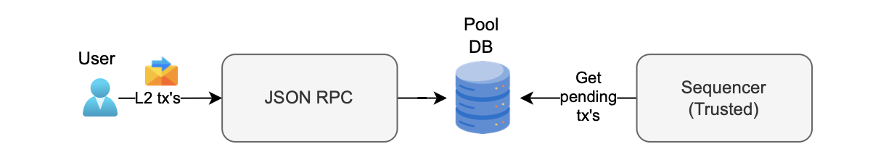
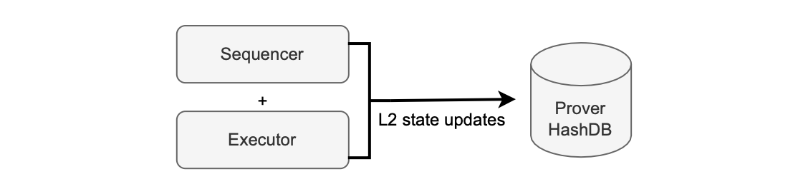

Sequencing batches
==================

The central entity responsible for assembling batches for sequencing is the trusted sequencer, which is built and managed by Polygon.

This sequencer may omit Layer 2 transactions therefore we have implemented [anti-censorship mechanism](https://docs.polygon.technology/zkEVM/architecture/protocol/malfunction-resistance/sequencer-resistance/).

The diagram below shows the sequencing workflow.

1.  L2 transactions via JSON RPC.
2.  Transactions stored in the pool DB.
3.  Trusted sequencer selects transactions from pool DB.
4.  Trusted sequencer batches and sequences transactions.

Batch pre-execution[¶](https://docs.polygon.technology/zkEVM/architecture/protocol/sequencing-batches/#batch-pre-execution "Link to this section")
--------------------------------------------------------------------------------------------------------------------------------------------------

The initial step in creating a batch involves verifying whether the chosen transactions align with execution parameters and do not surpass the gas limit. This step is known as *batch pre-execution*.

It is carried out by the sequencer through an executor, as depicted in the figure below.

While no proof is generated during the pre-execution stage, batch pre-execution ensures that the prover's subsequent proof generation is successful, and expedites batch sequencing overall.

A fast executor is used for batch pre-execution. This is a *single-computation* executor, capable of executing within blocktime.

The sequencer communicates with the executor for swift batch pre-execution.

Once the executor successfully completes batch pre-execution, the sequencer records the batch in the node's StateDB as a *closed batch*.

A closed batch means one of the following conditions has been fulfilled:

-   The execution trace reaches the maximum number of rows.
-   The gas used attains maximum gas limit.
-   The allocated time expires.

During batch pre-execution, and for batch closure, the sequencer and the executor update the Merkle tree of the zkEVM with L2 state changes and store them in the prover's hash DB. This is illustrated in the figure below:

The zkEVM's throughput depends on the speed at which we are able to close batches, which is directly impacted by the batch pre-execution process.

Performance problems can occur here because of excessive and inefficient interaction with the hash DB.

Optimizing this process may mean reducing the time spent on frequent updates during transaction processing by accumulating all state changes caused by a transaction and only updating the database at the end of a transaction's pre-execution.