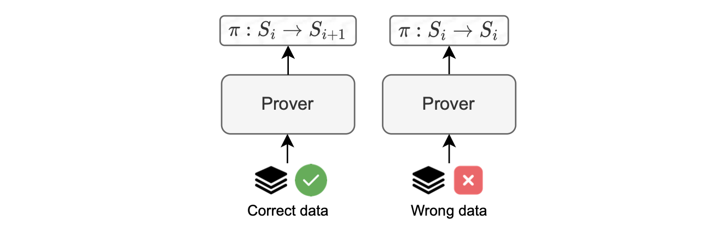
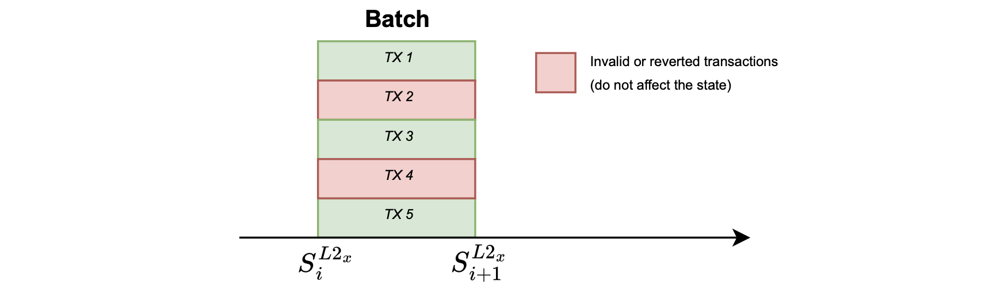

Prove anything paradigm
---------------------------------------------------------------------------------------------------------------------------------------------------------------

To address the potential threat of malicious sequencers, we adopt the "prove anything" paradigm.

With this approach, the prover possesses the capability to generate a proof of execution for any input data.

But this is on the condition that each batch must maintain a bounded amount of data.

The smart contract ensures compliance with this requirement throughout the sequencing process.

Batch execution is carried out for any input data, resulting in the generation of a proof that confirms a state change for valid input data, or no state change for invalid input data, as depicted in the figure below.

This strategy guarantees robust validation of execution outcomes, and provides a reliable mechanism to handle potential, malicious behavior.

### Invalid transactions

Let us describe some errors in transactions that cause the state to remain unchanged, as shown in the figure below.

#### Reverted transaction

A transaction may revert during execution due to many reasons, such as:

-   Running out of gas.

-   Having a stack that is too large.

-   Encountering a revert call in the code.

This is a common scenario in EVM processing.

#### Invalid intrinsic transaction

An invalid intrinsic transaction is a transaction that cannot be processed, and thus has no impact on the current state.

Keep in mind that this transaction could be part of a virtual batch. Examples of errors in this scenario are: incorrect nonce, insufficient balance, etc.

The zkEVM's trusted sequencer is unlikely to input an incorrect nonce. However, any member of the community can submit a batch, which may result in an error.

