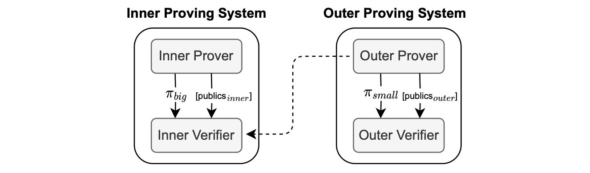
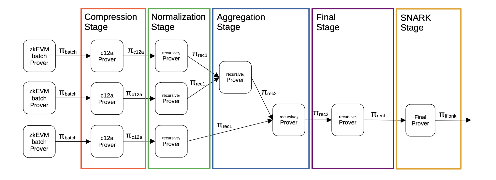
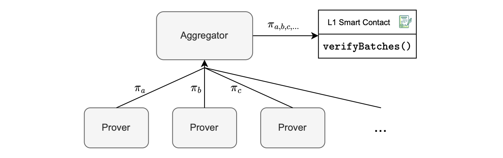
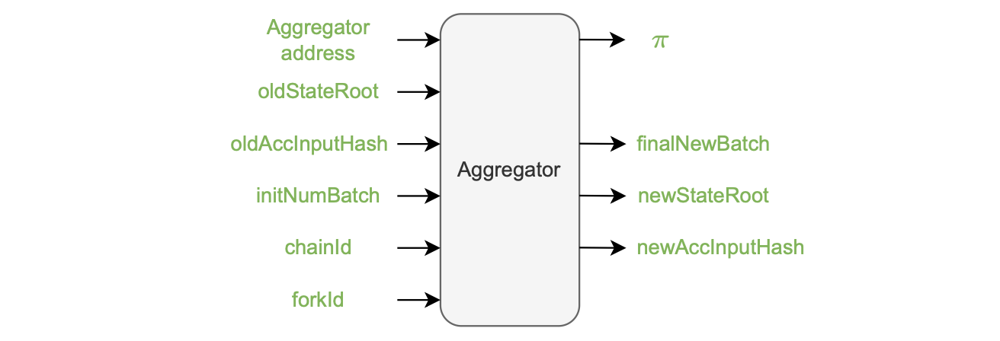
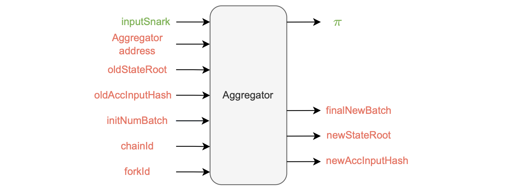

Prove anything paradigm
---------------------------------------------------------------------------------------------------------------------------------------------------------------

To address the potential threat of malicious sequencers, we adopt the "prove anything" paradigm.

With this approach, the prover possesses the capability to generate a proof of execution for any input data.

But this is on the condition that each batch must maintain a bounded amount of data.

The smart contract ensures compliance with this requirement throughout the sequencing process.

Batch execution is carried out for any input data, resulting in the generation of a proof that confirms a state change for valid input data, or no state change for invalid input data, as depicted in the figure below.

This strategy guarantees robust validation of execution outcomes, and provides a reliable mechanism to handle potential, malicious behavior.

### Invalid transactions

Let us describe some errors in transactions that cause the state to remain unchanged, as shown in the figure below.

#### Reverted transaction

A transaction may revert during execution due to many reasons, such as:

-   Running out of gas.

-   Having a stack that is too large.

-   Encountering a revert call in the code.

This is a common scenario in EVM processing.

#### Invalid intrinsic transaction

An invalid intrinsic transaction is a transaction that cannot be processed, and thus has no impact on the current state.

Keep in mind that this transaction could be part of a virtual batch. Examples of errors in this scenario are: incorrect nonce, insufficient balance, etc.

The zkEVM's trusted sequencer is unlikely to input an incorrect nonce. However, any member of the community can submit a batch, which may result in an error.

The *prove anything* approach allows the system to implement an anti-censorship measure called *forced batches*.

That is, in the case where the trusted sequencer does not process a user's transactions, the user can take the role of a sequencer by taking their L2 transactions into the virtual state.

The main use case is to allow a user to send bridge transactions to withdraw assets from L2 without the risk of censorship, which would otherwise make fund withdrawals impossible.

Since every user who sends L2 batch data is, by default, 'untrusted,' the system must ensure that anything sent by any user can be verified.

The *forced batches* mechanism is elaborated on in the [Malfunction resistance subsection](https://docs.polygon.technology/zkEVM/architecture/protocol/malfunction-resistance/sequencer-resistance/).

### VADCOPs

Although the current version of the proving system has this limitation in the backend (forcing execution traces of all state machines to have the same amount of rows), it is expected to be resolved with the implementation of a proving technique called *variable degree composite proofs* (VADCOPs).

VADCOPs are designed to partition large execution traces with many rows into smaller execution traces with fewer rows.

The main advantage with VADCOPs is the elimination of zkCounters.

See the figure below for a simplified illustration of the basic idea of what VADCOPs can achieve.

In this scenario, it becomes feasible to execute five Keccak operations despite the limit of executing only four operations at a time.

At a high level, the solution involves splitting the proof into two parts, each containing fewer rows, and then aggregating them to demonstrate the execution of five Keccak operations

Consequently, since the succinctness property of SNARKs dictates that verification time should be relatively smaller than the proving time, the final SNARK proofs are much smaller and faster to verify than the proofs in the initial stages.

### Proof aggregation

In the zkEVM context, aggregation is a technique that allows the prover to generate a single proof that covers multiple L2 batches.

This reduces the number of proofs to be verified, and thus increases the system throughput.

Proof aggregation means sending a single L1 transaction that aggregates multiple batches, and this improves the batch consolidation rate.

Note that the proving system limits aggregation to consecutive batches only.

Also, we can aggregate single-batch proofs with multiple-batch proofs, as shown in the figure below.

This is achievable because of a technique, used in the cryptographic backend, called *normalization*.

The first proving system generates such a big proof since it has a lot of high degree polynomials.

Thereafter, the *Compression Stage* is invoked and applied on in each batch proof, aiming to reduce the number of polynomials used, and hence allowing reduction in the proof size.

Next, the *Normalization Stage* is invoked, allowing each aggregator verifier and the normalization verifier to be exactly the same, permitting successful aggregation via a recursion.

Once the normalization step has been finished, the proofs go through aggregation.

The procedure is to construct a binary tree of proofs by aggregating every pair of proofs into one. We call this step, the *Aggregation Stage*.

In this step, two batch proofs are put together into one, and this repeated for as long as there's more than one proof to aggregate.

Observe that the *Aggregation Stage* is designed to accept:

-   Two compressed proofs.

-   Two aggregated proofs.

-   One compressed proof and an aggregated proof.

## Introducing the aggregator

In the Polygon zkEVM architecture, the aggregator is the component responsible for performing proof aggregation.

Its role is to aggregate several proofs into one, and send the aggregated proof to the L1 Smart Contract through the  verifyBatches()  function.

The aggregator invokes the  verifyBatches()  function on the smart contract, passing the following parameters:

-   The initial batch number,  initNumBatch.
-   The final batch number,  finalNewBatch.
-   The root,  newStateRoot.
-   The aggregated proof,  πa,b,c,....

See the figure below, depicting a single, aggregated proof,  πa,b,c,..., as an input to the verifier smart contract.

The previous root is stored in the smart contract, eliminating the need to transmit it.

Recall that the smart contract contains a summary of the batch information in the  _accumulated input hash_.

### Proof inputs and outputs

The proof generation process requires several inputs to ensure its soundness:

-   The aggregator address, serves as a safeguard against malleability in the  verifyBatches()  function, ensuring that no one can use another aggregator’s proof.
-   The previous state root (oldStateRoot), which is already included in the smart contract and does not require explicit sending.
-   The previous accumulated input hash (oldAccInputHash).
-   The initial batch number (initNumBatch).
-   The chainID and the forkID ensure that the proof is valid only within the intended chain and version of the zkEVM.

The figure below, depicts the aggregator inputs and outputs.

The aggregator generates the following outputs:

-   The updated state root,  newStateRoot.
    
-   The new accumulated input hash,  newAccInputHash.
    
-   The aggregated proof,  π.
    
-   The batch number of the last batch included in the aggregated proof once it has been successfully generated (finalNewBatch).
    

Currently, all the inputs and outputs are public. And this presents an efficiency problem, which we discuss below.

The smart contract structure shown in the figure below, enables upgradeability or alteration of the verifier, as necessary.

Currently we only provide a verifier called  `FflonkVerifier.sol`.

In this approach, the verifier must utilize a list of publics. But, a verifier with a single input is more cost-effective.

In Groth16, for instance, there is one  _scalar multiplication_  operation per public input, which costs approximately  10,000  gas units per public.

The key strategy is therefore to:

-   Create a single public input, which is the hash of all the previous public keys.
    
-   Transform all other public inputs into private inputs.
    

The figure below depicts this configuration, where public inputs are in green while private inputs are in red.

Hence, for the outer proof, there is a single public input in the aggregator called  inputSnark, which is a Keccak hash of all the previous public inputs and outputs.

Therefore, when  `ZkEVM.sol`  contract interacts with the  `VerifierRollups.sol`  contract, only a single public parameter is passed, minimizing data transmission costs.

This optimized approach requires two verifications:

-   Checking that the hash of all private inputs, arranged in the correct order, corresponds to the given  inputSnark.
    
-   Verifying that the total input hash, calculated for all processed batches by the aggregator, matches the specified  newAccInputHash.