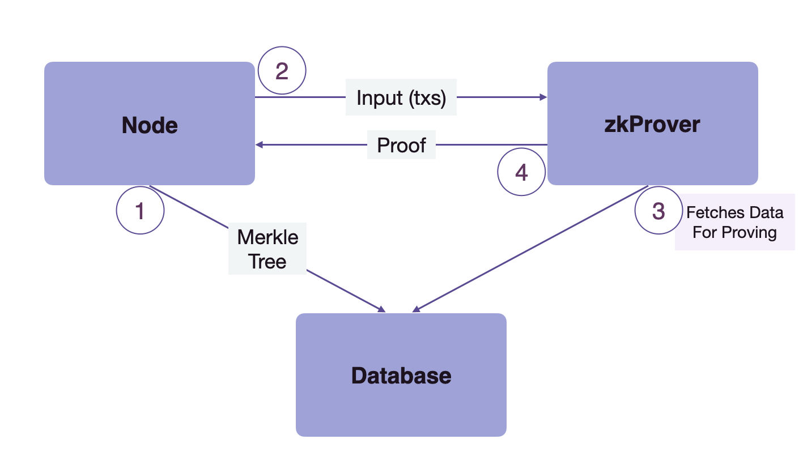

zkProver is a component of the Polygon zkEVM which is solely responsible for Proving.

The design paradigm at Polygon has shifted to developing a zero-knowledge virtual machine that emulates the Ethereum Virtual Machine (EVM).

Proving and verification of transactions in Polygon zkEVM are all handled by a zero-knowledge prover component called the zkProver. All the rules for a transaction to be valid are implemented and enforced in the zkProver.

The zkProver performs complex mathematical computations in the form of polynomials and assembly language which are later verified on a smart contract. Those rules could be seen as constraints that a transaction must follow in order to be able to modify the state tree or the exit tree.

Interaction with node and database
-------------------------------------------------------------------------------------------------------------------------------------------------------------

The zkProver mainly interacts with two components, i.e. the Node and the database (DB). Hence, before diving deeper into other components, we must understand the flow of control between zkProver, the Node, and database. Here is a diagram to explain the process clearly

1.  The node sends the content of Merkle trees to the database to be stored there.

2.  The node then sends the input transactions to the zkProver.

3.  The zkProver accesses the database and fetches the info needed to produce verifiable proofs of the transactions sent by the Node. This information consists of the Merkle roots, the keys and hashes of relevant siblings, and more.

4.  The zkProver then generates the proofs of transactions, and sends these proofs back to the Node.