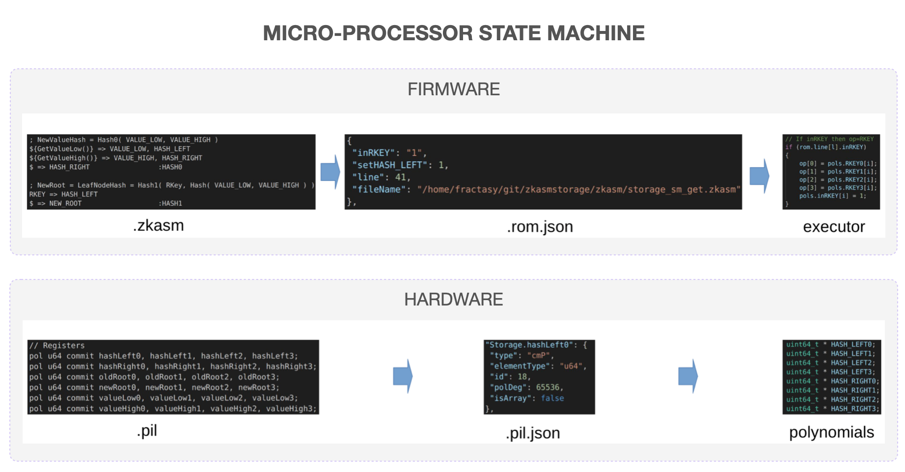
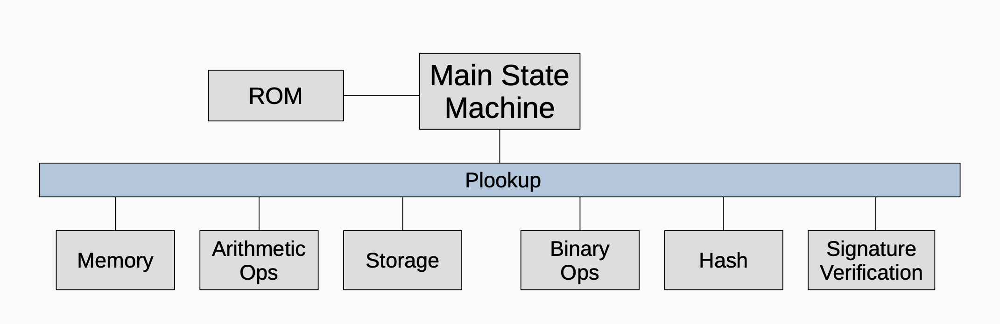
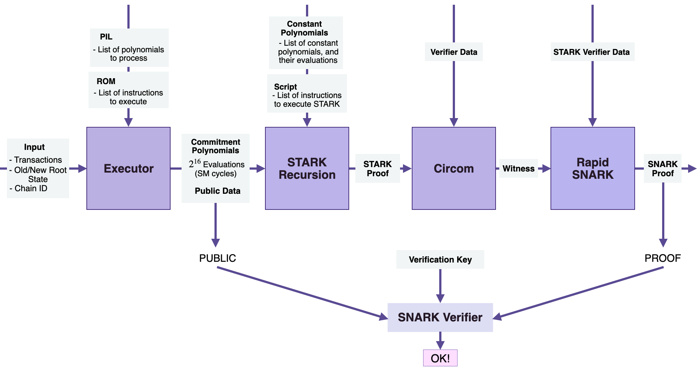

zkProver is a component of the Polygon zkEVM which is solely responsible for Proving.

The design paradigm at Polygon has shifted to developing a zero-knowledge virtual machine that emulates the Ethereum Virtual Machine (EVM).

Proving and verification of transactions in Polygon zkEVM are all handled by a zero-knowledge prover component called the zkProver. All the rules for a transaction to be valid are implemented and enforced in the zkProver.

The zkProver performs complex mathematical computations in the form of polynomials and assembly language which are later verified on a smart contract. Those rules could be seen as constraints that a transaction must follow in order to be able to modify the state tree or the exit tree.

Interaction with node and database
-------------------------------------------------------------------------------------------------------------------------------------------------------------

The zkProver mainly interacts with two components, i.e. the Node and the database (DB). Hence, before diving deeper into other components, we must understand the flow of control between zkProver, the Node, and database. Here is a diagram to explain the process clearly

1.  The node sends the content of Merkle trees to the database to be stored there.

2.  The node then sends the input transactions to the zkProver.

3.  The zkProver accesses the database and fetches the info needed to produce verifiable proofs of the transactions sent by the Node. This information consists of the Merkle roots, the keys and hashes of relevant siblings, and more.

4.  The zkProver then generates the proofs of transactions, and sends these proofs back to the Node.

State machines
---------------------------------------------------------------------------------------------------------------------

The zkProver follows modularity of design to the extent that, except for a few components, it is mainly a cluster of state machines. It has a total of thirteen (13) state machines;

1.  The Main state machine.

2.  Secondary state machines; Binary SM, Storage SM, Memory SM, Arithmetic SM, Keccak Function SM, PoseidonG SM.

3.  Auxiliary state machines; Padding-PG SM, Padding-KK SM, Bits2Field SM, Memory Align SM, Byte4 SM, ROM SM.

Due to the modular design of zkProver, the Main state machine can delegate as many of tasks as possible to other specialist state machines. This heavily improves the efficiency of Main SM

Two novel languages for zkProver
---------------------------------------------------------------------------------------------------------------------------------------------------------

The zkProver is the most complex module of zkEVM. It required development of two new programming languages to implement the needed elements;
 - The Zero-Knowledge Assembly language 
 - the Polynomial Identity Language.

It is not surprising that the zkProver uses a language specifically created for the firmware and another for the hardware because adopting the state machines paradigm requires moving from high-level programming to low-level programming.

These two languages, zkASM and PIL, were designed mindful of prospects for broader adoption outside Polygon zkEVM.

Microprocessor state machines
---------------------------------------------------------------------------------------------------------------------------------------------------

There are two microprocessor-type state machines; the Main SM and the Storage SM. These two state machines have the Firmware and the Hardware part. It is worth noting that each of these Microprocessor SM has its own ROM.

The Firmware part runs the zkASM language to set up the logic and rules, which are expressed in JSON format and stored in a ROM. The JSON-file is then parsed to the specific SM Executor, which executes Storage *Actions* in compliance with the rules and logic in the JSON-file.

The Hardware component, which uses the Polynomial Identity Language (PIL), defines constraints (or polynomial identities), expresses them in JSON format, and stores them in the accompanying JSON-file. These constraints are parsed to the specific SM Executor, because all computations must be executed in conformance to the polynomial identities.

Proving execution-correctness
---------------------------------------------------------------------------------------------------------------------------------------------------

The zkProver's state machines are designed to execute programs, as well as to guarantee that these programs are correctly executed.

Each secondary state machine therefore consists of its own executor and a PIL program that can be used to check correct execution of all the instructions coming from the Main SM Executor.

Here is a step-by-step outline of how the system achieves proof / verification of transactions:

-   Represent a given computation as a state machine (SM).
-   Express the state changes of the SM as polynomials.
-   Capture traces of state changes, called execution traces, as rows of a lookup table.
-   Form polynomial identities and/or constraints that these state transitions satisfy.
-   Prover uses a specific polynomial commitment scheme to commit and prove knowledge of the committed polynomials.
-   [Plookup](https://eprint.iacr.org/2020/315.pdf) is one of the ways to check if the Prover's committed polynomials produce correct traces.

While the polynomial constraints are written in the PIL language, the instructions are initially written in zkASM but subsequently expressed and stored in JSON format. Although not all verification involves a Plookup, the diagram below, briefly illustrates the wide role Plookup plays in the zkProver.

Components of zkProver
-------------------------------------------------------------------------------------------------------------------------------------

For the sake of simplicity, one can think of the zkProver as being composed of the following four components;

-   The Executor or the Main state machine executor.

-   The STARK Recursion Component.

-   The CIRCOM library.

-   The zk-SNARK Prover.

In the nutshell, the zkProver uses these four components to generates verifiable proofs. As a result, the constraints that each proposed batch must meet are polynomial constraints or polynomial identities. All valid batches must satisfy specific polynomial constraints.

Strategy to achieving succinctness
-------------------------------------------------------------------------------------------------------------------------------------------------------------

zk-STARK proofs are used because of their speed, and they require no trusted setup. They are however much larger compared to zk-SNARK proofs. It is for this reason, and the succinctness of the zk-SNARKs, that the zkProver uses a zk-SNARK to attest to the correctness of the zk-STARK proofs. zk-SNARKs are therefore published as the validity proofs to state changes. This strategy has huge benefits as it results in gas costs reducing from 5M to 350K

The general-computation executor approach suits the zkEVM context best, because both the EVM and the zkEVM evolve. Also, it is more efficient to keep modifying the assembly code than the whole executor.

The zkASM program that processes EVM transactions is called **zkEVM ROM** (as in "Read Only Memory") or simply the ROM.

By changing the ROM, we can make the L2 zkEVM more and more closer to the L1 EVM.

Hence, we have different versions of the zkEVM ROM. Each of these versions will be denoted with a unique identifier called **forkID**.

It is worth mentioning that another advantage of using a ROM-based approach is that we can test small parts of the assembly program in isolation.

Since each approach to executor design serves a different purpose, the zkEVM utilizes both approaches.