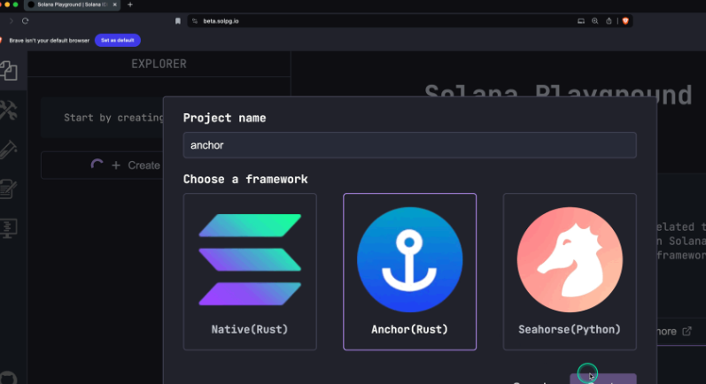

-   Requires a `data:u64` parameter as input
-   Creates a new account
-   Saves the value of the `data:u64` parameter in the account's data
-   Logs a message to the transaction's program logs


```rust
use anchor_lang::prelude::*;

// This is your program's public key and it will update
// automatically when you build the project.
declare_id!("11111111111111111111111111111111");

#[program]
mod hello_anchor {
    use super::*;
    pub fn initialize(ctx: Context<Initialize>, data: u64) -> Result<()> {
        ctx.accounts.new_account.data = data;
        msg!("Changed data to: {}!", data); // Message will show up in the tx logs
        Ok(())
    }
}

#[derive(Accounts)]
pub struct Initialize<'info> {
    // We must specify the space in order to initialize an account.
    // First 8 bytes are default account discriminator,
    // next 8 bytes come from NewAccount.data being type u64.
    // (u64 = 64 bits unsigned integer = 8 bytes)
    #[account(
      init,
      payer = signer,
      space = 8 + 8
    )]
    pub new_account: Account<'info, NewAccount>,
    #[account(mut)]
    pub signer: Signer<'info>,
    pub system_program: Program<'info, System>,
}

#[account]
pub struct NewAccount {
    data: u64
}
```

-   The declare\_id! macro specifies the on-chain address of your program. Solana Playground automatically updates this address when you build the program in the next step.

```
declare_id!("11111111111111111111111111111111");
```

-   The `#[program]` attribute annotates a module containing functions that represent the program's instructions.

```rust
#[program]
mod hello_anchor {
    use super::*;
    pub fn initialize(ctx: Context<Initialize>, data: u64) -> Result<()> {
        ctx.accounts.new_account.data = data;
        msg!("Changed data to: {}!", data); // Message will show up in the tx logs
        Ok(())
    }
}
```

In this example, the `initialize` instruction takes two parameters:

1.  `ctx: Context<Initialize>` \- Passes to the function the accounts required for this instruction, as specified in the `Initialize` struct.
2.  `data: u64` \- A custom parameter you must provide when you call the instruction.

The function body sets the `data` field of `new_account` to the provided `data` argument and then prints a message to the program logs.

-   The `#[derive(Accounts)]` attribute defines a struct that specifies the accounts required for a particular instruction, where each field represents a separate account.

    Anchor automatically handles common security checks related to account validation through field types (ex. `Signer<'info>`) and constraints (ex. `#[account(mut)]`).

    ```rust
    #[derive(Accounts)]
    pub struct Initialize<'info> {
        #[account(init, payer = signer, space = 8 + 8)]
        pub new_account: Account<'info, NewAccount>,
        #[account(mut)]
        pub signer: Signer<'info>,
        pub system_program: Program<'info, System>,
    }
    ```

-   The `#[account]` attribute defines a struct that represents the data type for accounts this program creates and owns.

```
    #[account]
    pub struct NewAccount {
    data: u64
    }

```