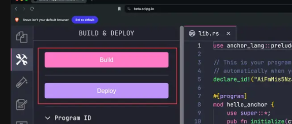

```bash
build
<!-- Building... -->
<!-- Build successful. Completed in 1.46s. -->
```
The `build` command compiles the program. The program bytecode is then stored in an executable program account when deployed.


Solana Playground updates the address in `declare_id!()`. This address represents your program's on-chain address (program ID).

After building the program, run `deploy` in the terminal to deploy the program to the network (devnet by default). Program deployment requires allocating SOL to the on-chain account that stores the program.

```bash
deploy

Deploying... This could take a while depending on the program size and network conditions.
Warning: 1 transaction not confirmed, retrying...
Deployment successful. Completed in 19s.
```


You can also use the Build and Deploy buttons on the left-side panel.