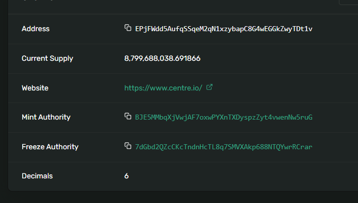

The `data` field of a Solana account contains raw bytes. To interpret this data meaningfully, you must deserialize it into the appropriate data type defined by the program that owns the account.

Most Solana programs provide client libraries with helper functions that abstract away the deserialization process. These functions convert the raw account bytes into structured data types, making it easier to work with the account data.

For example, `@solana/spl-token` includes the `getMint()` function to help deserialize a Mint account's `data` field into the [Mint](https://github.com/solana-program/token/blob/program%40v8.0.0/program/src/state.rs#L16-L30) data type.


The `getMint()` function deserializes the account's `data` field into the [Mint](https://github.com/solana-program/token/blob/program%40v8.0.0/program/src/state.rs#L16-L30) data type defined by the Token Program.

| Field | Description |
| --- |  --- |
| `address` | The Mint account's address |
| --- |  --- |
| `mintAuthority` | The authority allowed to mint new tokens |
| `supply` | The total supply of tokens |
| `decimals` | The number of decimal places for the token |
| `isInitialized` | Indicates if the Mint account has been initialized |
| `freezeAuthority` | The authority allowed to freeze token accounts |
| `tlvData` | Extra data for Token Extensions (requires further deserialization) |

You can view the fully deserialized [Mint Account](https://explorer.solana.com/address/EPjFWdd5AufqSSqeM2qN1xzybapC8G4wEGGkZwyTDt1v?cluster=mainnet-beta) data on the Solana Explorer.



```ts
import { PublicKey, Connection } from "@solana/web3.js";
import { getMint } from "@solana/spl-token";

const connection = new Connection(
  "https://api.mainnet-beta.solana.com",
  "confirmed"
);

const address = new PublicKey("EPjFWdd5AufqSSqeM2qN1xzybapC8G4wEGGkZwyTDt1v");
const mintData = await getMint(connection, address, "confirmed");

console.log(
  JSON.stringify(
    mintData,
    (key, value) => {
      // Convert BigInt to String
      if (typeof value === "bigint") {
        return value.toString();
      }
      // Handle Buffer objects
      if (Buffer.isBuffer(value)) {
        return `<Buffer ${value.toString("hex")}>`;
      }
      return value;
    },
    2
  )
);
```

```
{
  "address": "EPjFWdd5AufqSSqeM2qN1xzybapC8G4wEGGkZwyTDt1v",
  "mintAuthority": "BJE5MMbqXjVwjAF7oxwPYXnTXDyspzZyt4vwenNw5ruG",
  "supply": "8799703441139599",
  "decimals": 6,
  "isInitialized": true,
  "freezeAuthority": "7dGbd2QZcCKcTndnHcTL8q7SMVXAkp688NTQYwrRCrar",
  "tlvData": {
    "type": "Buffer",
    "data": []
  }
}
```