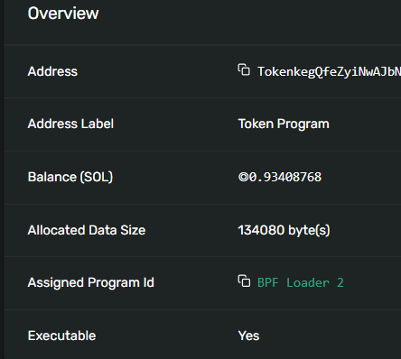

### All "wallet" accounts are simply System Program owned accounts that hold SOL and can sign transactions.


The Token Program is an executable program account on Solana. Like wallet accounts, programs have the same underlying [Account](https://github.com/anza-xyz/agave/blob/v2.1.11/sdk/account/src/lib.rs#L48-L60) data structure, but with key differences in its fields:

| Field | Description |
| --- |  --- |
| `executable` | Set to `true`, indicating that this account contains executable program code. |
| --- |  --- |
| `data` | For program accounts, this field stores the program's executable code. In contrast, wallet accounts have an empty data field. |
| `owner` | The account is owned by a Loader program, which is a category of built-in programs that own executable program accounts on Solana. (`BPFLoader2111111111111111111111111111111111`) |

The program account stores the compiled bytecode for the Token Program's [source code](https://github.com/solana-program/token/tree/main/program). You can view this program account on the [Solana Explorer](https://explorer.solana.com/address/TokenkegQfeZyiNwAJbNbGKPFXCWuBvf9Ss623VQ5DA).



All Solana accounts share the same [Account type](https://github.com/anza-xyz/agave/blob/v2.1.11/sdk/account/src/lib.rs#L48-L60).

A "wallet" on Solana is an account owned by the [System Program](https://github.com/anza-xyz/agave/tree/v2.1.11/programs/system), which is one of Solana's built-in programs. Wallet accounts are primarily used to hold SOL (tracked in the `lamports` field) and to sign transactions.

When you fetch a wallet account, the response includes these fields:

| Field | Description |
| --- |  --- |
| `data` | The account's data buffer. For wallet accounts, this is empty (0 bytes). Other account use this field to store data. |
| --- |  --- |
| `executable` | Indicates if the account contains executable program code. For wallet and state accounts, this is `false`. |
| `owner` | The program that owns the account. For wallets, this is always the System Program, with the address `11111111111111111111111111111111`. |
| `lamports` | The account's SOL balance, denominated in lamports (1 SOL = 1,000,000,000 lamports). |
| `rentEpoch` | A legacy field related to Solana's deprecated rent mechanism (currently unused). |
| `space` | The size, in bytes, of the `data` field (note: this is not a field in the `Account` type itself). |

```ts
import { Keypair, Connection, LAMPORTS_PER_SOL } from "@solana/web3.js";

const keypair = Keypair.generate();
console.log(`Public Key: ${keypair.publicKey}`);

const connection = new Connection("http://localhost:8899", "confirmed");

// Funding an address with SOL automatically creates an account
const signature = await connection.requestAirdrop(
  keypair.publicKey,
  LAMPORTS_PER_SOL
);
await connection.confirmTransaction(signature, "confirmed");

const accountInfo = await connection.getAccountInfo(keypair.publicKey);
console.log(JSON.stringify(accountInfo, null, 2));
```
```
Public Key: 9ErDKCA4Tp5VHceaeqLdUKpaTGLHaqK7m4FzPK5qqGYN
{
  "data": {
    "type": "Buffer",
    "data": []
  },
  "executable": false,
  "lamports": 1000000000,
  "owner": "11111111111111111111111111111111",
  "rentEpoch": 100000000,
  "space": 0
}
```