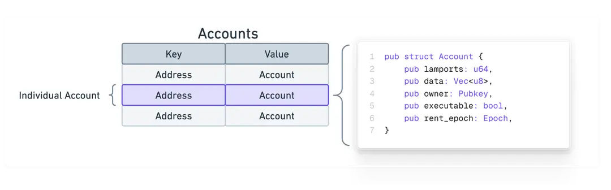

https://solana.com/docs/intro/quick-start/reading-from-network

On Solana, all data exists in "accounts". You can think of data on Solana as a public database with a single "Accounts" table, where each entry is an account with the same base [Account type](https://github.com/anza-xyz/agave/blob/v2.1.11/sdk/account/src/lib.rs#L48-L60).

Accounts on Solana can store "state" or "executable" programs. Each account has an "address" (public key) that serves as its unique ID used to locate its corresponding on-chain data.

Solana accounts contain either:

-   **State**: Data that meant to be read from and persisted. For example, information about tokens, user data, or other data defined within a program.
-   **Executable Programs**: Accounts containing the actual code of Solana programs. These accounts store instructions that users can invoke.