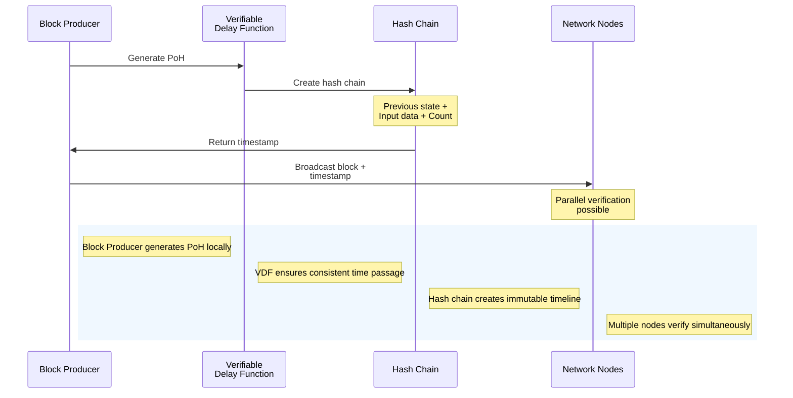

Proof of History (PoH) is Solana's innovative consensus mechanism that solves one of blockchain's fundamental challenges: how to establish time ordering in a decentralized system without relying on a central authority 1:1. This technology enables Solana to process transactions significantly faster than traditional blockchain networks while maintaining decentralization and security.

###  Core Concept

At its heart, PoH uses a Verifiable Delay Function (VDF) to create a mathematical proof of time passage. Each block producer must generate this proof before producing a block, effectively creating a cryptographically secure timeline of events 0:3.

The diagram illustrates several key aspects of PoH:

- The hash chain creates an immutable record of events, where each new entry depends on previous ones, making it impossible to alter the timeline
- Unlike traditional systems where nodes must synchronize clocks, PoH allows parallel verification - multiple nodes can verify different transactions simultaneously
- The process happens locally on each block producer's machine, eliminating the need for complex network-wide synchronization 0:3

###  Technical Implementation

Solana implements PoH through a sophisticated process:

Block producers generate timestamps using SHA256 hashingEach timestamp incorporates the hash of previous statesThe system maintains both upper and lower bounds on timeNetwork nodes can verify timestamps independently 0:3###  Benefits

1. **Speed and Efficiency**  - Eliminates the need for nodes to synchronize clocks
  - Enables parallel verification of transactions
  - Allows for approximately 400ms block times 1:2

2. **Scalability**  - Can handle over 50,000 transactions per second
  - Significantly outperforms traditional blockchain networks
  - Maintains efficiency even during high load 1:0

3. **Energy Efficiency**  - Doesn't require complex computations like Proof of Work
  - Uses hardware-optimized SHA256 hashing
  - Lower energy footprint compared to traditional mechanisms 1:4

###  Comparison with Other Consensus Mechanisms

| Feature | Proof of Work | Proof of Stake | Proof of History |
| --- | --- | --- | --- |
| Description | Computational puzzles | Staked assets | Verifiable timestamps |
| Rewards | Block rewards + fees | Staking rewards | Transaction fees |
| Primary Function | Mining | Validation | Timestamp validation |
| Security vs Efficiency | High security, low efficiency | More efficient, less secure | Balanced approach |
| Energy Consumption | High | Low | Low |

1:5###  Real-World Impact

The railroad analogy illustrates PoH's efficiency advantage:

- Traditional systems: Each station must contact others to verify train routes and times
- Solana's PoH: Trains carry timestamps (stamps) from each station, enabling quick verification
- Result: Faster transaction processing without sacrificing decentralization 0:4

###  Future Implications

While Solana's PoH represents a significant innovation in blockchain technology, it's worth noting that:

- The system is relatively young compared to Bitcoin and Ethereum
- Continues to evolve and improve
- Has shown promising results in high-performance applications
- Demonstrates potential for widespread adoption in decentralized finance and applications 2:4

Proof of History stands as a crucial innovation in blockchain technology, addressing the scalability limitations of traditional consensus mechanisms while maintaining decentralization and security. Its ability to efficiently establish time ordering without centralized coordination makes it particularly valuable for high-performance blockchain applications.