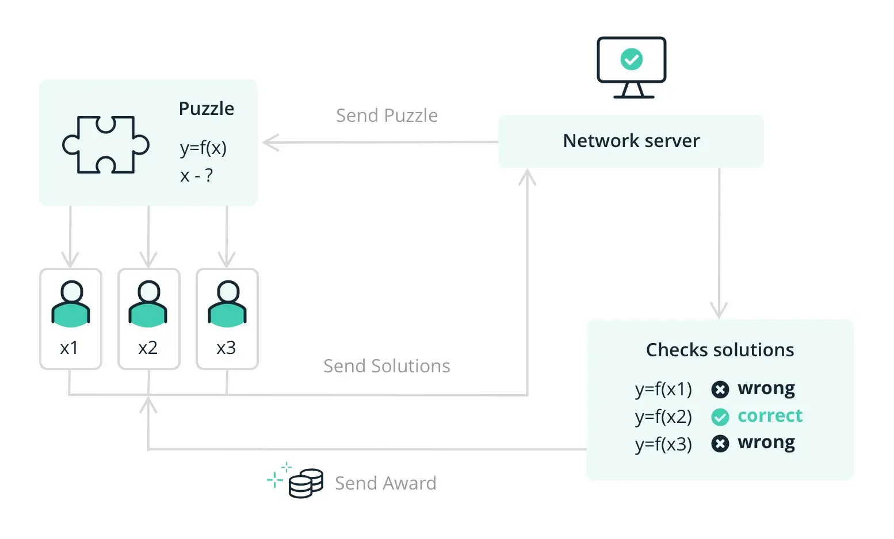
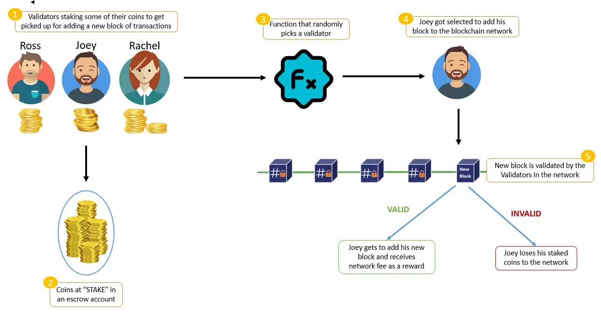

-   [Bitcoin Whitepaper](https://bitcoin.org/bitcoin.pdf)
-   [Ethereum Whitepaper](https://ethereum.org/en/whitepaper/)
-   [Coinbase's PoW vs PoS Article](https://www.coinbase.com/learn/crypto-basics/what-is-proof-of-work-or-proof-of-stake)
-   [Proof of Stake vs Delegated Proof of Stake](https://www.gemini.com/cryptopedia/proof-of-stake-delegated-pos-dpos)
-   [Solana Documentation on Synchronization](https://docs.solana.com/cluster/synchronization)
-   [Video on VDFs by a16z crypto](https://youtu.be/qf1CN5n8aHM?si=jkBbUopJP33elFTl)

* **Consensus algorithms**
  *Ensure decentralized agreement, security, and immutability in adversarial networks*

---

## ⚒ **Proof of Work (PoW)**

* **Core concept**
  *Miners solve cryptographic puzzles by expending computational resources*
* **Mechanism**
  *Hashing block data + nonce until hash meets target; first miner adds block and earns reward*
* **Strengths**

  * 🌍 **Decentralization**: Open participation
  * 🔒 **Security**: Costly to attack (51% attack hard)
  * 🏛 **Proven reliability**: Used successfully at scale
* **Weaknesses**

  * ⚡ **Energy-heavy**: High electricity use, environmental impact
  * 🏭 **Centralization risk**: Specialized hardware & cheap energy concentration

---

## 💎 **Proof of Stake (PoS)**

* **Core concept**
  *Validators lock tokens as stake to gain block proposal rights*
* **Mechanism**
  *Validators chosen by stake size/age; others attest; misbehavior punished by slashing*
* **Strengths**

  * 🌱 **Energy efficient**: Minimal computation required
  * 🚀 **Scalability**: Faster block finality, higher throughput
* **Weaknesses**

  * 🤑 **Wealth centralization**: Large stakers gain more influence
  * 🪙 **Lower incentives**: May reduce validator participation
  * ⚔ **Nothing-at-stake**: Risk of signing multiple forks
  * 🎲 **Fairness issues**: Uneven initial token distribution

---

## ⏱ **Proof of History (PoH)**

* **Core concept**
  *Cryptographic clock using sequential SHA-256 hashes to prove time passage and event order*
* **Mechanism**
  *Continuous hash chain timestamps transactions, reducing need for inter-node synchronization*
* **Purpose**

  * ⏳ *Pre-consensus tool*, not a consensus mechanism by itself
  * 🔄 Optimizes validator synchronization for faster consensus
* **Benefits**

  * 🕰 **Verifiable timing**: Clear transaction ordering
  * ⚡ **Efficiency**: Lower communication overhead
  * 📈 **Scalability**: Enables rapid block generation
* **Nuance**

  * Works as an enhancement to PoS, not standalone

---

## 🔍 **Comparative Insights**

| Mechanism | Role                    | Pros                         | Cons                                   |
| --------- | ----------------------- | ---------------------------- | -------------------------------------- |
| **PoW**   | Secures via computation | High security, decentralized | Energy waste, centralization           |
| **PoS**   | Secures via stake       | Efficient, scalable          | Wealth centralization, complex attacks |
| **PoH**   | Provides time/order     | Fast, efficient              | Not standalone, Solana-specific        |

---

## 🧠 **Key Notes**

* **Consensus = trust without central authority**
* **PoW = computation**, **PoS = economic stake**, **PoH = verifiable time sequencing**
* Every model trades off **security**, **efficiency**, **decentralization**, and **scalability**
* **Solana’s design = PoS + PoH** for speed and throughput

---

## 🔍 What is this article about?

- 📜 **Definition of blockchains**  
  - Distributed ledgers recording transactions across a network of computers.  
  - Emphasizes decentralization and immutability.  

- ⚙️ **Role of consensus algorithms**  
  - Enable agreement on the ledger’s state among distrustful participants.  
  - Remove need for centralized validation.  

- 🚫 **Risks without consensus**  
  - Vulnerability to double-spending.  
  - Potential forks and unresolved disputes.  
  - Loss of immutability and security.  

---

## 🎯 Why you should learn about consensus algorithms

- 🏗️ **Architectural impact on dApp development**  
  - Influences deployment costs and transaction throughput.  
  - Determines time to finality for transactions.  

- 🔐 **Security considerations**  
  - Understanding attack vectors and smart contract implications.  

- 🗳️ **Governance participation**  
  - Grasping voting mechanisms and economic incentives.  
  - Enabling active network contributions and reward strategies.  

- 📚 **Adapting to new protocols**  
  - Foundation for grasping PoS variants (e.g., Delegated or Leased PoS).  

---

## 🛠️ What is a consensus algorithm?

- 🌐 **Byzantine Generals’ Problem**  
  - Highlights challenges in reaching agreement with potential malicious actors.  

- 🚦 **Traffic light analogy**  
  - Consensus rules act like green/red signals for valid and invalid transactions.  
  - Uniform rule application across all participants.  

- 🔄 **Adaptive coordination**  
  - Maintains performance under changing network conditions.  

---

## 💥 Proof of Work (PoW)

### How it works

- 🧩 **Computational puzzle**  
  - Miners solve for a 64-digit hexadecimal hash via SHA256 (transactions + nonce).  
  - First solver earns the right to add the next block.  

- ⛏️ **Mining and incentives**  
  - “Mining” refers to puzzle-solving and block validation.  
  - Rewards: newly minted coins + transaction fees.  

### Benefits ✅

- 🔓 **Open participation**  
  - Anyone with hardware can mine, fostering decentralization.  

- 🔒 **High attack cost**  
  - 51% attack requires massive computational resources.  

- 📈 **Proven at scale**  
  - Tested through Bitcoin’s long-running network security.  

### Drawbacks ❌

- ⚡ **High energy consumption**  
  - Environmental concerns due to electricity-intensive mining.  

- 💰 **Centralization risk**  
  - Mining farms in low-cost regions concentrate hashing power.  

- 💵 **Barrier to entry**  
  - Expensive hardware limits profitable mining to large players.  

---

## 🌿 Proof of Stake (PoS)

### How it works

- 🔐 **Validators instead of miners**  
  - Stake tokens to earn validation rights.  
  - Selection factors: stake size, stake age.  

- 🗳️ **Voting & slashing**  
  - Validators propose and vote on blocks.  
  - Invalid proposals incur slashing penalties (stake loss).  

- 🎁 **Rewards**  
  - Transaction fees and sometimes new tokens.  

### Benefits ✅

- 🌱 **Energy efficiency**  
  - Ethereum’s Merge cut energy use by 99.84%.  

- ⚡ **Faster finality**  
  - Improved throughput and lower latency.  

- 🔄 **Scalability enablers**  
  - Suited for sharding and parallel transaction processing.  

### Drawbacks ❌

- 🏦 **Wealth centralization**  
  - Large stakeholders wield disproportionate influence.  

- 💸 **Variable rewards**  
  - Potential lower incentive compared to PoW mining returns.  

- 🔗 **Fork-voting risks**  
  - Need strict slashing rules to prevent multiple-fork voting.  

---

## 🔀 Delegated Proof of Stake (DPoS)

### How it works

- 🗳️ **Delegate election**  
  - Token holders vote for a fixed number of delegates.  
  - Voting power tied to token holdings.  

- 💼 **Block production**  
  - Elected delegates validate blocks on a rotating schedule.  
  - Rewards distributed proportionally to supporters.  

### Benefits ✅

- 🚀 **High performance**  
  - Fewer validators yield faster block times.  

- 🙌 **Accessibility**  
  - Low hardware requirements for delegates.  

### Drawbacks ❌

- 🏛️ **Centralization concern**  
  - Small delegate set could collude or be bribed.  

- 💤 **Voter apathy**  
  - Low participation risks concentration of power.  

---

## ⏱️ Proof of History (PoH)

### Concept

- 🕰️ **Decentralized clock**  
  - Cryptographic time-stamping without a trusted third party.  

- 🔗 **Sequential hash chain**  
  - Each hash depends on its predecessor, forming an immutable timeline.  

- ⏳ **Verifiable Delay Functions (VDFs)**  
  - Slow-to-compute, fast-to-verify functions enforcing elapsed time.  

### Analogy

- 📖 **Town scribe journal**  
  - Special ink changes color per entry, proving sequence and timing.  

### Advantages ✅

- 🚀 **Shorter block times**  
  - Allows parallel transaction processing and high throughput.  

- 🔒 **Strong integrity**  
  - Tampering requires recomputing entire hash chain.  

- 🔎 **Transparent timing**  
  - Verifiable timestamps without reliance on wallclock data.  

### Drawbacks ❌

- 🛠️ **Increased complexity**  
  - Complex architecture elevates bug and vulnerability risks.  

- 💻 **Higher hardware requirements**  
  - VDFs demand powerful nodes, raising participation costs.  

- ⏳ **Resource intensity**  
  - Short-term barrier until hardware improvements lower costs.  

---