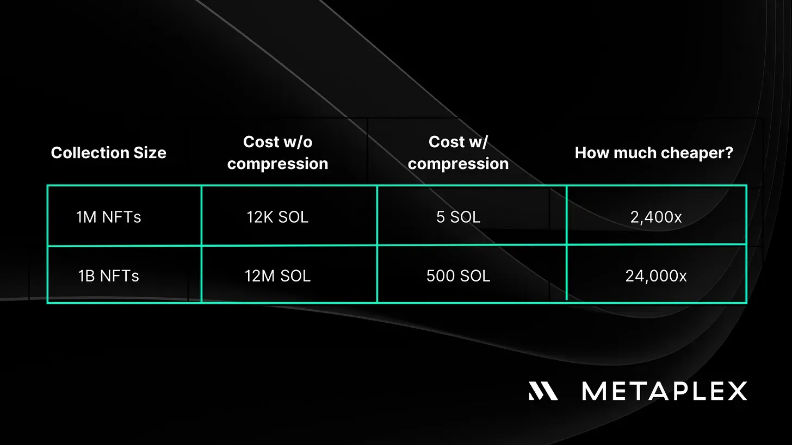
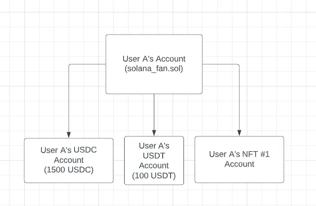

🎯 **Core Concept: Solana NFT Compression**  
*Massively reduces NFT storage costs by leveraging off-chain data with on-chain integrity verification.*

---

### 🔍 **Why NFT Compression?**
- **High storage costs** on blockchains limit scalable NFT applications.
- Traditional NFTs require on-chain mint, token, and metadata accounts → expensive.
- 🚀 Compression enables **minting billions of NFTs at ultra-low cost**.
  - *Example: ~$11,000 to mint 1B NFTs on Solana vs ~$50M on Polygon.*

---

### 🧱 **How It Works: The Tech Behind Compression**

- **Merkle Tree**  
  *A cryptographic data structure that hashes data into a single root for integrity verification.*
  - Data (e.g. NFT metadata) stored off-chain in **leaves**.
  - Parent nodes hash their children → forms a tree.
  - Final **root hash** stored on-chain.

- **On-Chain Root, Off-Chain Data**  
  - Bulk NFT data stored on **Solana ledger** (not full on-chain accounts).
  - Only **root hash** is stored on-chain → minimal storage cost.

- **Account Compression Program**  
  *Core Solana program enabling compressed data structures.*
  - Manages Merkle tree creation and updates.
  - Validates changes using **proof path** (subset of tree needed to recompute root).

- **Tamper-Proof Guarantee**  
  - Any change in off-chain data alters the root hash.
  - Users can **verify data integrity** by comparing local proof with on-chain root.

---

### 🌐 **Bubblegum Program: NFT Compression in Action**

- Built on top of **Account Compression Program**.
- **Eliminates need** for traditional mint, token, and metadata accounts.
- Each NFT = a **leaf** in the Merkle tree.
- Supports full NFT operations:
  - ✅ **Mint**, **Transfer**, **Burn**
  - 🔐 **Delegate**, **Verify Creator/Collection**
  - 💡 **Redeem**, **Decompress**, **Cancel** actions

- Minting = appending a new leaf to the tree.
- All actions are **on-chain transactions** → fully auditable.

---

### 🔄 **Data Availability & Trust Model**

- **Indexers & RPCs** maintain current Merkle tree state.
  - *Act as fast lookup services for compressed NFT data.*
- ❗ No central point of failure:
  - If indexer fails → **rebuild tree from transaction history**.
  - All data can be **replayed and verified** from chain logs.

- Think of RPCs as **caches**, not sources of truth.

---

### 📡 **Reading Compressed NFTs: DAS API**

- **Digital Asset Standard (DAS) API**  
  *Unified, high-speed interface for querying all Solana tokens.*
  - Works for **both compressed and regular NFTs**.
  - Supports queries by:  
    👤 **Owner**, 🎨 **Creator**, 📦 **Collection**
  - Returns **on-chain accurate data** with minimal latency.

---

### 🚀 **Real-World Use Cases**

- 🧩 **Dialect** → Compressed **in-chat sticker packs**
- 🌐 **Helium** → Representing **Helium Hotspots** as NFTs
- 💌 **Crossmint** → Scalable **airdrops** for 100k+ users
- 🌧️ **Drip Haus** → Mass **NFT airdrops**
- 🖼️ **Render Network** → Tokenizing **3D scene graphs** for GPU rendering

---

### 💡 **Key Takeaways**

- **NFT compression = scalability breakthrough** for Solana.
- 💰 Cost reduction: **3+ orders of magnitude cheaper** than alternatives.
- 🔐 Security: **On-chain root + off-chain data = low cost + high integrity**.
- 🌳 Merkle trees enable **efficient, verifiable state management**.
- 🛠️ Developers can **mint, transfer, burn** compressed NFTs seamlessly.
- 🌍 Future of digital assets: **Ubiquitous, low-cost, composable NFTs**.