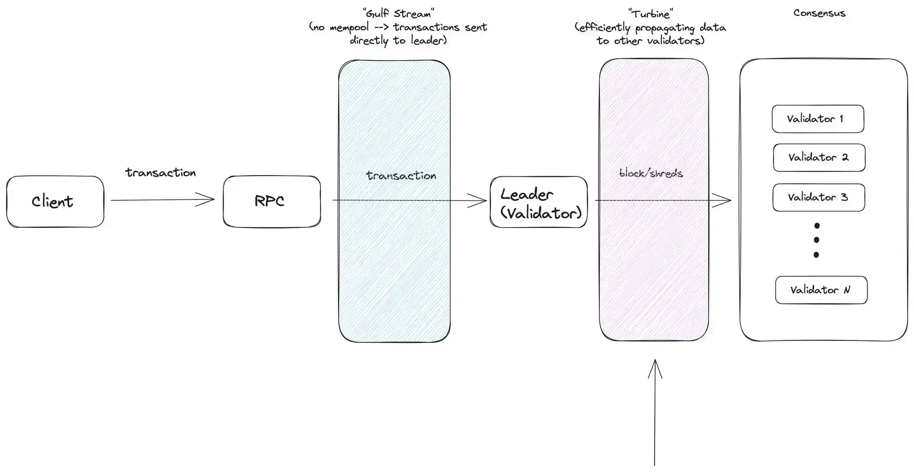
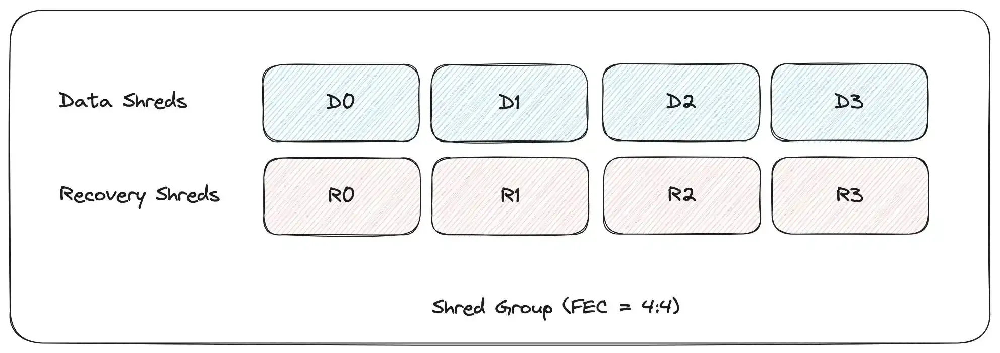
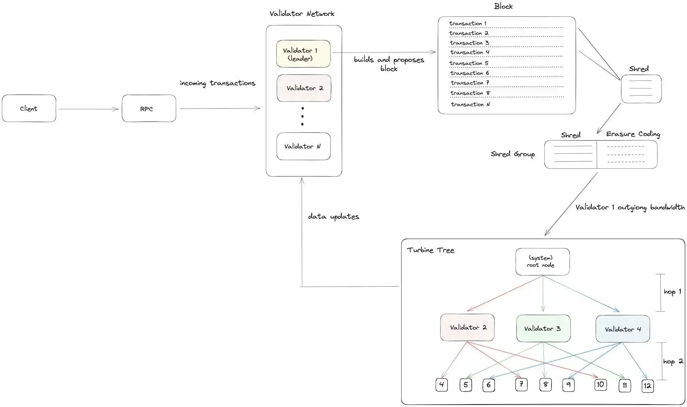
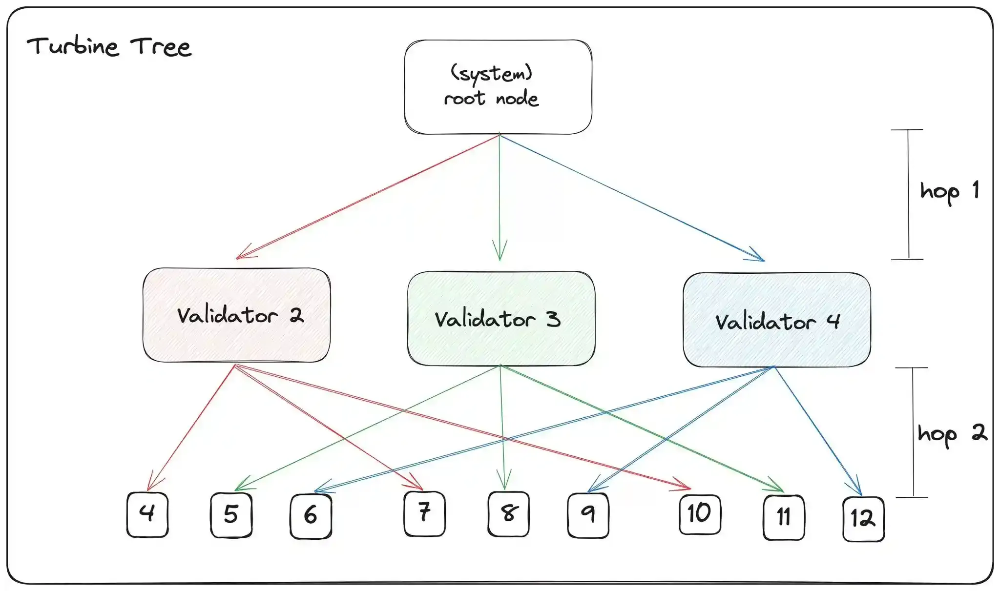

# 🚀 **Turbine: Solana’s High-Speed Block Propagation Engine**

## 🔗 Why Data Availability Matters
>Data availability ensures every node can access block data to validate transactions — critical for **security**, **integrity**, and **decentralization**.

But broadcasting full blocks to all nodes creates massive **bandwidth bottlenecks**, especially at Solana’s scale (50k+ TPS).  
Turbine solves this with a smart, layered approach.

---

## 🧩 What is Turbine?
Turbine is Solana’s **multi-layer block propagation protocol** that efficiently spreads block data across validators using:

- 🔤 **Shreds** (small data units)
- 🌲 **Tree-based topology**
- 🛠️ **Erasure coding**
- 📡 **UDP for low-latency transmission**

> Unlike traditional flooding or gossip, Turbine minimizes redundant traffic and leader bandwidth load.

---


## 🔄 The Block Propagation Lifecycle

1. **Leader builds a block**
   - Orders transactions during its 4-slot window
   - No mempool (thanks to Gulf Stream)

2. **Block → Shreds**
   - Split into **MTU-sized shreds** (max size per network packet)
   - Apply **Reed-Solomon erasure coding** → generates *data shreds* + *recovery shreds*

3. **Shreds grouped into Shred Groups**
   - Example: `32:32` FEC → 32 data + 32 recovery = 64 total
   - Can lose **up to 50%** of packets and still reconstruct the block!

4. **Turbine Tree takes over**
   - Sends shreds through a **hierarchical validator tree**
   - Each node relays to only a few others — not everyone




---

## 🧱 Shred Group & Erasure Coding

```
[Data Shred 1]   [Data Shred 2]   [Data Shred 3]   [Data Shred 4]
     ↓               ↓               ↓               ↓
[Recovery Shred A] → Generated via Reed-Solomon FEC
[Recovery Shred B] → Enables reconstruction if data is lost
```

✅ With `4:4` FEC: Lose any 4 of 8 → still recover full data  
✅ Default on Solana: `32:32` → survives 15% packet loss with ~99% success

🔁 **FEC rate is dynamic** — leaders adjust based on:
- Network packet loss
- Tree depth
- Stake-weighted conditions

---

## 🌲 The Turbine Tree: How It Works

Turbine uses a **deterministic, stake-aware tree** for propagation.

### Step-by-step:

1. **Root node collects all active validators**
2. **Sort by stake-weight**  
   👑 Higher-stake validators get priority
3. **Deterministically shuffle the list**  
   🔐 Seed = `(leader ID, slot, shred index, shred type)`  
   Prevents targeting attacks
4. **Divide into layers**  
   Based on `DATA_PLANE_FANOUT = 200`
5. **Build tree (2–3 hops deep)**  
   Most nodes are just 2–3 hops from leader

```
        [Leader]
           ↓
        [Root]
     ↙    ↓    ↘
   [L1]  [L1]   [L1]
  ↙↓↘  ↙↓↘   ↙↓↘
[L2]...[L2] [L2]...
```

Each validator knows:
- ✅ Which shreds it receives
- ✅ Which shreds it must forward
- ✅ Where it sits in the tree

---

## 📦 Transport: UDP vs TCP

| Feature        | Solana (UDP)       | Ethereum (TCP)     |
|---------------|--------------------|--------------------|
| Latency       | ⚡ **100ms** (6MB cross-region) | 🐢 ~900ms |
| Protocol      | UDP                | TCP (DevP2P)       |
| Retries       | Handled by Turbine + repair | Built-in |
| Future        | 🔄 Exploring QUIC  | —                  |

> UDP gives Solana **massive speed gains** — critical for sub-second block times.

---

## 🔁 Fallbacks: Gossip & Repair

If shreds are missing:
- Node requests missing pieces via **gossip network**
- Any node with full data can **repair** by sending needed shreds
- Pushes retransmission load **down the tree**, not back to leader

🛠️ This is **deterministic repair**: no blind flooding.

---

## 🔁 Turbine vs Ethereum: Key Differences

| Aspect                | Solana (Turbine)                          | Ethereum (Gossip)                        |
|----------------------|-------------------------------------------|------------------------------------------|
| Propagation          | 🌲 Tree-based, hierarchical                | 🌐 Flood-style gossip                     |
| Data Unit            | Shreds (erasure-coded)                    | Full blocks                               |
| Bandwidth            | 💥 Spikes up to **1 Gbps** (not sustained) | 📦 Steady ~25 Mbps recommended           |
| Transport            | UDP                                       | TCP                                       |
| Light Clients        | ❌ Not supported yet                      | ✅ Supported via data availability proofs |
| Data Availability    | Full download by all validators           | Relies on gossip + DAS in L2s             |

---

## 🔍 Open Research & Challenges

- 🧪 **Data Availability Sampling (DAS)**:  
  Turbine lacks DAS — can’t let light clients verify without full downloads.  
  Projects like *Celestia* and *EigenDA* focus here.

- 💸 **MEV Centralization Risk**:  
  High-stake nodes get data first → potential advantage in MEV extraction.

- 🖥️ **Modular Use of Turbine**:  
  Could Turbine run as a standalone DA layer on specialized hardware?

- ⚙️ **Firedancer Impact**:  
  Aims for **10 Gbps** optimized propagation — how will it scale on consumer nodes?

- 🔄 **DAS over Turbine?**  
  Early ideas (e.g., DAS-S) suggest hybrid models may emerge.

---

## 🧩 SVM L2s & Turbine Relevance

On Solana L2s like **Eclipse** or **Pythnet**:
- No native validator set → Turbine doesn’t apply
- Instead, publish data to external DA layers (e.g., **Celestia**)
- Enables fraud proofs and trust-minimized validation

> Turbine is **chain-specific**; modular DA layers offer flexibility.


### Additional Resources / Further Reading

-   [Turbine Block Propagation](https://docs.solana.com/cluster/turbine-block-propagation)
-   [Understanding Erasure Coding](https://stonefly.com/blog/understanding-erasure-coding/)
-   [Ethereum Blocks](https://ethereum.org/en/developers/docs/blocks/)
-   [Pyth Perseus Network Upgrade](https://pyth.network/blog/perseus-network-upgrade)
-   [Intro to EigenDA: Hyperscale Data Availability for Rollups](https://www.blog.eigenlayer.xyz/intro-to-eigenda-hyperscale-data-availability-for-rollups/)
-   [Firedancer](https://jumpcrypto.com/firedancer/)