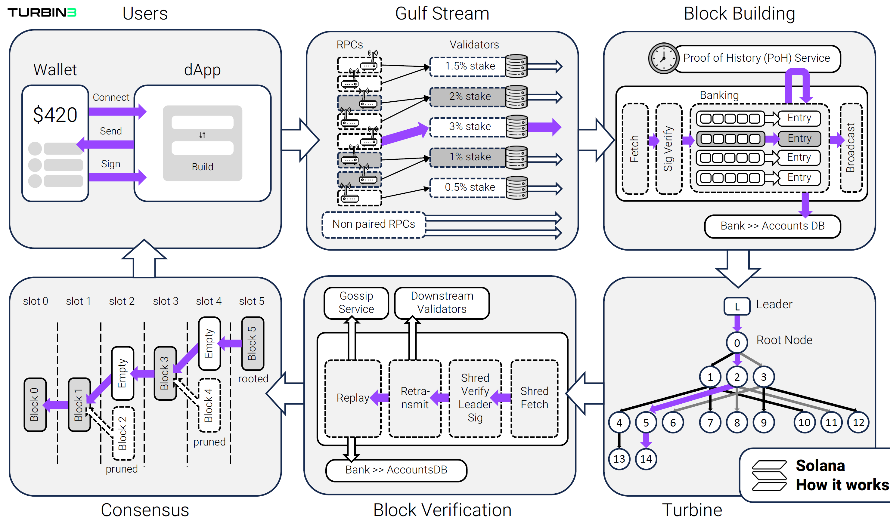
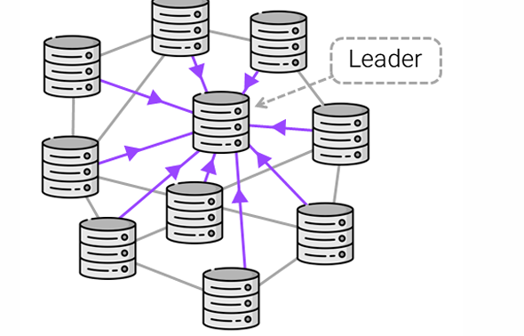
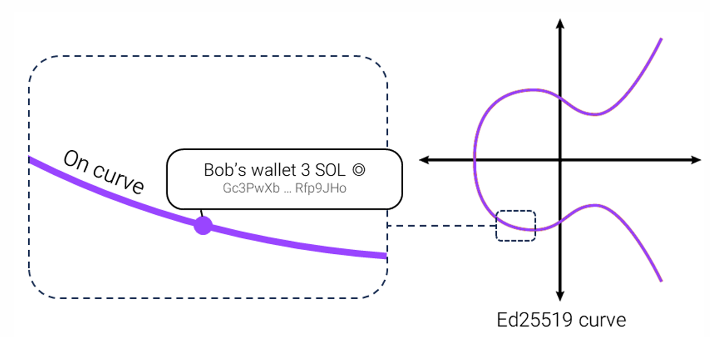
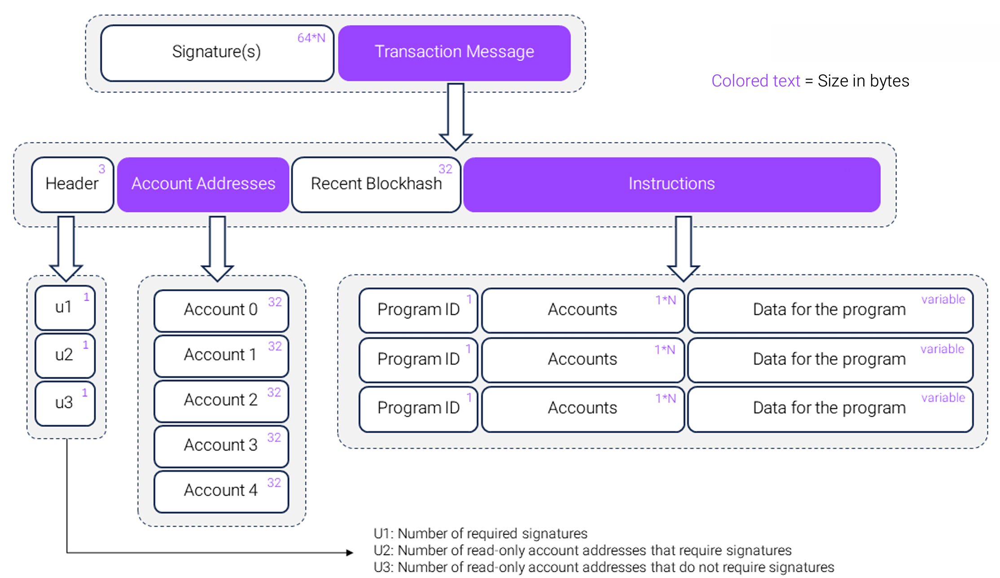
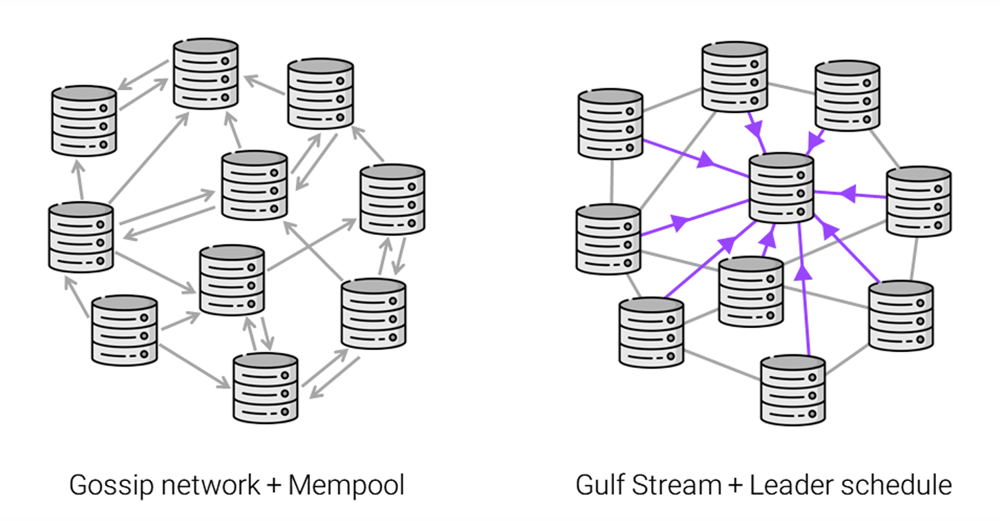
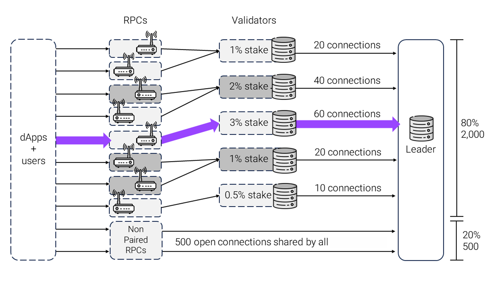
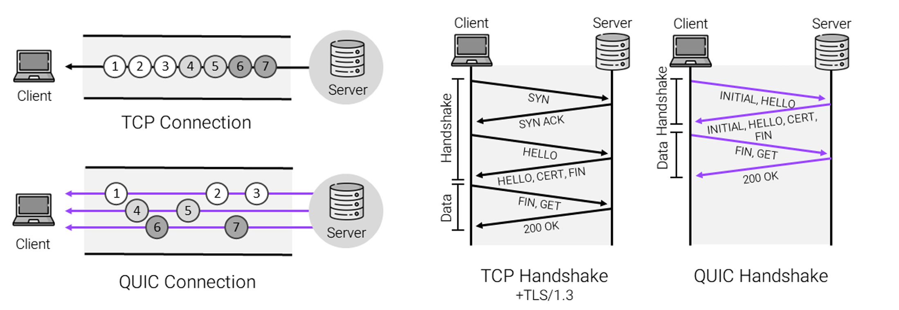
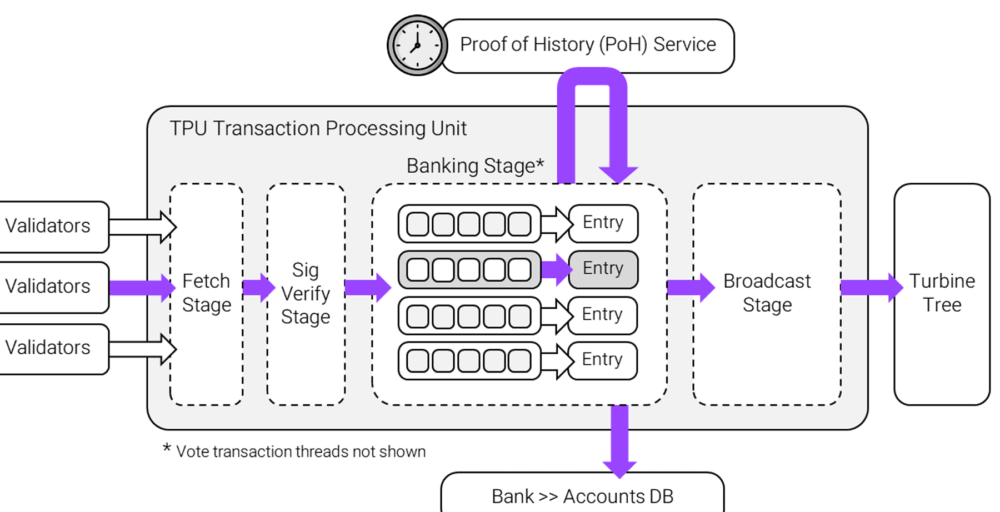

##  Transaction Lifecycle:


* Users send transactions to the current leader, who compiles, executes, and records them in a block.

* The block is then broadcast to other validators for execution and confirmation.


--

## Wallets

* **Public keys** are 32-byte values, represented as Base58-encoded strings.
* **Private keys** (secret keys) are also 32 bytes and function as the password granting full access to an account.
* Signing with a private key is how blockchains handle authorization—anyone with the private key has complete control over the account.
* **Keypairs** are 64-byte structures, consisting of the public key (first 32 bytes) and the private key (last 32 bytes).

---
Here’s the cleaned and organized version:

---

**Public Key (Base58)**

```
FDKJvWcJNae6wecbgDYDFPCfgs14aJnVsUfWQRYWLn4Tn
```

**Keypair (Base58)**

```
3j15jr41S9KmdfughusutvvqBjAeEDbU5sDQp8EbwQ3Hify2pfM1hiEsuFFAVq8bwGywnZpswrbDzPENbBZbd5nj
```

**Keypair (Integer Array)**

```
[63,107,47,255,141,135,58,142,191,2,45,78,18,90,162,107,197,8,33,211,15,228,235,250,30,
185,122,105,23,147,115,115,86,8,155,67,155,110,51,117,0,19,150,143,217,132,205,122,91,
167,61,6,246,107,39,51,110,185,81,13,81,16,182,30,71]
```




**Key Derivation**

* Private keys can be generated from mnemonic seed phrases (12 or 24 words), commonly used for backup and recovery.
* Multiple keys can be deterministically derived from a single seed phrase.

**Cryptography**

* Solana uses **Ed25519** elliptic curve cryptography for public/private keys.
* Ed25519 offers small key/signature sizes, fast computation, and resistance to common attacks.
* Each Solana wallet address corresponds to a point on the Ed25519 curve.

**Transactions & Signing**

* Transactions are signed with the private key; signatures are verified using the public key.
* The signature ensures authenticity, prevents tampering, and uniquely identifies the transaction.
* Transactions are the only way to change state on Solana and are **atomic**—they either execute fully or fail entirely.


---

## A Solana Transaction




**Solana Transaction Structure**
A transaction (or **transaction message**) has four parts:

1. **Header** – References the account address list and marks which accounts must sign the transaction.
2. **Account Addresses** – Lists all accounts read or written during execution. This explicit list is unique to Solana, enabling performance optimizations but requiring developers to determine all involved accounts beforehand.
3. **Recent Blockhash** – Prevents duplicate or stale transactions. Expires after 151 blocks (\~1 minute). RPCs retry every \~2 seconds until the transaction is finalized or the blockhash expires.
4. **Instructions** – Each specifies the program to run, accounts involved, and necessary data (e.g., transfer, mint, burn, create account, close account).

**Constraints**

* **Size limit:** 1,232 bytes.
* **Account limit:** Restricted number of referenced accounts.
* **Compute limit:** Measured in **compute units (CUs)**, representing processing cost.

---

```rust
total fee = prioritization fee + base fee
prioritization fee = compute unit price (micro-lamports) x compute unit limit
``` 


**Solana Transaction Fees**

* **Base Fee:** Fixed at 5,000 lamports per signature (usually 1 signature per transaction), regardless of complexity.
* **Prioritization Fee:** Optional under normal load, but often required during congestion. Priced in micro-lamports (1 millionth of a lamport) per compute unit to incentivize validators to include the transaction.
* **Fee Distribution:** Currently, 50% of all fees are burned and 50% go to the block producer. Under SIMD-96, 100% of prioritization fees will go to the block producer; base fee split remains the same.


```rust
 Substantial changes to the core Solana protocol go through a formal, transparent process of submitting a Solana Improvement Document (SIMD) which community members and core engineering will publicly critique. SIMDs are then  voted on by the network.
``` 


**Solana Transaction Flow**

1. **Wallet Connection** – User connects their wallet, allowing the app to read the public key. The key remains encrypted and sandboxed.
2. **Transaction Message Creation** – Built based on user actions (e.g., token swap with specified amounts and slippage).
3. **Signing** – The wallet signs the message with the private key after prompting the user for confirmation, often showing a transaction simulation.
4. **Submission** – The signed transaction is sent to an RPC provider, which forwards it to validators. RPCs also enable transaction simulation and on-chain data retrieval via JSON-RPC or WebSocket endpoints.

**Failed Transactions**

* On Solana, “failed transactions” still consume fees and execute successfully at the runtime level but end with a logical failure.
* Over 80% of these are due to **error code 0x1771** (exceeded slippage).
* 95% of such transactions are sent by just 0.1% of active addresses, mostly automated **arbitrage bots**.





----------

**RPC Nodes in Solana**
RPCs (Remote Procedure Calls) refer to RPC nodes, which act as gateways for interacting with and reading data from the Solana network. These nodes run the same software as full validators but with different settings, enabling them to simulate transactions accurately and maintain an up-to-date view of the network state.

As of now, Solana has over 4,000 RPC nodes. Unlike full validator nodes, RPC nodes:

* Hold no stake in the network.
* Cannot vote or produce blocks.
* Operate mainly as a paid service for developers, since they do not earn staking rewards.

This is different from most blockchains, where validator and RPC nodes are often the same entity.

---

**Transaction Flow and Leader Schedule**
Solana was designed to operate **without a mempool**. Instead of broadcasting transactions randomly across the network (as in traditional gossip-based blockchains), all transactions are sent directly to a predetermined *leader* for each slot.

#### Process:

1. An RPC node receives a transaction message.
2. The RPC forwards it to the slot’s leader.
3. A leader schedule is generated before each epoch (\~every 2 days).
4. The epoch is divided into slots (400 ms each).
5. Validators with more stake have a higher probability of being chosen as leaders.
6. When it’s a validator’s turn, it switches to *leader mode*, processes transactions, and broadcasts the resulting block to the network.

---

**Stake-Weighted Quality of Service (SWQoS)**
In early 2024, Solana introduced **Stake-Weighted Quality of Service** to reduce spam and improve Sybil resistance. This system:

* Prioritizes transactions relayed through staked validators.
* Allocates higher transaction forwarding capacity to validators with more stake.
* Limits spam from non-staked nodes by giving them less priority.

---

**Solana Clusters**
Solana operates four clusters:

* **Localnet** – Local testing environment.
* **Testnet** – Network testing by validators and developers.
* **Devnet** – Public testing with test tokens.
* **Mainnet-Beta** – The production network where tokens have real value.

When people refer to “the Solana network,” they almost always mean **Mainnet-Beta**.




---------

## **Stake-Leasing Model & SWQoS Allocation**  

Under this model, **validators** can enter agreements to **lease their stake-weighted capacity** to **RPC nodes**.  

- **RPC Node Benefit:** Gains **increased bandwidth**, enabling higher **transaction inclusion rates** in blocks.  
- **Capacity Allocation:**  
  - **80%** of a leader’s capacity (**~2,000 connections**) reserved for **Stake-Weighted Quality of Service (SWQoS)**.  
  - **20%** (**~500 connections**) reserved for **transaction messages from non-staked nodes**.  

This allocation mirrors **priority lanes on highways** — drivers pay a toll to **bypass congestion**.  

### **Impact on the Solana Ecosystem**  
- **Increased requirements** for forwarding transactions to leaders.  
- **Reduced effectiveness** of spam attacks.  
- **Incentive for high-traffic apps** to **vertically integrate**, by:  
  - Running their **own validator nodes**, or  
  - Securing access to **staked connections**.  
- Result: **Privileged, low-latency access** to leader nodes → **enhanced transaction throughput**.  

---

## **A QUIC Note**  

In **late 2022**, Solana adopted the **QUIC networking protocol** for transaction message transmission to leaders.  

- **Reason for Adoption:** Network disruptions caused by **bot-driven NFT mint spamming**.  
- **Protocol Benefits:**  
  - Enables **rapid, asynchronous communication** like UDP.  
  - Offers **secure sessions** and **flow control strategies** like TCP.  
  - Limits **traffic per source**, protecting against spam and focusing on **genuine transactions**.  
  - Uses **separate streams**, so dropped transactions **don’t block others**.  

**In Short:** QUIC combines the **speed of UDP** with the **reliability of TCP**, optimizing Solana’s transaction pipeline under high-load conditions.

---

## **Stake-Weighting in Solana**  

**Stake-weighting** is a **foundational principle** across Solana’s architecture, influencing:  
- **Voting rewards**  
- **Turbine tree structure**  
- **Leader scheduling**  
- **Gulf Stream transaction forwarding**  
- **Gossip network message propagation**  

Validators with **greater stake** receive **higher trust** and **priority roles** in the network.  

----

## **Continuous Block Building in Solana**  

Most blockchain networks use **discrete block building** — constructing entire blocks before broadcasting them. **Solana** instead implements **continuous block building**, where blocks are assembled and streamed **dynamically** during an allocated time slot. This design significantly **reduces latency**.  

- **Slot Duration:** 400 milliseconds  
- **Leader Rotation:** Each leader is assigned **four consecutive slots** (1.6 seconds) before rotating to the next leader.  
- **Block Acceptance Requirement:** All transactions must be **valid** and **reproducible**.  

---

## **Leader Preparation Phase**  

Two slots before becoming leader, a validator halts transaction forwarding to prepare for its workload.  

- **Traffic Surge:** Incoming network traffic spikes to **1+ GB/s** as the entire cluster directs packets to the upcoming leader.  

---

## **Transaction Processing Pipeline (TPU)**  

The **Transaction Processing Unit (TPU)** is the validator’s **core block production logic**.  

1. **Fetch Stage**  
   - Transactions are received via **QUIC**.  

2. **SigVerify Stage**  
   - Verifies transaction signatures.  
   - Ensures the correct number of signatures.  
   - Removes duplicate transactions.  

3. **Banking Stage (Block-Building Stage)**  
   - Named after **“bank”**, representing the state at a given block.  
   - **Per-block bank:** Tracks and updates state during block creation.  
   - **Finalization:** Once enough validators vote on a block, account updates are flushed from the bank to disk.  
   - **Permanent State:** The blockchain’s final state is the sum of all confirmed transactions, which can be **deterministically reconstructed** from history.  

   