##  Transaction Lifecycle:


* Users send transactions to the current leader, who compiles, executes, and records them in a block.

* The block is then broadcast to other validators for execution and confirmation.


--

## Wallets

* **Public keys** are 32-byte values, represented as Base58-encoded strings.
* **Private keys** (secret keys) are also 32 bytes and function as the password granting full access to an account.
* Signing with a private key is how blockchains handle authorization—anyone with the private key has complete control over the account.
* **Keypairs** are 64-byte structures, consisting of the public key (first 32 bytes) and the private key (last 32 bytes).

---
Here’s the cleaned and organized version:

---

**Public Key (Base58)**

```
FDKJvWcJNae6wecbgDYDFPCfgs14aJnVsUfWQRYWLn4Tn
```

**Keypair (Base58)**

```
3j15jr41S9KmdfughusutvvqBjAeEDbU5sDQp8EbwQ3Hify2pfM1hiEsuFFAVq8bwGywnZpswrbDzPENbBZbd5nj
```

**Keypair (Integer Array)**

```
[63,107,47,255,141,135,58,142,191,2,45,78,18,90,162,107,197,8,33,211,15,228,235,250,30,
185,122,105,23,147,115,115,86,8,155,67,155,110,51,117,0,19,150,143,217,132,205,122,91,
167,61,6,246,107,39,51,110,185,81,13,81,16,182,30,71]
```


**Key Derivation**

* Private keys can be generated from mnemonic seed phrases (12 or 24 words), commonly used for backup and recovery.
* Multiple keys can be deterministically derived from a single seed phrase.

**Cryptography**

* Solana uses **Ed25519** elliptic curve cryptography for public/private keys.
* Ed25519 offers small key/signature sizes, fast computation, and resistance to common attacks.
* Each Solana wallet address corresponds to a point on the Ed25519 curve.

**Transactions & Signing**

* Transactions are signed with the private key; signatures are verified using the public key.
* The signature ensures authenticity, prevents tampering, and uniquely identifies the transaction.
* Transactions are the only way to change state on Solana and are **atomic**—they either execute fully or fail entirely.


---

## A Solana Transaction


**Solana Transaction Structure**
A transaction (or **transaction message**) has four parts:

1. **Header** – References the account address list and marks which accounts must sign the transaction.
2. **Account Addresses** – Lists all accounts read or written during execution. This explicit list is unique to Solana, enabling performance optimizations but requiring developers to determine all involved accounts beforehand.
3. **Recent Blockhash** – Prevents duplicate or stale transactions. Expires after 151 blocks (\~1 minute). RPCs retry every \~2 seconds until the transaction is finalized or the blockhash expires.
4. **Instructions** – Each specifies the program to run, accounts involved, and necessary data (e.g., transfer, mint, burn, create account, close account).

**Constraints**

* **Size limit:** 1,232 bytes.
* **Account limit:** Restricted number of referenced accounts.
* **Compute limit:** Measured in **compute units (CUs)**, representing processing cost.

---

```rust
total fee = prioritization fee + base fee
prioritization fee = compute unit price (micro-lamports) x compute unit limit
``` 


**Solana Transaction Fees**

* **Base Fee:** Fixed at 5,000 lamports per signature (usually 1 signature per transaction), regardless of complexity.
* **Prioritization Fee:** Optional under normal load, but often required during congestion. Priced in micro-lamports (1 millionth of a lamport) per compute unit to incentivize validators to include the transaction.
* **Fee Distribution:** Currently, 50% of all fees are burned and 50% go to the block producer. Under SIMD-96, 100% of prioritization fees will go to the block producer; base fee split remains the same.


```rust
 Substantial changes to the core Solana protocol go through a formal, transparent process of submitting a Solana Improvement Document (SIMD) which community members and core engineering will publicly critique. SIMDs are then  voted on by the network.
``` 


**Solana Transaction Flow**

1. **Wallet Connection** – User connects their wallet, allowing the app to read the public key. The key remains encrypted and sandboxed.
2. **Transaction Message Creation** – Built based on user actions (e.g., token swap with specified amounts and slippage).
3. **Signing** – The wallet signs the message with the private key after prompting the user for confirmation, often showing a transaction simulation.
4. **Submission** – The signed transaction is sent to an RPC provider, which forwards it to validators. RPCs also enable transaction simulation and on-chain data retrieval via JSON-RPC or WebSocket endpoints.

**Failed Transactions**

* On Solana, “failed transactions” still consume fees and execute successfully at the runtime level but end with a logical failure.
* Over 80% of these are due to **error code 0x1771** (exceeded slippage).
* 95% of such transactions are sent by just 0.1% of active addresses, mostly automated **arbitrage bots**.


----------

**RPC Nodes in Solana**
RPCs (Remote Procedure Calls) refer to RPC nodes, which act as gateways for interacting with and reading data from the Solana network. These nodes run the same software as full validators but with different settings, enabling them to simulate transactions accurately and maintain an up-to-date view of the network state.

As of now, Solana has over 4,000 RPC nodes. Unlike full validator nodes, RPC nodes:

* Hold no stake in the network.
* Cannot vote or produce blocks.
* Operate mainly as a paid service for developers, since they do not earn staking rewards.

This is different from most blockchains, where validator and RPC nodes are often the same entity.

---

**Transaction Flow and Leader Schedule**
Solana was designed to operate **without a mempool**. Instead of broadcasting transactions randomly across the network (as in traditional gossip-based blockchains), all transactions are sent directly to a predetermined *leader* for each slot.

#### Process:

1. An RPC node receives a transaction message.
2. The RPC forwards it to the slot’s leader.
3. A leader schedule is generated before each epoch (\~every 2 days).
4. The epoch is divided into slots (400 ms each).
5. Validators with more stake have a higher probability of being chosen as leaders.
6. When it’s a validator’s turn, it switches to *leader mode*, processes transactions, and broadcasts the resulting block to the network.

---

**Stake-Weighted Quality of Service (SWQoS)**
In early 2024, Solana introduced **Stake-Weighted Quality of Service** to reduce spam and improve Sybil resistance. This system:

* Prioritizes transactions relayed through staked validators.
* Allocates higher transaction forwarding capacity to validators with more stake.
* Limits spam from non-staked nodes by giving them less priority.

---

**Solana Clusters**
Solana operates four clusters:

* **Localnet** – Local testing environment.
* **Testnet** – Network testing by validators and developers.
* **Devnet** – Public testing with test tokens.
* **Mainnet-Beta** – The production network where tokens have real value.

When people refer to “the Solana network,” they almost always mean **Mainnet-Beta**.


---------

## **Stake-Leasing Model & SWQoS Allocation**  

Under this model, **validators** can enter agreements to **lease their stake-weighted capacity** to **RPC nodes**.  

- **RPC Node Benefit:** Gains **increased bandwidth**, enabling higher **transaction inclusion rates** in blocks.  
- **Capacity Allocation:**  
  - **80%** of a leader’s capacity (**~2,000 connections**) reserved for **Stake-Weighted Quality of Service (SWQoS)**.  
  - **20%** (**~500 connections**) reserved for **transaction messages from non-staked nodes**.  

This allocation mirrors **priority lanes on highways** — drivers pay a toll to **bypass congestion**.  

### **Impact on the Solana Ecosystem**  
- **Increased requirements** for forwarding transactions to leaders.  
- **Reduced effectiveness** of spam attacks.  
- **Incentive for high-traffic apps** to **vertically integrate**, by:  
  - Running their **own validator nodes**, or  
  - Securing access to **staked connections**.  
- Result: **Privileged, low-latency access** to leader nodes → **enhanced transaction throughput**.  

---

## **A QUIC Note**  

In **late 2022**, Solana adopted the **QUIC networking protocol** for transaction message transmission to leaders.  

- **Reason for Adoption:** Network disruptions caused by **bot-driven NFT mint spamming**.  
- **Protocol Benefits:**  
  - Enables **rapid, asynchronous communication** like UDP.  
  - Offers **secure sessions** and **flow control strategies** like TCP.  
  - Limits **traffic per source**, protecting against spam and focusing on **genuine transactions**.  
  - Uses **separate streams**, so dropped transactions **don’t block others**.  

**In Short:** QUIC combines the **speed of UDP** with the **reliability of TCP**, optimizing Solana’s transaction pipeline under high-load conditions.

---

## **Stake-Weighting in Solana**  

**Stake-weighting** is a **foundational principle** across Solana’s architecture, influencing:  
- **Voting rewards**  
- **Turbine tree structure**  
- **Leader scheduling**  
- **Gulf Stream transaction forwarding**  
- **Gossip network message propagation**  

Validators with **greater stake** receive **higher trust** and **priority roles** in the network.  

----

## **Continuous Block Building in Solana**  

Most blockchain networks use **discrete block building** — constructing entire blocks before broadcasting them. **Solana** instead implements **continuous block building**, where blocks are assembled and streamed **dynamically** during an allocated time slot. This design significantly **reduces latency**.  

- **Slot Duration:** 400 milliseconds  
- **Leader Rotation:** Each leader is assigned **four consecutive slots** (1.6 seconds) before rotating to the next leader.  
- **Block Acceptance Requirement:** All transactions must be **valid** and **reproducible**.  

---

## **Leader Preparation Phase**  

Two slots before becoming leader, a validator halts transaction forwarding to prepare for its workload.  

- **Traffic Surge:** Incoming network traffic spikes to **1+ GB/s** as the entire cluster directs packets to the upcoming leader.  

---

## **Transaction Processing Pipeline (TPU)**  

The **Transaction Processing Unit (TPU)** is the validator’s **core block production logic**.  

1. **Fetch Stage**  
   - Transactions are received via **QUIC**.  

2. **SigVerify Stage**  
   - Verifies transaction signatures.  
   - Ensures the correct number of signatures.  
   - Removes duplicate transactions.  

3. **Banking Stage (Block-Building Stage)**  
   - Named after **“bank”**, representing the state at a given block.  
   - **Per-block bank:** Tracks and updates state during block creation.  
   - **Finalization:** Once enough validators vote on a block, account updates are flushed from the bank to disk.  
   - **Permanent State:** The blockchain’s final state is the sum of all confirmed transactions, which can be **deterministically reconstructed** from history.  

   


   Here's the cleaned and organized version:

**Parallel Transaction Processing in Solana**

- Transactions are processed in parallel and packaged into **ledger entries**, where each entry contains a batch of 64 non-conflicting transactions.
- Each transaction must specify all accounts it will read from or write to, enabling efficient parallel processing.
  
**Conflict Resolution Mechanism:**
- Transactions conflict when they:
  - Both attempt to write to the same account (write-write conflict)
  - One reads while another writes to the same account (read-write conflict)
- Non-conflicting transactions are executed in parallel within the same entry
- Conflicting transactions are placed in separate entries and executed sequentially

**Design Tradeoffs:**
- Places additional burden on developers to declare all accessed accounts
- Enables validators to easily:
  - Identify non-conflicting transactions
  - Avoid race conditions
  - Maximize parallel execution efficiency


  ---------

  Here's the cleaned and organized version:

**SVM Terminology Clarification**
- "SVM" may refer to either:
  - Solana Virtual Machine
  - Sealevel Virtual Machine
- Both terms describe the same concept (Sealevel being Solana's runtime environment)
- The terminology remains inconsistently applied despite recent standardization efforts

**Parallel Processing Architecture**
- 6 dedicated processing threads:
  - 4 for normal transactions
  - 2 for vote transactions (critical for consensus)
- Parallelization achieved exclusively through CPU cores (no GPU requirements)

**Transaction Execution Flow**
1. **Pre-execution Preparation**
   - Transactions grouped into entries
   - Required accounts are locked
   - Validation checks performed:
     - Transaction recency verification
     - Duplicate processing prevention

2. **Execution Phase**
   - Accounts loaded into memory
   - Transaction logic executed via:
     - Solana's modified rBPF implementation
     - JIT-compiled eBPF virtual machine
   - Account states updated

3. **Post-execution Settlement**
   - Entry hash sent to Proof of History service
   - On successful recording:
     - Changes committed to the bank
     - Account locks released

**Implementation Notes**
- Validators have full discretion over:
  - Transaction ordering within blocks
  - Optimization strategies
- This flexibility enables specialized implementations (e.g., Jito's approach)


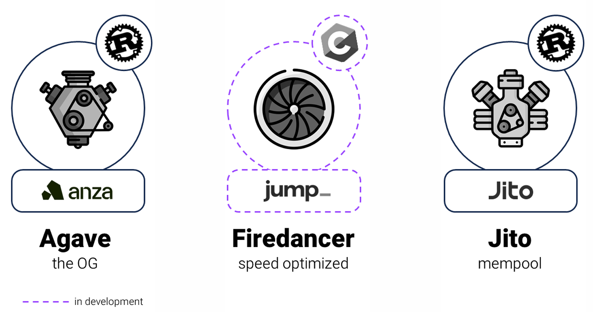
**Clients**  

Solana is a decentralized network of independently operated nodes that collectively maintain a unified ledger. Each node runs high-performance, open-source **validator client software**.  

### **Client Evolution**  
- **Original Client**:  
  - Launched as the **Solana Labs client** (Rust)  
  - Now called **Agave** (still Rust-based)  
- **Firedancer**:  
  - A **complete rewrite in C**, developed by Jump Trading  
  - Designed for **maximum performance**  
  - Expected to be the fastest validator client on any blockchain  

Client diversity remains a key priority for Solana’s development.

### Understanding Solana's Validator Clients: A Move Towards Diversity and Resilience

The Solana network is a high-performance blockchain platform supported by thousands of independent nodes that work in concert to maintain a single, unified ledger. Each of these nodes operates using software known as a "client." Initially, the network launched with a single validator client written in the Rust programming language, originally developed by Solana Labs and now known as the Agave client. Since its inception, a key priority for the Solana ecosystem has been to expand its client diversity, a goal that is being significantly advanced with the introduction of new clients like Firedancer.

#### The Critical Role of Client Diversity

Relying on a single validator client creates a potential single point of failure. If a bug or vulnerability exists in the dominant client's code, it could lead to network-wide disruptions or instability. By fostering a multi-client environment, where different client software is developed and maintained by independent teams, the network's overall resilience is enhanced. Should one client encounter an issue, the others can continue to operate, thereby minimizing the risk of a complete network outage.

#### Key Validator Clients on the Solana Network

**Agave:**
The original validator client for Solana was developed by Solana Labs. This Rust-based client is now managed by Anza and has been forked into a new repository called 'Agave'. This move was part of a broader strategy to support a multi-client ecosystem and distinguish the ongoing development by the Anza team from the original work by Solana Labs. The Agave client has undergone significant updates, with versions 2.0, 2.1, and 2.2 introducing numerous performance optimizations and new features to improve the network's robustness and efficiency.

**Firedancer:**
Developed by Jump Crypto, Firedancer is a completely new validator client built from the ground up in the C programming language. It is engineered to be the most performant validator client on any blockchain, with demonstrations showing it can process over 1 million transactions per second. Firedancer features a modular, tile-based architecture designed for high-performance and security, with distinct components for networking, execution, verification, and storage. Its development represents a significant step towards enhancing Solana's scalability and security.

**Jito-Solana:**
The Jito-Solana client, developed by Jito Labs, is a fork of the original Solana Labs client. It is specifically designed to optimize for Maximal Extractable Value (MEV) opportunities, providing validators with additional economic incentives. As of October 2023, the Jito client was being run by over 31% of Solana validators, showcasing the growing adoption of alternative clients.

**Frankendancer:**
To facilitate the rollout of Firedancer, a hybrid client known as Frankendancer is operational on the Solana mainnet. This client combines Firedancer's high-performance networking components with Agave's established code for execution and consensus. This allows for real-world testing and data collection on the mainnet in a controlled manner.

**Other Clients:**
The Solana ecosystem also includes other validator clients in various stages of development, such as:
*   **Sig:** A client written in the Zig programming language.
*   **Mithril:** A full node client developed in Golang, designed with lower hardware requirements.

This growing variety of validator clients underscores the Solana community's commitment to decentralization and network stability. By having multiple, independently developed clients, the Solana network is becoming more robust and less susceptible to issues that could arise from a single software implementation.

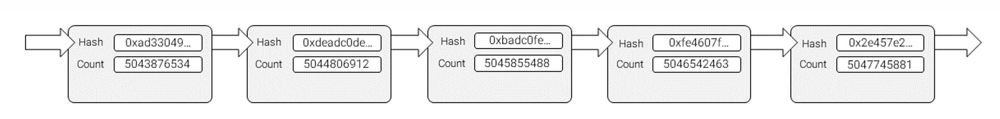
### Proof of History

Proof of History (PoH) is Solana’s cryptographic clock, providing a verifiable sequence of events and a trusted notion of time across the network. It reduces reliance on node-to-node communication by replacing coordination overhead with local computation.

In traditional blockchains, communication complexity increases with network size. Solana mitigates this by using PoH to pre-order transactions. Validators can commit blocks after just one round of voting, as the order and timing of events are already established.

PoH ensures:
- A verifiable sequence of transactions.
- That validators cannot produce blocks prematurely.
- Adherence to the leader schedule by requiring a minimum number of PoH ticks before block submission.

PoH is not a consensus mechanism. It works alongside Solana’s Proof of Stake (PoS) consensus to enhance throughput and reduce latency.

PoH is built on SHA-256 hashing, leveraging these properties:
- **Deterministic**: Same input → same output.
- **Fixed Size**: Output is always 256 bits.
- **Efficient**: Fast to compute for any input.
- **Preimage Resistance**: Infeasible to reverse hash to find input.
- **Avalanche Effect**: Small input change → vastly different hash.
- **Collision Resistance**: Infeasible to find two inputs with same hash.

PoH creates a chain by repeatedly hashing the previous output. Each hash serves as a timestamp, proving that a given event occurred in sequence. This enables a trustless, high-frequency timeline that underpins Solana’s scalability.
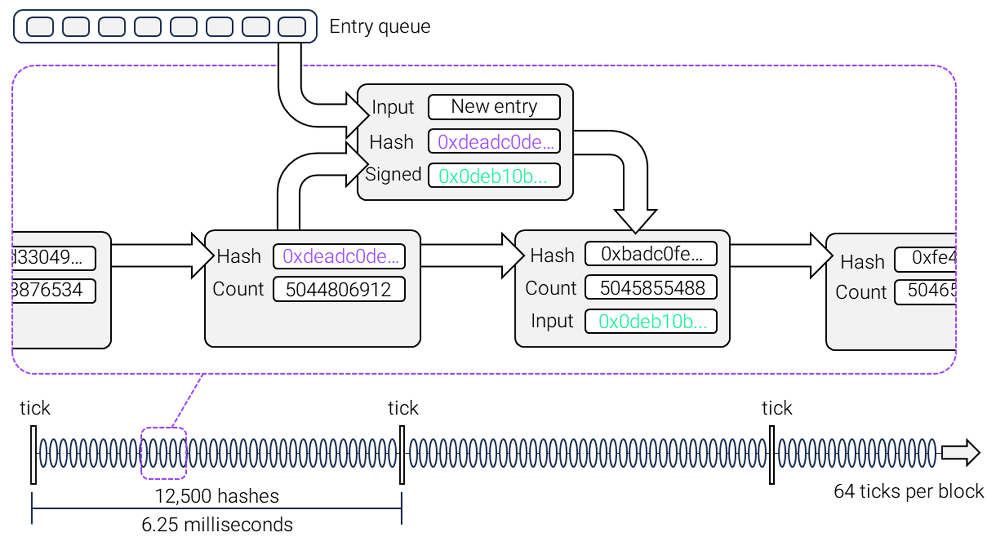
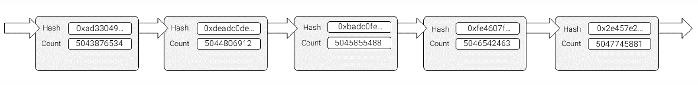
## **Proof of History Service in Validators**  

Each **validator client** runs a dedicated **Proof of History (PoH) service** that continually executes the **SHA-256 hash algorithm**, producing a **chain of hashes**.  

- **Hash Linking:** Each hash’s input is the output of the previous hash.  
- **Verifiable Delay Function (VDF):**  
  - Hashes must be generated **sequentially**.  
  - The result of future hashes **cannot be predicted** in advance.  
- **Time Proof:** If a PoH service produces 1,000 hashes, it is proof that the required time to compute them has elapsed.  

---

### **Properties and Performance**  

- Acts as a **“micro proof of work”** during a leader’s slot.  
- Difficult to **generate** but easy to **verify**:  
  - Verification is parallelized since all hash input/output pairs are broadcast to the network.  
- **CPU-bound:** Performance differences across high-end CPUs are small, and SHA-256 optimization is already near the upper limit — partly due to years of Bitcoin-related optimizations.  

---

### **Process During Block Production**  

1. **Input from Banking Stage:**  
   - The PoH service receives newly processed entries.  

2. **Hash Combination:**  
   - The *current PoH hash* is combined with a *hash of all transactions in the entry* to produce the **next PoH hash**.  

3. **Timestamp & Ordering:**  
   - This hash serves as a timestamp, recording the sequence of processed transactions.  

4. **High-Frequency Hashing:**  
   - A single block contains roughly **800,000 hashes**.  

5. **Ticks:**  
   - PoH stream also includes **“ticks”** — empty entries marking the leader’s liveness and the continued passage of time.  


   ## **Key Benefit of PoH**  

The primary benefit of **Proof of History (PoH)** is that it enforces strict adherence to the **leader schedule**, even if a block producer is **offline** (*delinquent*).  

- Prevents **malicious validators** from producing blocks **before** their designated turn.  

---

## **Ticks and Timing**  

- **Tick Interval:** Every **6.25 milliseconds**.  
- **Ticks per Block:** **64 ticks** per block.  
- **Block Time:** **400 milliseconds** total.  

---

## **Continuous Operation**  

- Validators run the **PoH clock** at all times, not just when they are leaders.  
- This clock is crucial for **synchronization** across the network, ensuring a unified, verifiable sequence of events.  

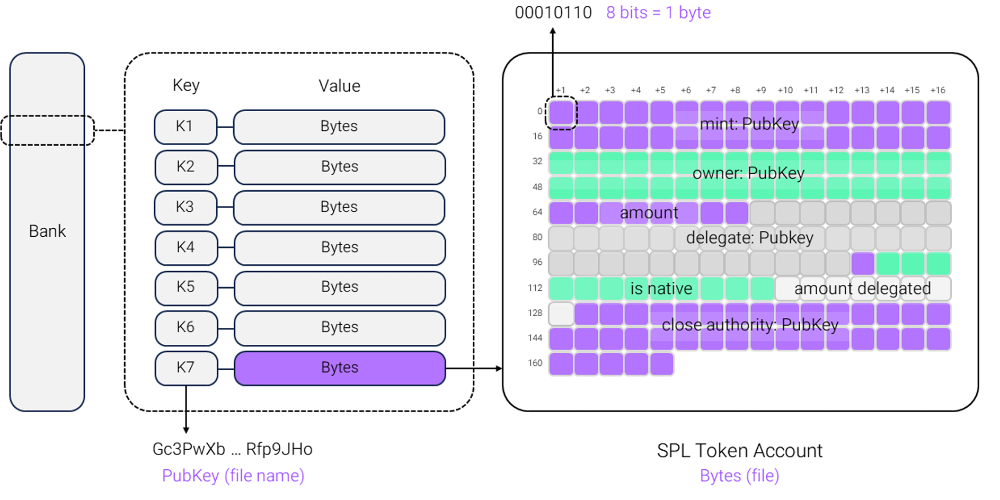


---

## **AccountsDB and Global State in Solana**

### **AccountsDB Overview**
- **Purpose:** Maintains the *global state* of the Solana blockchain.
- **Structure:**  
  - Backed by an **accounts database** stored both **in-memory** and **on disk**.  
  - Uses a **hashmap** as the account index, effectively acting as a **large key-value store**.  
    - **Key:** Account address.  
    - **Value:** Account data.
- **Scale:** Hundreds of millions of accounts exist today.  
- **Reason for Scale:** On Solana, *“everything is an account”*—including user info, token balances, and executable programs.

---

## **Types of Solana Accounts**

| **Account Type**          | **Description**                                                                                  | **Example** |
|---------------------------|--------------------------------------------------------------------------------------------------|-------------|
| **User Accounts**         | Accounts with a private key, typically generated by wallet software for a user.                 | Phantom or Solflare wallet account |
| **Data Accounts**         | Store persistent *state information*, such as token balances or NFT metadata.                   | SPL Token account storing 100 USDC |
| **Program Accounts**      | Contain **executable bytecode** (e.g., `.exe` on Windows or `.app` on macOS).                    | A custom DeFi protocol smart contract |
| **Native Program Accounts** | Pre-deployed Solana programs for core network functions.                                        | Vote Program, BPF Loader |

---

## **Program Behavior in Solana**
- **Immutable Code:** Program accounts store only executable logic; they do **not** change when run.
- **State Management:** Programs mutate the state of *other accounts*, never their own account data.
- **Benefit:** This *separation of code and state* enables optimizations unique to Solana, such as high parallelization.
- **Development:**
  - Primary language: **Rust** (safety + performance).
  - Additional SDKs: **TypeScript** and **Python** for frontend apps and API integrations.

---

## **Native Programs and Built-In Functionality**
- Provide essential network features without requiring custom deployment.
- Example: Token creation
  - Developers **do not** need to deploy new code to issue a token.
  - Instead, send instructions to the **SPL Token native program**, which configures an account to store token metadata.

---

## **Rent Mechanism**
- **Purpose:** Prevents *state bloat* by incentivizing closure of unused accounts.
- **Rent-Exempt Requirement:**  
  - A minimum SOL balance must be held in an account to keep it persistent in memory.  
  - This balance increases if the *size* of account data increases.
- **Rent Refund:**
  - If an account is closed, the rent-exempt SOL is returned to the owner.
  - **Example:**  
    - Token account rent-exempt amount: **0.002 SOL**.  
    - If a user transfers all tokens out and closes the account, they reclaim **0.002 SOL**.
- **Automation:** Many programs automatically close unused accounts to return rent.
- **Account Cleanup Tools:** Multiple applications exist to help users reclaim small balances from unused accounts.

---
## **Ownership Model**  

- **Purpose:** Enhances security by restricting which programs can modify an account’s data.  
- **Account Owner:**  
  - Every Solana account has an associated **program owner**.  
  - The owner governs the account and enforces rules/permissions.  
  - Only the owner program can modify the account’s data.  
- **Exception:**  
  - **Lamport Transfers:** Any program or user can increase an account's lamports (smallest SOL unit) balance, regardless of ownership.  

---

## **Storage of State**  

- **Immutable Programs:** Solana programs are read-only executable files and cannot store mutable state within themselves.  
- **State Storage via PDAs:**  
  - **Program Derived Addresses (PDAs):**  
    - Special accounts owned by a program, not tied to a user.  
    - Used for persisting state for programs.  
  - **Address Derivation:**  
    - Normal user accounts: Derived from Ed25519 public keys.  
    - PDAs: Derived from a combination of parameters (keywords, other account addresses) and the program’s ID.  
  - **Security Property:**  
    - PDAs exist **off-curve**—they don’t lie on the Ed25519 elliptic curve and have no private key.  
    - Only the owning program can generate valid signatures for a PDA.  
    - Guarantees that **only the program can modify the PDA’s state**.  

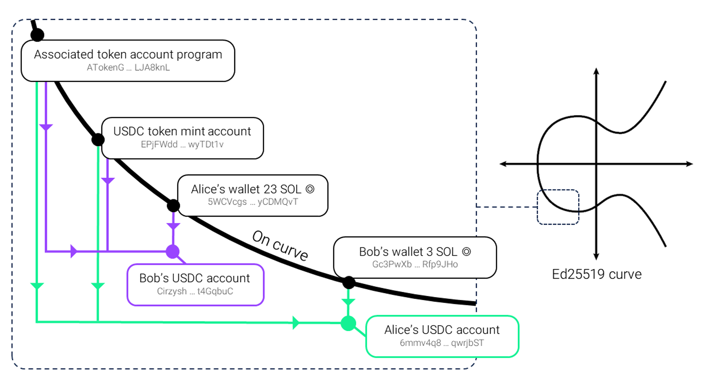

**Above**: Solana token accounts are specific examples of Program Derived Addresses (PDAs). They are used to hold tokens and live “off-curve.” The Associated Token Account (ATA) program ensures that each wallet can  only have one associated token account for each token type, providing a standardized way to manage token 
accounts.


## **Turbine: Block Propagation in Solana**  

### **From Banking Stage to Turbine**  
- After the **banking stage**, transactions are organized into **entries** and sent to the **Proof of History (PoH) stream** for timestamping.  
- The **block’s bank** is updated.  
- Entries are passed to **Turbine**, the block propagation system.  

---

### **Turbine Overview**  
- **Purpose:** Propagates the leader’s block to all validators quickly and efficiently.  
- **Inspiration:** Based on **BitTorrent**’s peer-to-peer distribution model.  
- **Goal:** Reduce communication overhead and minimize the amount of data a leader must send directly.  

---

### **Shredding Process**  
- Transactions are split into small packets called **shreds** via **shredding**.  
- **Shreds:**  
  - Comparable to video frames; individually useless but reconstructable into the full block.  
  - Sent between validators using **UDP**.  
  - Redundancy and reliability provided through **erasure coding**.  

---

### **Erasure Coding**  
- Polynomial-based **error detection and correction**.  
- Ensures the block is recoverable even if some shreds are missing due to network loss or malicious dropping.  
- **Forward Error Correction (FEC) Batches:**  
  - Default: **64 shreds** = 32 data shreds + 32 recovery shreds.  
  - Can recover from up to **50% packet loss** within a batch.  

---

### **Authentication & Integrity**  
- Each **64-shred batch** is **merkelized**:  
  - Merkle root is signed by the leader.  
  - Root is chained to the **previous batch’s root**.  
- This chained Merkle proof allows validators to securely obtain shreds from **any node** while ensuring verifiable authenticity and integrity.  

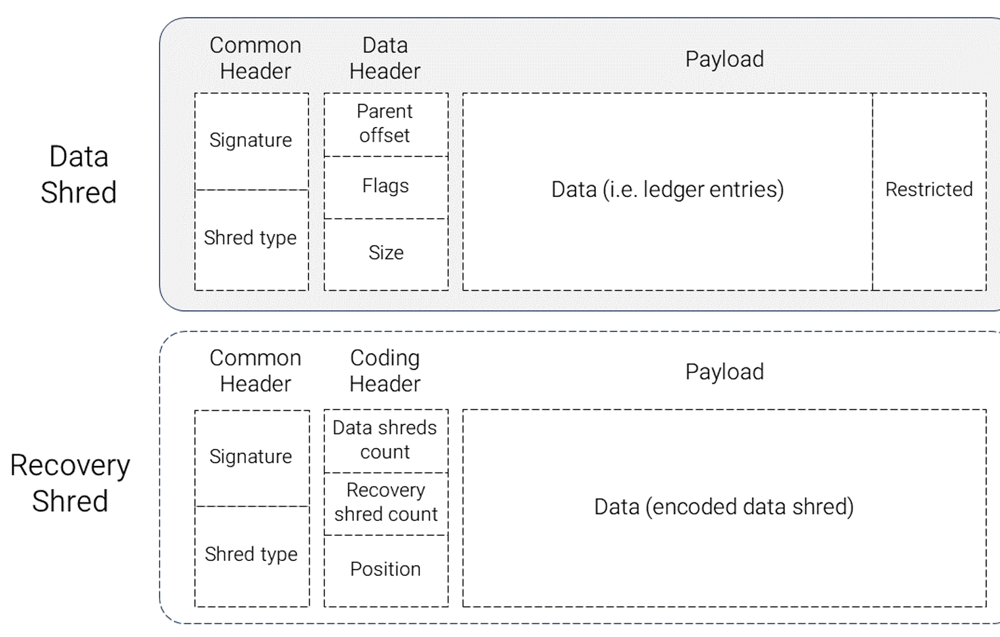

## **Turbine Tree Structure and Data Flow**  

- **Initial Broadcast:**  
  - The **leader** sends shreds to a **single root node**.  
  - The root node relays them to other validators.  
  - The designated root node **changes with each shred**.  

---

### **Validator Layering**  
- Validators are arranged into **layers**, forming the **Turbine Tree**.  
- **Placement by Stake:**  
  - Higher-stake validators are typically nearer the **top**.  
  - Lower-stake validators are positioned toward the **bottom**.  
- **Tree Depth:** Usually spans **2–3 hops** depending on active validator count.  

---

### **Rotation & Security**  
- **Tree order rotates** for every new shred batch to prevent targeted attacks or predictable relay paths.  

---

### **Load Distribution**  
- Primary objective: **reduce outbound data load** on the leader and root node.  
- Achieved via a **transmit-and-retransmit** system:  
  - Leader sends to a few nodes.  
  - Those nodes retransmit to others.  
  - Spreads network load and reduces strain on any single participant.  


  
  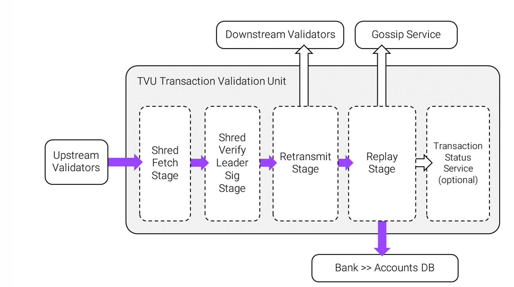

  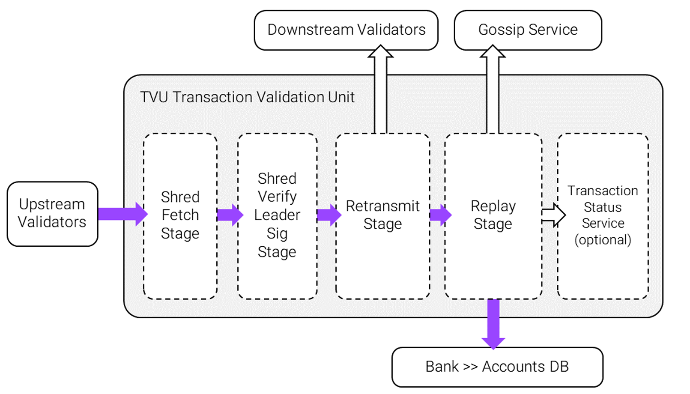


  # Transaction Validation Unit (TVU) Flow

Once a validator receives a new block from the leader via **Turbine**, it must:

1. **Validate all transactions** in the order dictated by **Proof of History (PoH)**.
2. **Update its local bank** with the results.

This work is handled by the **Transaction Validation Unit (TVU)** — the validator-side counterpart to the leader’s **Transaction Processing Unit (TPU)**. The TVU is responsible for processing incoming shreds and validating entire blocks.

## TVU Stages

1. **Shred Fetch Stage** — Receives shreds over Turbine.
2. **Reassembly & Replay** — Reconstructs the full block from shreds and replays all transactions.
3. **PoH Verification** — Validates PoH hashes in parallel to ensure transaction order integrity.
4. **State Update** — Applies all verified transactions to the local bank.

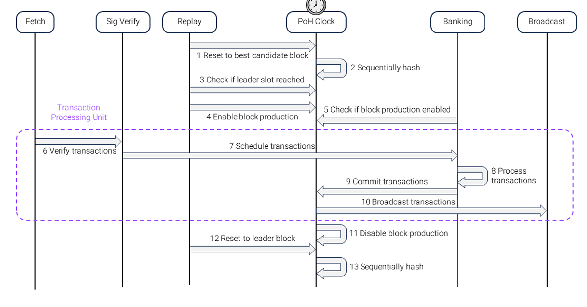
Above: the replay stage is responsible for switching the validator into 
leader mode and beginning block production. 

# Additional TVU Stages

## Shred Verify Leader Signature Stage

* Performs multiple sanity checks on incoming shreds.
* Most critical check: verifying the **leader’s signature** to confirm the shreds originated from the correct leader.

## Retransmit Stage

* Forwards validated shreds to appropriate downstream validators to continue network propagation.

## Replay Stage (Block Validation)

* Replays each transaction **exactly** and **in the correct PoH order** while updating the local bank.
* Functionally equivalent to the **banking stage** in the TPU.
* Considered the **core block validation stage**.
* Operates as a **single-threaded process loop** that coordinates:

  * Voting
  * Resetting the PoH clock
  * Switching banks


## **Tower BFT (Solana’s Consensus Mechanism)**  

- **Algorithm Basis:** Custom implementation of **Practical Byzantine Fault Tolerance (PBFT)**, adapted for Solana as **Tower BFT**.  
- **Byzantine Assumption:** Designed to tolerate a fraction of **malicious or faulty nodes** in the validator set.  

---

### **Key Differentiator: Proof of History Integration**  
- **Traditional PBFT:** Requires multiple communication rounds to agree on transaction order.  
- **Tower BFT in Solana:**  
  - Uses the **synchronized PoH clock** to establish a pre-agreed timestamp/ordering of events.  
  - Eliminates the need for heavy multi-round messaging.  
  - **Result:** Lower latency and reduced consensus overhead.  

---

### **Voting Process and Incentives**  
- **Participation:** Validators submit **vote transactions** for blocks they deem valid.  
- **Vote Criteria:** Block must be free of errors such as **double spends** or **invalid signatures**.  
- **Fee Requirement:** Votes incur a **transaction fee** and are processed alongside normal transactions.  
- **Rewards:**  
  - Correct votes earn validators a **credit**.  
  - Credits translate into staking rewards.  
  - Encourages voting for the **heaviest fork** (one most likely to be finalized).  

---

### **Vote vs. Non-Vote Transactions**  
- **Vote Transactions:** Validator consensus messages, prioritized to ensure network finality.  
- **Non-Vote Transactions:** User and application-level operations.  
- **Execution Separation:** Handled by **dedicated voting threads** (2 out of 6 total TPU threads).  

---

### **Forks in Solana**  
- **Reason:** Solana does **not** stall block production while waiting for global agreement.  
- **Effect:**  
  - Multiple blocks may connect to the **same parent block**, creating forks.  
  - Fork resolution handled by **voting and fork selection rules** under Tower BFT.  


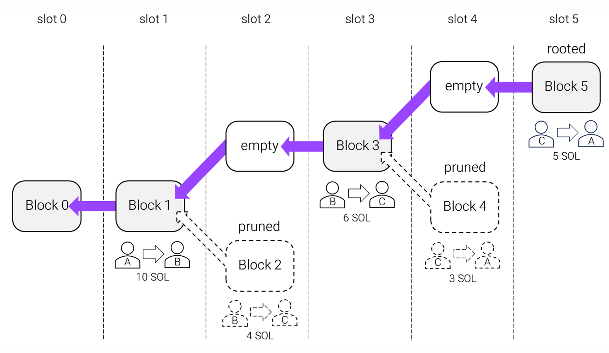

Above: once a block becomes rooted, account updates from earlier banks 
that are not ancestors of the finalized bank are pruned


# Forks and Consensus in Solana

* Validators may encounter **competing forks** — different chains of blocks produced by different leaders.
* Validators must **vote** on these forks and rely on Solana’s consensus algorithm to decide which fork to adopt.
* Only one fork will ultimately be **finalized**; blocks from discarded forks are abandoned.

## Leader Slots and Fork Limits

* Each slot has a **predetermined leader**.
* Only the leader’s block for that slot will be accepted — no two blocks can occupy the same slot.
* As a result, the set of possible forks is constrained to a **“there / not there” skip list**, where forks can only emerge at the boundaries between leader rotation slots.


## **Fork Commitment, Slot Skips, and Finalization in Solana**  

---

### **Fork Commitment & Lockouts**  
- Once a validator **votes for a fork**, it is bound to that fork until its **lockout period** expires.  
- Lockout ensures validators maintain consistency and prevents rapid switching between forks.  

---

### **Skipped Slots & Causes**  
- **Skip Rate:** Typically **2%–10%** of slots produce no block.  
- **Primary Cause:** Forks from competing blocks linked to the same parent.  
- **Other Causes:**  
  - Start of a **new epoch** (leader schedule transition)  
  - **Offline leader** failing to produce a block  
  - **Invalid block** generation by the leader  

---

### **Bank Finalization & State Management**  
- Each block has an associated **bank** that contains its state.  
- **Finalization Process:**  
  1. When a bank is finalized, account updates from it and its ancestors are **flushed to disk**.  
  2. Account updates from earlier, **non-ancestor banks** are **pruned**.  
  3. This enables **efficient state management** while tracking multiple possible forks.  

---

### **Transaction Status Stages**  
1. **Processed:** Transaction is in a produced block.  
2. **Confirmed:** Block has **two-thirds supermajority votes**.  
3. **Finalized:** More than **31 blocks** have been built on top of the transaction’s block.  

---

### **Reliability Note**  
- In Solana’s history, **no optimistically confirmed block** has ever failed to reach **finalization**.  


## **Solana Gossip Network**  

---

### **Role in the Network**  
- Serves as the **control plane** of Solana.  
- **Control Plane vs. Data Plane:**  
  - *Data Plane* handles transaction flows.  
  - *Control Plane* disseminates **metadata** about the network state, including:  
    - Validator/RPC contact info  
    - Ledger height  
    - Vote information  
- Enables **decentralized state awareness** without relying on a central source.  

---

### **Node Discovery & Communication**  
- Without gossip, validators and RPC nodes would not know which **addresses and ports** are open across services.  
- Allows **new nodes** to discover peers and join the network efficiently.  

---

### **Protocol & Broadcast Model**  
- **Design:** Peer-to-peer communication using a **tree broadcast** approach based on a modified **PlumTree** algorithm.  
- **Purpose:** Ensures fast, efficient, and redundant information propagation through the network.  
- Operates largely **independently** from other validator components.  

---

### **Operation & Message Characteristics**  
- Validators and RPCs share **signed data objects** every **0.1 seconds** over **UDP**.  
- **Message Constraints:**  
  - Size must be ≤ **1280 bytes** (*packet struct* in the codebase).  
  - Broadcast in small, frequent updates to maintain consistency across nodes.  

---

### **Gossip Records**  
- Represent the actual **data objects** exchanged.  
- **Properties:** Signed, versioned, timestamped for integrity and freshness.  
- **Types:** ~10 record types, each serving different purposes (e.g., vote info, ledger updates, contact metadata).  

## **Solana Archive Storage (Warehouse Nodes)**  

---

### **Purpose**  
- Ensures **long-term availability** of full transaction history for the network.  
- Supports **data replay**, **analytics**, and **historical queries**.  

---

### **Operators**  
- Managed by:  
  - **Professional RPC service providers**  
  - **Solana Foundation**  
  - Other **ecosystem participants** committed to history preservation  

---

### **Archive Types**  
1. **Ledger Archive**  
   - Contains **raw ledger data** and **AccountsDB snapshots**.  
   - Enables **full state replay from scratch** for node bootstrap or forensic analysis.  
2. **Google Bigtable Instance**  
   - Stores processed **block data** for fast historical queries and indexing.  


   ----

   ## **Solana Inflation & Staking Rewards**  

---

### **Inflation Mechanism**  
- New **SOL tokens** are generated **each epoch** to fund staking rewards.  
- Causes a **wealth transfer**:  
  - Non-stakers lose relative network share.  
  - Stakers gain proportional rewards.  
- **Inflation schedule:**  
  - Started (early 2021) at **8%** annual rate.  
  - Decreases by **15% per year** until stabilizing at **1.5% long-term**.  

---

### **Staking Participation**  
- Any SOL holder can stake to:  
  - **Earn rewards**.  
  - **Help secure** the network.  
- Staking involves assigning tokens to **one or more validators**.  

---

### **Delegation**  
- **Delegating:** Assigning stake to a validator as a sign of trust.  
- Tokens remain under the owner’s control — validator **cannot spend or take ownership**.  
- All staking, unstaking, and redelegation actions take effect **at the start of the next epoch**.  


**Solana Validator Voting, Credits, and Inflation Rewards**

---

### **Voting Process & Costs**
- **Voting Mechanics:**
  - Validators submit vote transactions for each slot; only accurate, successful votes earn *credits*.
  - Each vote transaction costs **0.000005 SOL**, with *no priority fee* required.
- **Cost Structure:**
  - Voting expenses typically total about **1 SOL per day per validator**—the main ongoing cost of validation.

---

### **Earning Credits**
- *During an epoch*, validators accumulate credits for successful votes.
- Credits measure *participation* and *contribute to reward calculation* at epoch end.
- Example:  
  - *Top validators:* Successfully vote on ~90% of slots.
  - *Average validator:* ~80% slot voting success (~345,600 credits per 432,000-slot epoch).
  - *Skipped slots* (no block produced): 2–10% of slots; cannot be voted on and yield no credits.

---

### **Inflation Reward Distribution**
- **Reward Pooling:**
  - Total epoch inflation is divided by credits earned across all validators.
  - A validator’s share = `(validator_credits / total_credits)`, further weighted by **stake amount**.
- **Reward Formula:**
  - *If a validator has 1% of total stake and average credits, they earn ≈1% of inflation pot.*
  - *Above-average credits → higher rewards; below-average credits → lower rewards.*

---

### **Factors Affecting Validator & Staker Returns**
- **Voting Performance:** Higher voting/credit rate directly increases SOL rewards.
- **Commission Rate:** Validators set a commission, reducing delegator returns.
- **Delinquency:** Being offline or out-of-sync (delinquent) reduces both credits and rewards.
- **Block Production:** Validators acting as slot leaders receive additional **block rewards**.

---

### **Key Points**
- *Validator returns (APY) vary based on voting performance, commission rate, and uptime.*
- *Main validator cost is from voting transactions, not hardware or entry fees.*
- *Delegators should consider performance and commission when selecting validators.*


```rust
 Price of LST = (total staked SOL in pool * price of SOL) / total LST minted
``` 

# Solana Staking and Rewards System

## Block Rewards Distribution

Block rewards are structured as follows:

- **50%** of base fees
- **50%** of priority fees

The remaining fees are burned.

### Key Characteristics:
- **Exclusive to block producer**: Only the validator who produced the block receives these rewards
- **Instant distribution**: Unlike staking rewards (distributed per epoch), block rewards are immediately credited to the validator's identity account upon block production

## Liquid Staking

Liquid staking has emerged as a popular alternative to native staking, offering enhanced capital efficiency.

### How It Works:

1. **Token Exchange**: Participants stake their SOL and receive a Liquid Staking Token (LST) or Liquid Staking Derivative (LSD)
2. **Pooled Delegation**: SOL is typically staked in a pool that delegates tokens across multiple validators
3. **Ownership Representation**: LST tokens represent the user's proportional share of the staked SOL

### Benefits:

- **Liquidity**: LST tokens can be freely traded
- **DeFi Integration**: Tokens can be utilized across Solana's DeFi ecosystem
- **Continuous Rewards**: Users continue earning staking rewards while maintaining liquidity

### Reward Mechanisms:

| Staking Type | Reward Distribution |
|--------------|-------------------|
| **Native Staking** | Stakers directly accrue additional SOL over time |
| **Liquid Staking** | Rewards are reinvested into the pool, increasing the LST's fair value |

### Price Stability:

The LST price remains rational through:
- **Redemption mechanisms** for converting LSTs back to underlying staked SOL
- **Arbitrage traders** who capitalize on price discrepancies


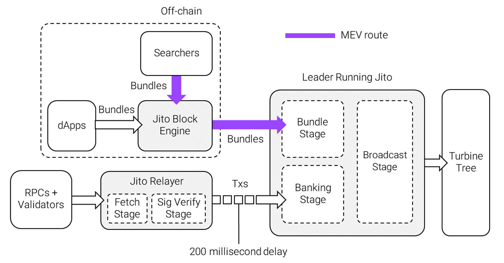

# Jito

**Overview**

* **Client lineage:** Fork of the original **Agave** client
* **Adoption:** > **80% of stake** on Solana uses the Jito validator client (as of writing)
* **Core feature:** **Out-of-protocol blockspace auction** that supplies validators with additional economic incentives via **tips**
* **Routing behavior:** When a leader runs the Jito client, their transactions are **initially routed to the Jito-Relayer**

**Key points**

* **Out-of-protocol auction**

  * Operates outside on-chain consensus
  * Matches blockspace with paying transactions/tips to increase validator revenue
* **Economic impact**

  * Provides direct monetary incentives (tips) to validators
  * Primary driver of adoption among validators
* **Operational flow**

  * Leader → *Jito-Relayer* (initial handling of transactions) → Inclusion path determined by relayer/leader logic

**Reference table**

| Aspect                   | Details                                        |
| ------------------------ | ---------------------------------------------- |
| Client origin            | Fork of Agave                                  |
| Stake using client       | >80% (as of writing)                           |
| Auction type             | Out-of-protocol blockspace auction             |
| Primary incentive        | Tips to validators                             |
| Initial transaction path | Sent to **Jito-Relayer** when leader uses Jito |
| Main adoption reason     | Extra economic incentives (tips)               |


## **Jito Relayer & Blockspace Auctions**  

---

### **Relayer Functionality**  
- **Purpose:** Acts as a **transaction proxy router** for Solana leaders.  
- **Network Transparency:**  
  - Other nodes are **unaware** of the relayer’s existence.  
  - Transactions are sent to the leader’s advertised **`ingress_socket`** over the gossip network, but actually reach the relayer.  
- **Speed Bump:**  
  - Relayer **holds transactions for 200ms** before forwarding to the leader.  
  - This delay creates a short window to run **blockspace auctions**.  
- **Forwarding Logic:** After 200ms, transactions are **released regardless** of auction results.  

---

### **Blockspace Auctions**  
- **Execution Venue:** Conducted **off-chain** via the **Jito Block Engine**.  
- **Participants:** Searchers and applications.  
- **Bundles:**  
  - Groups of **atomically executed transactions**.  
  - Often time-sensitive (e.g., arbitrage, liquidation opportunities).  
- **Fees:**  
  - **5% fee** on all tips paid to Jito.  
  - Minimum tip: **10,000 lamports**.  

---

### **Tips & Fee Model**  
- Tips are **out-of-protocol** — not part of Solana’s in-protocol **base** or **priority** fee system.  
- Legacy: Jito formerly ran a **canonical out-of-protocol mempool service**, now **deprecated**.  