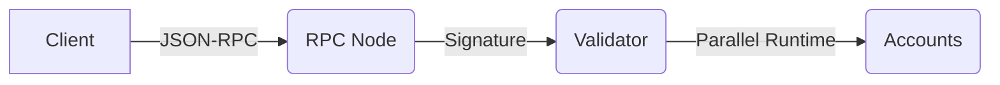

# 🦀 **Solana Programming Model – Workshop Deck**

---

## 1️⃣ 🛠️ **Dev Environment Setup**
- **Install Solana CLI**
  ```bash
  sh -c "$(curl -sSfL https://release.solana.com/v1.18.0/install)"
  solana --version
  ```
- **Add Rust**
  ```bash
  curl --proto '=https' --tlsv1.2 -sSf https://sh.rustup.rs | sh
  source ~/.cargo/env
  ```
- **Configure Keypair & Cluster**
  ```bash
  solana-keygen new                # local keypair
  solana config set --url devnet   # devnet RPC
  solana airdrop 2                 # free SOL
  ```
- **Scaffold (React + Rust)**
  ```bash
  git clone https://github.com/solana-labs/dapp-scaffold
  cd dapp-scaffold
  yarn && yarn start
  ```
  *Bootstraps Phantom wallet, dev-net faucet, and minimal client.*

---

## 2️⃣ 🗂️ **Accounts 101**
| Field | Value | Emoji |
|-------|-------|-------|
| **Address** | 32-byte Pubkey | 🔑 |
| **Owner** | Program that controls writes | 🧑‍💻 |
| **Data** | Binary blob (max **10 MB**) | 🗜️ |
| **Lamports** | Balance in **lamports** (1 SOL = 1e9) | 💰 |
| **Rent** | Pay **~0.002 SOL / MB / year** | 🏠 |
| **Executable** | Code vs. data | ⚙️ |

> 📝 *Everything in Solana is an account: programs, tokens, user data, even SOL itself.*

---

## 3️⃣ 🔄 **Transaction Flow**

- **Transaction** = array of **Instructions**  
- **Instruction** = program_id + accounts + data  
- **Accounts** flagged `is_signer` / `is_writable`  

---

## 4️⃣ 🧩 **Program Derived Address (PDA)**
- **Definition** *An account **without a private key** deterministically derived from seeds + program_id.*
- **Syntax (Rust)**
  ```rust
  let (pda, bump) = Pubkey::find_program_address(
      &[b"escrow", user.as_ref(), id.to_le_bytes().as_ref()],
      &program_id,
  );
  ```
- **Benefits**
  1. Predictable lookup
  2. Program can sign via **CPI invoke_signed**
  3. Avoids 32 random bytes
- **Example: Associated Token Account (ATA)**
  ```typescript
  const ata = await getAssociatedTokenAddress(mint, wallet.publicKey);
  ```
  Seeds: `[wallet, token_program, mint]`

---

## 5️⃣ 🪙 **Token Program Deep-Dive**
### **Account Types**
- **Mint** – global supply / decimals ❄️  
- **Token Account** – user balance 🧾  
- **ATA** – canonical token account per wallet 🪄

### **Create Your Own Token (CLI)**
```bash
spl-token create-token                 # mint
spl-token create-account <TOKEN_MINT>  # token account
spl-token mint <TOKEN_MINT> 1000       # supply
```

### **Code Snippet (Rust CPI)**
```rust
invoke(
    &spl_token::instruction::transfer(
        &token_program,
        &source,
        &dest,
        &authority,
        &[],
        amount,
    )?,
    &[source, dest, authority],
)?;
```

---

## 6️⃣ 🏗️ **Solana Program Library (SPL)**
| Program | Purpose | Link |
|---|---|---|
| **spl-token** | Fungible & NFT standard | 📎 |
| **spl-associated-token-account** | ATA creation | 📎 |
| **spl-memo** | Attach text to tx | 📝 |
| **serum-dex** | Central-limit order book | 📈 |
| **token-swap** | AMM curve | 🔄 |
| **lending** | Multi-asset borrow/lend | 🏦 |

---

## 7️⃣ 🧪 **Dev Workflow**
1. **Write Rust Program**
   - `lib.rs`
   - Entry point: `process_instruction`
2. **Build & Deploy**
   ```bash
   cargo build-sbf
   solana program deploy target/deploy/my_program.so
   ```
3. **Generate IDL with Anchor (optional)**
   ```bash
   anchor build
   anchor deploy
   ```
4. **Interact via JS/TS**
   ```typescript
   const tx = new Transaction().add(
     new TransactionInstruction({
       keys: [{ pubkey: pda, isSigner: false, isWritable: true }],
       programId,
       data: Buffer.from([...]),
     })
   );
   await connection.sendTransaction(tx, [payer]);
   ```

---

## 8️⃣ ⚡ **Parallelism & Performance**
- **Runtime Rules**
  - 200 k compute units per instruction  
  - **4** CPI depth  
  - **30 accounts max** (UDP frame limit)  
- **Parallel Processing**
  - Non-overlapping writable accounts → **simultaneous execution**  
  - Separate DEX markets for BTC/USDC & SOL/USDC → **no lock contention**

---

## 9️⃣ 🔐 **Security Checklist**
```text
✅ Verify account ownership (token_program, system_program, etc.)
✅ Check seeds & bump for PDAs
✅ Validate signer keys
✅ Reject duplicate accounts
✅ Use constant-time comparisons
```
> Most hacks stem from **missing input validation**.

---

## 🔟 🎲 **Randomness & Off-chain Cranks**
- **No native VRF**  
  - **Commit-reveal**: hash off-chain → reveal later  
  - **Pyth / Switchboard** for price feeds  
- **Crank Example**
  ```typescript
  // pseudo cron service
  while (true) {
    const pending = await program.account.pending.all();
    for (const p of pending) {
      await program.methods.process().accounts({ ... }).rpc();
    }
    await sleep(5000);
  }
  ```

---

## 🧰 **Toolbox Quick-Refs**
| Tool | Purpose | Command |
|---|---|---|
| **Phantom** | Browser wallet | chrome extension 🦊 |
| **Solana Explorer** | Tx & account lookup | https://explorer.solana.com |
| **Solscan** | Rich analytics | https://solscan.io |
| **Anchor CLI** | Framework & IDL | `anchor init my-dapp` |
| **Amman** | Local validator | `npx amman-validator` |

---

## 📚 **Resources & Next Steps**
- **Docs**  
  - https://docs.solana.com  
  - https://project-serum.github.io/anchor  
- **Community**  
  - Discord: `#hackathon-support`  
  - Weekly **Office Hours** (Twitch)  
- **Template Repos**  
  - Rust only: `solana-program-library/token`  
  - React + Rust: `solana-labs/dapp-scaffold`