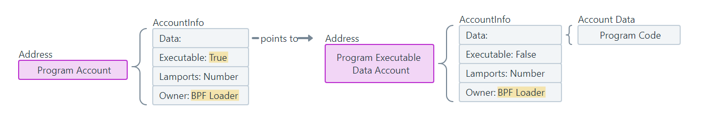
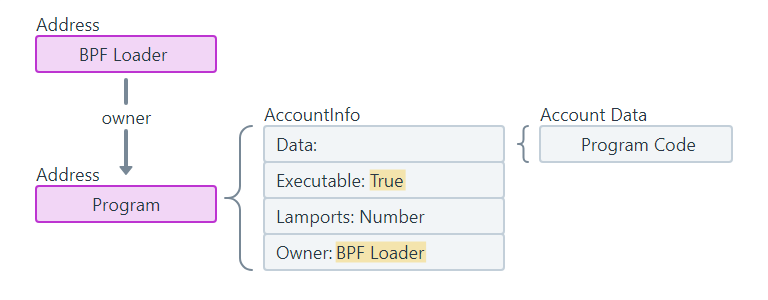

### Program Account [#](https://solana.com/docs/core/accounts#program-account)

When new programs are [deployed](https://github.com/solana-labs/solana/blob/27eff8408b7223bb3c4ab70523f8a8dca3ca6645/programs/bpf_loader/src/lib.rs#L498) on Solana, technically three separate accounts are created:

-   **Program Account**: The main account representing an on-chain program. This account stores the address of an executable data account (which stores the compiled program code) and the update authority for the program (address authorized to make changes to the program).
-   **Program Executable Data Account**: An account that contains the executable byte code of the program.
-   **Buffer Account**: A temporary account that stores byte code while a program is being actively deployed or upgraded. Once the process is complete, the data is transferred to the Program Executable Data Account and the buffer account is closed.

For example, here are links to the Solana Explorer for the Token Extensions [Program Account](https://explorer.solana.com/address/TokenzQdBNbLqP5VEhdkAS6EPFLC1PHnBqCXEpPxuEb) and its corresponding [Program Executable Data Account](https://explorer.solana.com/address/DoU57AYuPFu2QU514RktNPG22QhApEjnKxnBcu4BHDTY).






```
The address of the "Program Account" is commonly referred to as the “Program ID”, which is used to invoke the program.
```