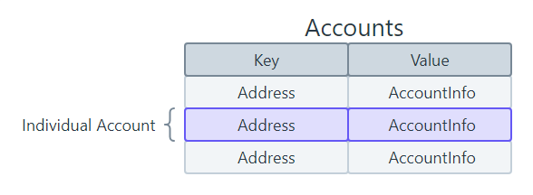
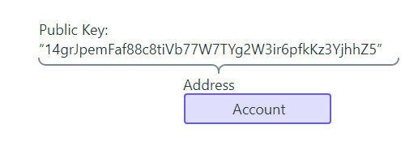

On Solana, all data is stored in what are referred to as "accounts”. The way data is organized on Solana resembles a key-value store, where each entry in the database is called an "account".

Key Points [#](https://solana.com/docs/core/accounts#key-points)
----------------------------------------------------------------

-   Accounts can store up to 10MB of data, which can consist of either executable program code or program state.

-   Accounts require a rent deposit in SOL, proportional to the amount of data stored, which is fully refundable when the account is closed.

-   Every account has a program "owner". Only the program that owns an account can modify its data or deduct its lamport balance. However, anyone can increase the balance.

-   Programs (smart contracts) are stateless accounts that store executable code.

-   Data accounts are created by programs to store and manage program state.

-   Native programs are built-in programs included with the Solana runtime.

-   Sysvar accounts are special accounts that store network cluster state.
-   
----------

Each account is identifiable by its unique address, represented as 32 bytes in the format of an Ed25519 PublicKey. You can think of the address as the unique identifier for the account

