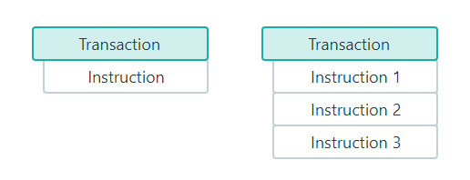

Below are key details about how transactions are executed:

-   Execution Order: If a transaction includes multiple instructions, the instructions are processed in the order they are added to the transaction.
-   Atomicity: A transaction is atomic, meaning it either fully completes with all instructions successfully processed, or fails altogether. If any instruction within the transaction fails, none of the instructions are executed.
-   

Key Points [#](https://solana.com/docs/core/transactions#key-points)
--------------------------------------------------------------------

-   Solana transactions consist of instructions that interact with various programs on the network, where each instruction represents a specific operation.

-   Each instruction specifies the program to execute the instruction, the accounts required by the instruction, and the data required for the instruction's execution.

-   Instructions within a transaction are processed in the order they are listed.

-   Transactions are atomic, meaning either all instructions process successfully, or the entire transaction fails.

-   The maximum size of a transaction is 1232 bytes.