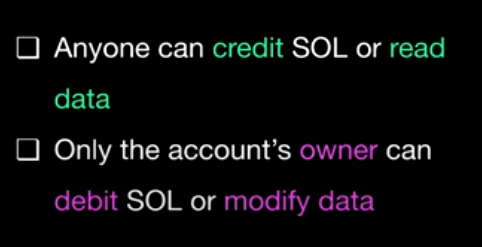
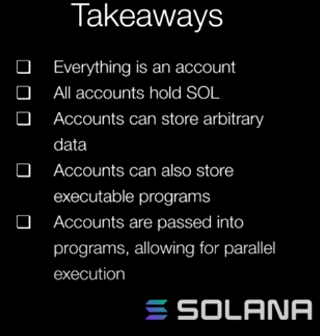
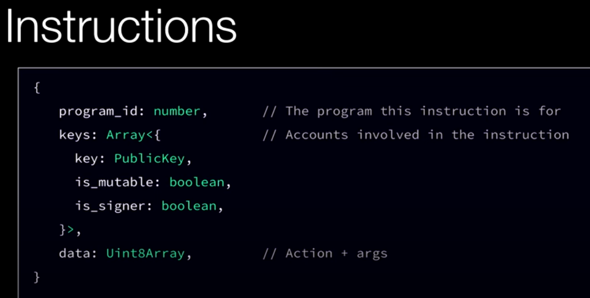
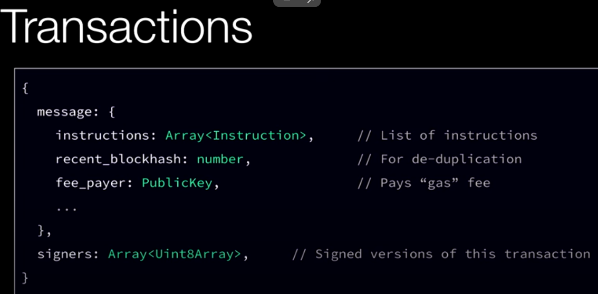

# Solana Workshop Breakdown

## Solana Network Overview

* **Technical Advantages:**
    * Fast confirmation times (approximately 400 milliseconds).
    * Low transaction fees (around 5,000 lamports per signature).
* **Network Operations:**
    * Global network of 25,000+ validators.
    * Validator leader receives and packs transactions into blocks.
    * Turbine protocol propagates blocks.
    * Parallel transaction execution.
    * Proof of History enhances speed.

## Solana Programming Model

* **Accounts:**
    * Fundamental units, like files in an operating system.
    * Unique 256-bit addresses.
    * Hold SOL balance (in lamports).
    * Store arbitrary data (raw bytes).
    * Data storage cost covered by rent.
    * Permissionless crediting and reading.
    * Owner-controlled debiting and modification.

* **Programs (Smart Contracts):**
    * Special accounts with executable flag set to true.
    * Contain eBPF bytecode.
    * Typically written in Rust, C, or C++.
    * Stateless, reading and writing data to other accounts.
    * Execute instructions.
    * Cross-program invocation (CPI) for inter-program communication.

## Solana Instructions and Transactions

* **Instructions:**
    * Specify program ID, involved accounts (keys), and data (raw bytes).
    * Facilitate parallel execution.
* **Transactions:**
    * Bundles of instructions.
    * Include recent block hash, fee payer address, and signatures.
    * Atomic execution (all or nothing).

## Transaction Lifecycle

1. Client builds instructions and transaction.
2. Client sends transaction to RPC.
3. RPC forwards transaction to validators.
4. Validators execute instructions using Solana runtime.
5. Instructions call specific programs.
6. Programs update relevant accounts.

## Tokens on Solana

* **Three Core Programs:**
    * Token Program (creates mints).
    * Associated Token Program (manages ATAs).
    * Metadata Program (stores token metadata).
* **Mints:**
    * Accounts controlling token balance.
    * Analogous to government mints.
* **Associated Token Accounts (ATAs):**
    * Hold tokens owned by a wallet.
    * Unique ownership relationship.
* **Metadata Accounts:**
    * Store token metadata (name, image, symbol).
* **Creating SPL Tokens:**
    * Create mint account.
    * Initialize mint.
    * Create ATA.
    * Mint tokens to ATA.

## NFTs on Solana

* **Specialized SPL Tokens:**
    * Zero decimal places.
    * Supply of one.
    * Customizable metadata.
* **Master Edition:**
    * Stores specific metadata.
* **Collection:**
    * NFT grouping.

## Account Structures

* **Mint Accounts:**
    * Decimals, initialization status, supply, mint authority, freeze authority.
* **Associated Token Accounts (ATAs):**
    * Derived PDA based on user's wallet, token program, and mint address.
    * Stores balance.
* **Metadata Accounts:**
    * Derived PDA based on "metadata", metadata program, and mint address.
    * Stores title, symbol, URI, creators.

