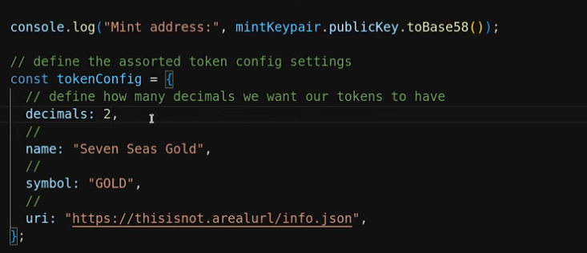

## Solana Workshop 

**Agenda:**

1. Solana Network Overview (Technical Advantages & Architecture)
2. Solana Programming Model
3. Solana Program Instructions and Transactions
4. Building Solana Transactions (Demos with TypeScript/JavaScript)
5. Tokens on Solana (SPL Tokens, NFTs, and Metadata)
6. Workshop Challenge

### II. Solana Network Overview

**Technical Advantages:**

* **Fast Confirmation Times:** ~400 milliseconds network validation.
* **Low Transaction Fees:** ~5,000 lamports per signature.  (1 SOL ≈ 1 billion lamports)
* **Global Distribution:** 25,000+ voting validators worldwide.

**Network Architecture:**

1. **Validator Leader:** Receives and packs transactions into blocks.
2. **Block Propagation:** Blocks are propagated across the network via Turbine.
3. **Parallel Execution:** Stateless transactions enable parallel processing, leading to faster confirmation times.
4. **Proof of History:**  A core innovation contributing to Solana's speed.

**Key Takeaways:**

* Fast confirmation times
* Low transaction fees
* Parallel execution of programs and transactions
* Ideal for high-performance applications

### III. Solana Programming Model

**1. Accounts:**

* Fundamental building blocks (like files in an OS).
* Unique 256-bit addresses.
* Hold SOL balance (in lamports).
* Store arbitrary data (raw bytes).
* Data storage cost is paid via "rent."

**Account Permissions:**

* **Permissionless:** Crediting SOL, reading data.
* **Owner Only:** Debiting SOL, modifying data.

**Account Structure:**

| Field        | Description                                     |
|-------------|-------------------------------------------------|
| Key         | Account address (public key)                   |
| Lamports    | SOL balance (smallest unit)                     |
| Data        | Raw bytes (u8 array)                          |
| Executable | Boolean (true for programs, false for data)      |
| Owner       | Program owning the account                      |

**2. Programs (Smart Contracts):**

* Special type of account (executable flag = true).
* Contain eBPF bytecode.
* Typically written in Rust (also C/C++, with helper libraries for Python and others).
* Stateless: Read and write data to other accounts, not themselves.
* Execute instructions.
* Communicate via Cross-Program Invocation (CPI).

**Key Takeaways (Accounts & Programs):**

* Everything on Solana is an account.
* All accounts hold a SOL balance.
* Accounts can store arbitrary data and executable programs.
* Parallel execution is enabled by passing accounts into programs.

### IV. Solana Instructions and Transactions

**1. Instructions:**

* **Structure:**
    * `programId`: Program executing the instruction.
    * `keys`: Array of accounts involved.
    * `data`: Raw bytes sent to the program.

**2. Transactions:**

* **Structure:**
    * `instructions`: Array of instructions.
    * `recentBlockhash`: Prevents duplication.
    * `feePayer`: Account paying transaction fees.
    * `signers`: Array of signing accounts (required for debiting SOL or modifying data).

**Key Takeaways (Transactions & Instructions):**

* Programs invoke instructions.
* Instructions are sent via transactions.
* Transactions are atomic (all or nothing).
* Transactions must be signed.

### V. Transaction Lifecycle

1. **Client (DApp):** Builds instructions and bundles them into a transaction.
2. **RPC Client:** Forwards the transaction to validators.
3. **Validators:** Execute instructions using the Solana runtime.
4. **Programs:** Execute code based on received instructions, updating relevant accounts.

https://github.com/solana-developers/pirate-bootcamp/blob/main/quest-1/scripts/1.simpleTransaction.ts

### VI. Tokens on Solana

**1. Token Types:**

* **SPL Tokens:** Solana Program Library tokens.
* **NFTs (Non-Fungible Tokens):**  SPL tokens with unique properties (0 decimals, supply of 1, customizable metadata).

**2. Programs Involved:**

* **Token Program:** Manages mint accounts (like a treasury/mint for currency).
* **Associated Token Program (ATA):** Manages unique ownership relationships between wallets and tokens.
* **Metadata Program (Metaplex):** Manages token metadata (name, symbol, image, etc.).

**3.  SPL Token Creation Process:**

1. Create a mint account.
2. Initialize the mint account.
3. Create an associated token account (ATA).
4. Mint tokens from the mint to the ATA.

**4. NFTs:**

* Decimals: 0
* Supply: 1
* Customizable Metadata:  Includes attributes, multiple images, etc.
* Master Edition: Account storing specific metadata.
* Collection: NFT grouping related NFTs.

**Key Takeaways (SPL Tokens):**

* No need to deploy a new program to create tokens.
* Token creation can be done in a single transaction.
* Related accounts (mint, ATA, metadata) describe and manage tokens.

### VII. Workshop Challenge

* Create an NFT collection of 32 unique pirate ship NFTs for the 7even C’s game.
* Experiment with IPFS and Arweave storage for NFT metadata.
* Create three additional SPL tokens: Gold, Rum, and Cannons.
