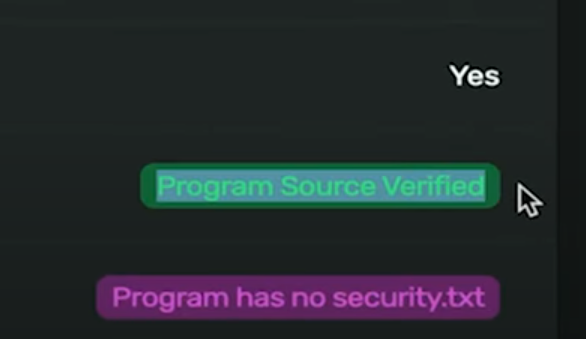
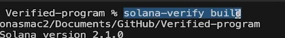

**Verified Builds Overview**  


- **Purpose**: Verify that on-chain programs match their claimed source code.  
- **Benefits**:  
  - **Trust**: Users confirm programs behave as intended.  
  - **Discoverability**:  
    - Verified badge in **Solana Explorer**, **Solscan**, and **Solana FM**.  
    - Public repository link visible on-chain.  
    - Direct access to SDKs, docs, and frontends via GitHub.  

---

**Verification Process**  
1. **Prepare Your Program**:  
   - Ensure source code is **open-source** (public repository).  
   - Include a `Cargo.lock` file in the root directory.  

2. **Build with Docker**:  
   - **Requirements**:  
     - Docker installed.  
     - `cargo` (via Rust toolchain).  
     - Install CLI: `cargo install solana-verify`.  
   - **Command**: `solana-verify build`  
     - Uses Docker to create a **deterministic build** based on `Cargo.toml`-specified Solana version (e.g., 2.1).  

3. **Deploy the Program**:  
   - Use standard deployment (e.g., `solana program deploy`).  
   - Recommended: Use **multisig + Squads v3** for secure deployment.  

4. **Verify via CLI**:  
   - **Command**: `solana-verify verify-from-repository <PROGRAM_ID> <REPO_PATH>`  
     - Clones repository, rebuilds in Docker, and compares on-chain hash.  
   - **On-Chain Verification**:  
     - After hash match, confirm to write build data to a **PDA** (public on-chain record).  

5. **Public API Verification**:  
   - Add `--remote` flag to submit build to **AASC API**:  
     - **Command**: `solana-verify verify-from-repository --remote <PROGRAM_ID> <REPO_PATH>`  
     - Third-party validation grants the **verified badge** in explorers.  

---

**Key Commands & Tools**  
- **CLI Installation**: `cargo install solana-verify`  
- **Build Command**: `solana-verify build`  
- **Verification Command**:  
  ```bash  
  solana-verify verify-from-repository <PROGRAM_ID> <REPO_PATH>  
  ```  
- **Remote Verification**: Append `--remote` to the above command.  

---

**Best Practices**  
- **Repository Structure**:  
  - Place programs in **root directory** or subfolder (examples provided in [Solana documentation](https://docs.solana.com/verified-builds)).  
- **Post-Verification**:  
  - Link SDKs, docs, and frontend URLs in the repository for discoverability.  
  - Use **multisig deployments** for enhanced security.  

---

**Troubleshooting & Notes**  
- **Common Issues**:  
  - Missing `Cargo.lock` file.  
  - Mismatched Solana versions in `Cargo.toml` vs. Docker build.  
- **Non-Root Programs**: Adjust paths if the program is in a subdirectory.  

---

**Documentation & Examples**  
- **Guides**: [Solana Verified Builds Documentation](https://docs.solana.com/verified-builds)  
- **Sample Repos**:  
  - [Verified Program (Root Directory)](https://github.com/solana-developers/verified-program-root)  
  - [Verified Program (Subdirectory)](https://github.com/solana-developers/verified-program-subdirectory)