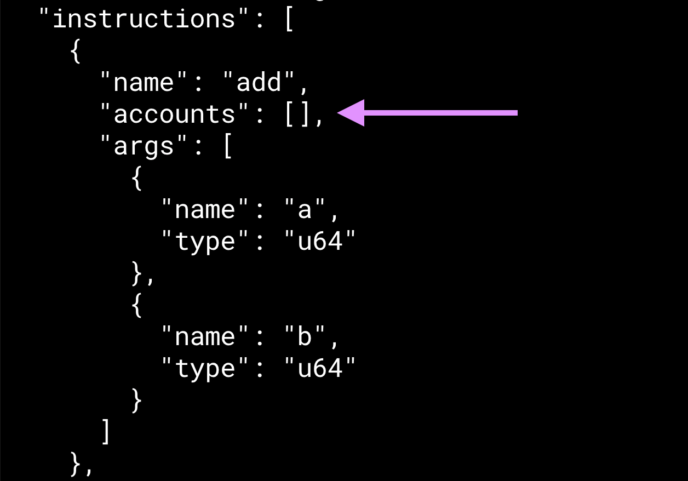

The IDL (Interface Definition Language) is a JSON file that describes how to interact with a Solana program. It is automatically generated by the Anchor framework.

There is nothing special about the function called "initialize" --- it's a name Anchor picks. What we will learn in this tutorial is how the typescript unit tests are able to "find" the appropriate function.

Let's create a new project called `anchor-function-tutorial` and change the name in the initialize function to `boaty_mc_boatface`, keeping everything else the same.

```
pub fn boaty_mc_boatface(ctx: Context<Initialize>) -> Result<()> {
    Ok(())
}

```

Now let's change the test to the following

```
it("Call boaty mcboatface", async () => {
  // Add your test here.
  const tx = await program.methods.boatyMcBoatface().rpc();
  console.log("Your transaction signature", tx);
});

```

Now run the tests with `anchor test --skip-local-validator`

It runs as expected. So how did this sorcery work?


-----------

What about the `Initialize` struct?
-----------------------------------

Now there is another sneaky thing going on here. We've left the `Initialize` struct untouched and are reusing it between functions. Again, the name does not matter. Let's change the struct name to `Empty` and re-run the test.

```rust
//...
  // Change struct name here
    pub fn add(ctx: Context<Empty>, a: u64, b: u64) -> Result<()> {
        let sum = a + b;
        msg!("Sum is {}", sum);
        Ok(())
    }
//...

// Change struct name here too
#[derive(Accounts)]
pub struct Empty {}

```

Again, the name `Empty` is totally arbitrary here.


What is `#[derive(Accounts)]` struct?
-------------------------------------
### Accounts IDL key

Below we screenshot the IDL of our program above. So we can see the relationship between the "Accounts" in that Rust Attribute `#[derive(Accounts)]` and the "accounts" key in the IDL:


In our example, the `accounts` key in the JSON IDL above marked by the purple arrow is empty. But that is not the case for most useful Solana transactions as we will learn later.


Now let's see what happens when the struct is non-empty. Copy the code below and replace the contents of `lib.rs`.

```rust
use anchor_lang::prelude::*;

declare_id!("8PSAL9t1RMb7BcewhsSFrRQDq61Y7YXC5kHUxMk5b39Z");

#[program]
pub mod anchor_function_tutorial {
    use super::*;

    pub fn non_empty_account_example(ctx: Context<NonEmptyAccountExample>) -> Result<()> {
        Ok(())
    }
}

#[derive(Accounts)]
pub struct NonEmptyAccountExample<'info> {
    signer: Signer<'info>,
    another_signer: Signer<'info>,
}


```