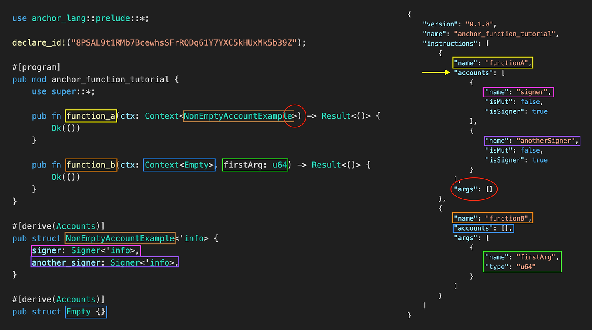

The IDL (Interface Definition Language) is a JSON file that describes how to interact with a Solana program. It is automatically generated by the Anchor framework.

There is nothing special about the function called "initialize" --- it's a name Anchor picks. What we will learn in this tutorial is how the typescript unit tests are able to "find" the appropriate function.

Let's create a new project called `anchor-function-tutorial` and change the name in the initialize function to `boaty_mc_boatface`, keeping everything else the same.

```
pub fn boaty_mc_boatface(ctx: Context<Initialize>) -> Result<()> {
    Ok(())
}

```

Now let's change the test to the following

```
it("Call boaty mcboatface", async () => {
  // Add your test here.
  const tx = await program.methods.boatyMcBoatface().rpc();
  console.log("Your transaction signature", tx);
});

```

Now run the tests with `anchor test --skip-local-validator`

It runs as expected. So how did this sorcery work?


-----------

What about the `Initialize` struct?
-----------------------------------

Now there is another sneaky thing going on here. We've left the `Initialize` struct untouched and are reusing it between functions. Again, the name does not matter. Let's change the struct name to `Empty` and re-run the test.

```rust
//...
  // Change struct name here
    pub fn add(ctx: Context<Empty>, a: u64, b: u64) -> Result<()> {
        let sum = a + b;
        msg!("Sum is {}", sum);
        Ok(())
    }
//...

// Change struct name here too
#[derive(Accounts)]
pub struct Empty {}

```

Again, the name `Empty` is totally arbitrary here.


What is `#[derive(Accounts)]` struct?
-------------------------------------
### Accounts IDL key

Below we screenshot the IDL of our program above. So we can see the relationship between the "Accounts" in that Rust Attribute `#[derive(Accounts)]` and the "accounts" key in the IDL:


In our example, the `accounts` key in the JSON IDL above marked by the purple arrow is empty. But that is not the case for most useful Solana transactions as we will learn later.


Now let's see what happens when the struct is non-empty. Copy the code below and replace the contents of `lib.rs`.

```rust
use anchor_lang::prelude::*;

declare_id!("8PSAL9t1RMb7BcewhsSFrRQDq61Y7YXC5kHUxMk5b39Z");

#[program]
pub mod anchor_function_tutorial {
    use super::*;

    pub fn non_empty_account_example(ctx: Context<NonEmptyAccountExample>) -> Result<()> {
        Ok(())
    }
}

#[derive(Accounts)]
pub struct NonEmptyAccountExample<'info> {
    signer: Signer<'info>,
    another_signer: Signer<'info>,
}


```

Now run anchor build – let’s see what we get back in the new IDL.

```json
{
  "version": "0.1.0",
  "name": "anchor_function_tutorial",
  "instructions": [
    {
      "name": "nonEmptyAccountExample",
      "accounts": [
        {
          "name": "signer",
          "isMut": false,
          "isSigner": true
        },
        {
          "name": "anotherSigner",
          "isMut": false,
          "isSigner": true
        }
      ],
      "args": []
    }
  ],
  "metadata": {
    "address": "8PSAL9t1RMb7BcewhsSFrRQDq61Y7YXC5kHUxMk5b39Z"
  }
}


```
Note that "`accounts`" is no longer empty and is populated with the fields from the struct: "`signer`" and "`anotherSigner`" (note that `another_signer` got transformed from snake case into camel case). The IDL has been updated to match the struct we just changed, specifically with the number of accounts we added.

you can think of it as analogous to `tx.origin` in Ethereum.

### example 2

```rust
use anchor_lang::prelude::*;

declare_id!("8PSAL9t1RMb7BcewhsSFrRQDq61Y7YXC5kHUxMk5b39Z");

#[program]
pub mod anchor_function_tutorial {
    use super::*;

    pub fn function_a(ctx: Context<NonEmptyAccountExample>) -> Result<()> {
        Ok(())
    }

    pub fn function_b(ctx: Context<Empty>, firstArg: u64) -> Result<()> {
        Ok(())
    }
}

#[derive(Accounts)]
pub struct NonEmptyAccountExample<'info> {
    signer: Signer<'info>,
    another_signer: Signer<'info>,
}

#[derive(Accounts)]
pub struct Empty {}

```
Now build it with `anchor build`



The function `function_a` has no arguments and this shows in the IDL as an empty array under the `args` key.

Its `Context` takes the `NonEmptyAccountExample` struct. This struct `NonEmptyAccountExample` has two signer fields: `signer` and `another_signer`. Note that these are repeated as elements in the account key in the IDL for `function_a`. You can see that Anchor translated Rust's snake case to camel case in the IDL.

**Update for Anchor 0.30** Anchor no longer automatically performs this translation ([release notes](https://github.com/coral-xyz/anchor/blob/v0.30.0/CHANGELOG.md#fixes-2)).

The function `function_b` takes an u64 argument. Its context struct is empty, so the `accounts` key in IDL for `function_b` is an empty array.

In general, we expect the array of items in the IDL's `accounts` key to match the keys of the account struct that the function takes in its `ctx` argument.

Summary
-------

In this chapter:

-   We learned Solana uses an IDL (iInterface Definition Language) to show how to interact with a Solana program and what fields appear in the IDL.
-   We introduced the struct modified by `#[derive(Accounts)]` and how it relates to function arguments.
-   Anchor interprets snake\_case functions in Rust as camelCase functions in the Typescript tests.