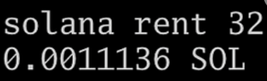
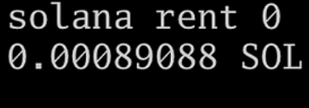

When allocating storage space, the payer must pay a certain number of SOL per byte allocated.

Solana calls this the "rent". This name is a bit misleading because it implies a monthly top-up is required, but this is not always the case. Once the rent is paid, no more payments are needed, even after the two years pass. When two years of rent are paid, the account is considered "rent exempt."

The name comes from Solana originally charging accounts in terms of bytes per year. If you only paid enough rent for half a year, your account would get erased after six months. If you paid for two years of rent in advance, the account would be "rent exempt." The account would never have to pay rent again. Nowadays, all accounts are required to be rent-exempt; you cannot pay less than 2 years of rent.

Although rent is computed on a "per byte" basis, accounts with zero data are not free; Solana still has to index them and store metadata about them.

**When accounts are initialized, the amount of rent needed is computed in the background; you don't need to calculate the rent explicitly**.

However, you do want to be able to anticipate how much storage will cost so you can design your application properly.

If you want a quick estimate, running `solana rent <number of bytes>` in the command line will give you a quick answer:


As mentioned earlier, allocating zero bytes is not free:


Let's see how this fee is calculated.

The [Anchor Rent Module](https://docs.rs/solana-program/latest/solana_program/rent/index.html) gives us some constants related to rent:

-   `ACCOUNT_STORAGE_OVERHEAD`: this constant has a value of 128 (bytes) and as the name suggests, an empty account has 128 bytes of overhead.
-   `DEFAULT_EXEMPTION_THRESHOLD`: this constant has a value of 2.0 (float 64) and refers to the fact that paying two years of rent in advance makes the account exempt from paying further rent.
-   `DEFAULT_LAMPORTS_PER_BYTE_YEAR`: this constant has a value of 3,480 meaning each byte requires 3,480 lamports per year. Since we are required to pay two years worth, each byte will cost us 6,960 lamports.

The following rust program prints out how much an empty account will cost us. Note that the result matches the screenshot of the `solana rent 0` above:

```rust
`use anchor_lang::prelude::*;
use anchor_lang::solana_program::rent as rent_module;

declare_id!("BfMny1VwizQh89rZtikEVSXbNCVYRmi6ah8kzvze5j1S");

#[program]
pub mod rent {
    use super::*;

    pub fn initialize(ctx: Context<Initialize>) -> Result<()> {
        let cost_of_empty_acc = rent_module::ACCOUNT_STORAGE_OVERHEAD as f64 *
                                rent_module::DEFAULT_LAMPORTS_PER_BYTE_YEAR as f64 *
                                rent_module::DEFAULT_EXEMPTION_THRESHOLD;

        msg!("cost to create an empty account: {}", cost_of_empty_acc);
        // 890880

        Ok(())
    }
}

#[derive(Accounts)]
pub struct Initialize {}`
```

If we want to compute how much a non-empty account will cost, then we simply add the number of bytes to the cost of an empty account as follows:

```
`use anchor_lang::prelude::*;
use anchor_lang::solana_program::rent as rent_module;

declare_id!("BfMny1VwizQh89rZtikEVSXbNCVYRmi6ah8kzvze5j1S");

#[program]
pub mod rent {
    use super::*;

    pub fn initialize(ctx: Context<Initialize>) -> Result<()> {
        let cost_of_empty_acc = rent_module::ACCOUNT_STORAGE_OVERHEAD as f64 *
                                rent_module::DEFAULT_LAMPORTS_PER_BYTE_YEAR as f64 *
                                rent_module::DEFAULT_EXEMPTION_THRESHOLD;

        msg!("cost to create an empty account: {}", cost_of_empty_acc);
        // 890,880 lamports

        let cost_for_32_bytes = cost_of_empty_acc +
                                32 as f64 *
                                rent_module::DEFAULT_LAMPORTS_PER_BYTE_YEAR as f64 *
                                rent_module::DEFAULT_EXEMPTION_THRESHOLD;

        msg!("cost to create a 32 byte account: {}", cost_for_32_bytes);
        // 1,113,600 lamports
        Ok(())
    }
}

#[derive(Accounts)]
pub struct Initialize {}`
```

Again, note that the output of this program matches the output on the command line.

