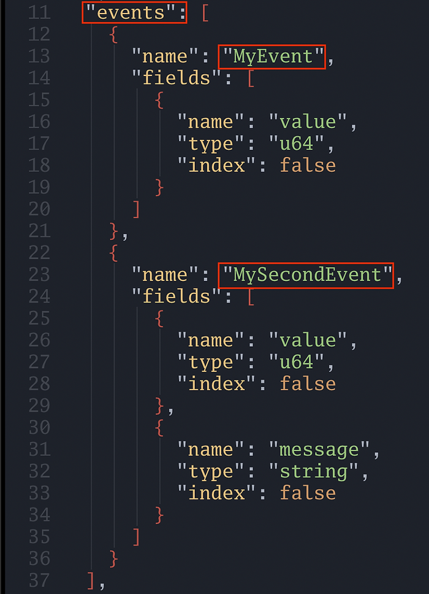

Solana Logs and Events
----------------------

The program below has two events: `MyEvent` and `MySecondEvent`. Similar to how Ethereum events have "arguments", Solana events have fields in the struct:

```rust
use anchor_lang::prelude::*;

declare_id!("FmyZrMmPvRzmJCG3p5R1AnbkPqSmzdJrcYzgnQiGKuBq");

#[program]
pub mod emit {
    use super::*;

    pub fn initialize(ctx: Context<Initialize>) -> Result<()> {
        emit!(MyEvent { value: 42 });
        emit!(MySecondEvent { value: 3, message: "hello world".to_string() });
        Ok(())
    }
}

#[derive(Accounts)]
pub struct Initialize {}

#[event]
pub struct MyEvent {
    pub value: u64,
}

#[event]
pub struct MySecondEvent {
    pub value: u64,
    pub message: String,
}

```

Events become part of the [Solana program's IDL](https://www.rareskills.io/post/anchor-idl), similar to how events are part of a Solidity smart contract's ABI. Below we screenshot the IDL of the program above while highlighting the relevant



There is no such thing as "indexed" or "non-indexed" information in Solana like there is in Ethereum (even though there is an "index" field in the screenshot above, it has no use).

Unlike Ethereum, we cannot directly query for past events over a range of block numbers. We can only listen for events as they occur. (We will see later Solana's method to audit past transactions). The code below shows how to listen for events in Solana: