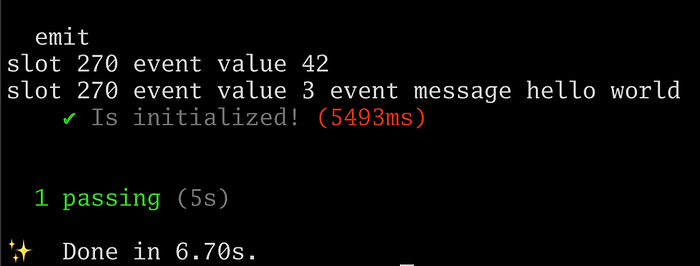

Solana Logs and Events
----------------------

The program below has two events: `MyEvent` and `MySecondEvent`. Similar to how Ethereum events have "arguments", Solana events have fields in the struct:

```rust
use anchor_lang::prelude::*;

declare_id!("FmyZrMmPvRzmJCG3p5R1AnbkPqSmzdJrcYzgnQiGKuBq");

#[program]
pub mod emit {
    use super::*;

    pub fn initialize(ctx: Context<Initialize>) -> Result<()> {
        emit!(MyEvent { value: 42 });
        emit!(MySecondEvent { value: 3, message: "hello world".to_string() });
        Ok(())
    }
}

#[derive(Accounts)]
pub struct Initialize {}

#[event]
pub struct MyEvent {
    pub value: u64,
}

#[event]
pub struct MySecondEvent {
    pub value: u64,
    pub message: String,
}

```

Events become part of the Solana program's IDL, similar to how events are part of a Solidity smart contract's ABI. Below we screenshot the IDL of the program above while highlighting the relevant


There is no such thing as "indexed" or "non-indexed" information in Solana like there is in Ethereum (even though there is an "index" field in the screenshot above, it has no use).

Unlike Ethereum, we cannot directly query for past events over a range of block numbers. We can only listen for events as they occur. (We will see later Solana's method to audit past transactions). The code below shows how to listen for events in Solana:

```rust
import * as anchor from "@coral-xyz/anchor";
import { BorshCoder, EventParser, Program } from "@coral-xyz/anchor";
import { Emit } from "../target/types/emit";

describe("emit", () => {
  // Configure the client to use the local cluster.
  anchor.setProvider(anchor.AnchorProvider.env());

  const program = anchor.workspace.Emit as Program<Emit>;

  it("Is initialized!", async () => {
    const listenerMyEvent = program.addEventListener('MyEvent', (event, slot) => {
      console.log(`slot ${slot} event value ${event.value}`);
    });

    const listenerMySecondEvent = program.addEventListener('MySecondEvent', (event, slot) => {
      console.log(`slot ${slot} event value ${event.value} event message ${event.message}`);
    });

    await program.methods.initialize().rpc();

    // This line is only for test purposes to ensure the event
    // listener has time to listen to event.
    await new Promise((resolve) => setTimeout(resolve, 5000));

    program.removeEventListener(listenerMyEvent);
    program.removeEventListener(listenerMySecondEvent);
  });
});
```

It is not possible to scan for past logs like it is in Ethereum, they must be watched for while the transaction is happening.


How logs work
-------------

In the EVM, logs are emitted by running the `log0`, `log1`, `log2` etc opcode. In Solana, logs are run by calling the system call `sol_log_data`. As an argument, it is simply a sequence of bytes:

[https://docs.rs/solana-program/latest/src/solana\_program/log.rs.html#116-124](https://docs.rs/solana-program/latest/src/solana_program/log.rs.html#116-124)

Below is the function of the system call in the Solana client:

```rust
/// Print some slices as base64.
pub fn sol_log_data(data: &[&[u8]]) {
    #[cfg(target_os = "solana")]
    unsafe {
        crate::syscalls::sol_log_data(data as *const _ as *const u8, data.len() as u64)
    };

    #[cfg(not(target_os = "solana"))]
    crate::program_stubs::sol_log_data(data);
}

```
The "struct" structure we are using to create an event is an abstraction on the byte sequence. Behind the scenes, Anchor turns the struct into a byte sequence to pass to this function. The Solana system call only takes a byte sequence, not a struct.

Solana logs are not for historical querying
-------------------------------------------

In Ethereum, logs are used for auditing purposes, but in Solana, logs cannot be used in that manner since they can only be queried as they occur. Therefore, they are better suited for passing information to the frontend application. Solana functions cannot return data to the frontend the way that Solidity view functions can, so Solana logs are a lightweight way to accomplish this.

Events are preserved in the block explorer however. See the bottom of this transaction as an example:
<https://explorer.solana.com/tx/JgyHQPxL3cPLFtV4cx5i842ZgBx57R2fkNn2TZn1wsQZqVXKfijd43CEHo88C3ridK27Kw8KkMzfvDdqaS398SX>


Unlike Ethereum, Solana transactions can be queried by address
--------------------------------------------------------------

In Ethereum, there is no direct way to query the transactions either sent to a smart contract or from a particular wallet.

We can *count* the number of transactions sent from an address using [eth\_getTransactionCount](https://ethereum.org/developers/docs/apis/json-rpc#eth_gettransactioncount). We can get a specific transaction using the transaction hash with [eth\_getTransactionByHash](https://ethereum.org/developers/docs/apis/json-rpc#eth_gettransactionbyhash). We can get the transactions in a specific block using [eth\_getBlockByNumber](https://ethereum.org/developers/docs/apis/json-rpc#eth_getblockbynumber) or [eth\_getBlockByHash](https://ethereum.org/developers/docs/apis/json-rpc#eth_getblockbyhash).

However, it is not possible to get all transactions by address. This has to be done indirectly by parsing every block since the wallet became active or the smart contract was deployed.