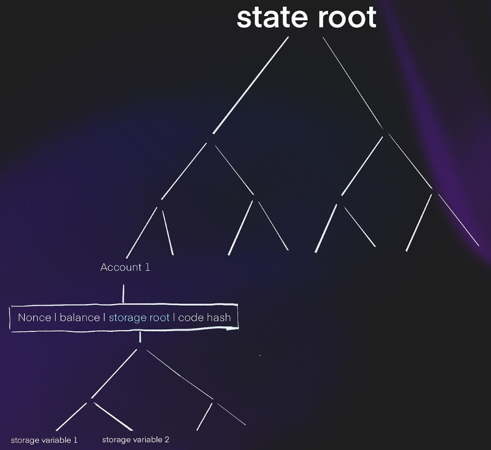
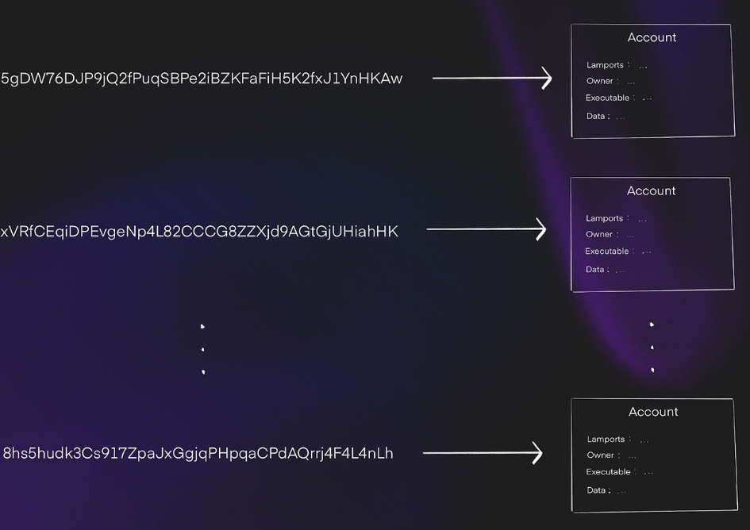
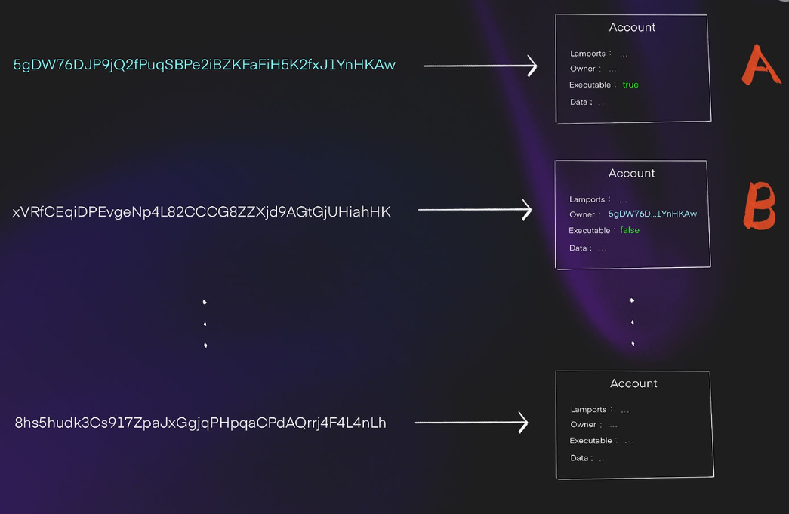
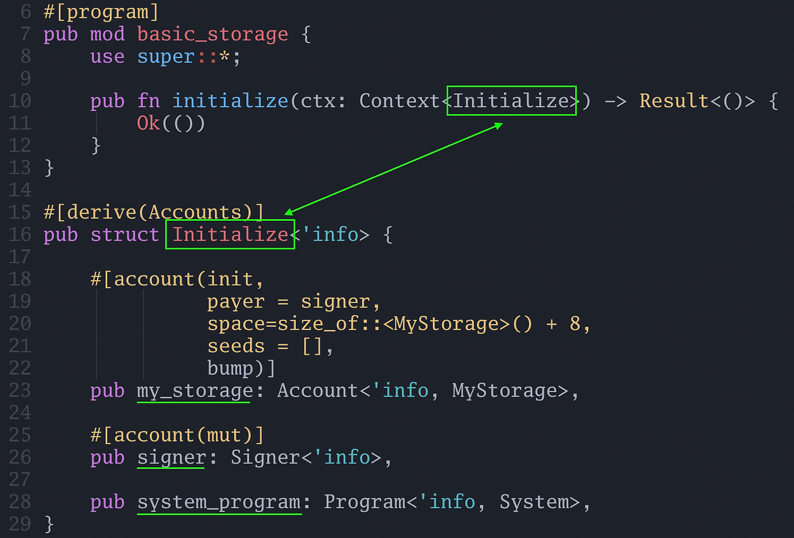
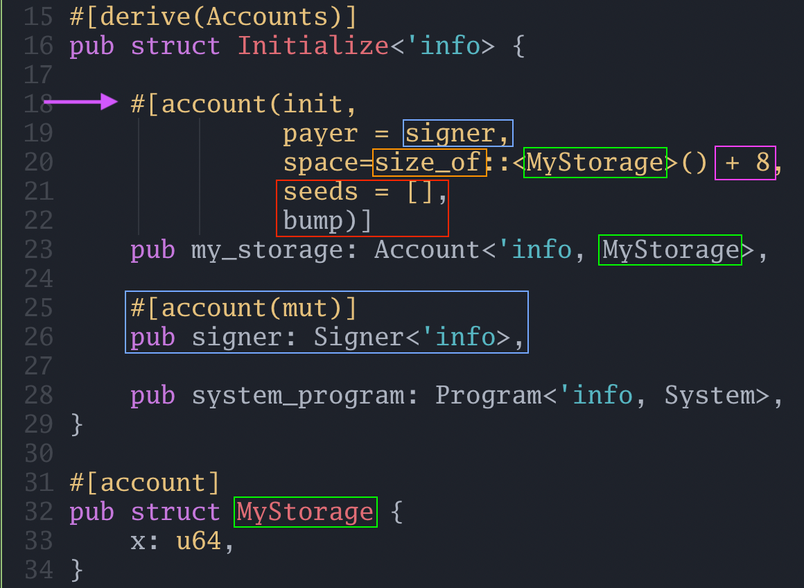

In Solidity and Ethereum, a more exotic design pattern to store data is SSTORE2 or SSTORE3 where the data is stored in the bytecode of another smart contract.

In Solana, this is not an exotic design pattern, it is the norm!

Recall that we can update the bytecode of a Solana program (if we are the original deployer) at will unless the program is marked as immutable.

Solana uses the same mechanism for data storage.

Storage slots in Ethereum are effectively a massive key-value store:

```
{
    key: [smart_contract_address, storage slot]
    value: 32_byte_slot // (for example: 0x00)
}
```

Solana's model is similar: it is a massive key-value store where the "key" is a base 58 encoded address and the value is a data blob that can be up to to 10MB large (or optionally hold nothing). It can be visualized as follows:

```
{
    // key is a base58 encoded 32 byte sequence
    key: ETnqC8mvPRyUVXyXoph22EQ1GS5sTs1zndkn5eGMYWfs
    value: {
        data: 020000006ad1897139ac2bdb67a3c66a...
        // other fields are omitted
    }
}
```

In Ethereum, the bytecode of a smart contract and the storage variables of a smart contract are stored separately i.e. they are indexed differently and must be loaded using different APIs.

The following diagram shows how Ethereum maintains state. Each account is a leaf in a Merkle tree. Note that the "storage variables" are stored "inside" the account of the smart contract (Account 1).




In Solana, **everything is an account** that can potentially hold data. Sometimes we refer to one account as a "program account" or another account as a "storage account" but the only difference is whether the executable flag is set to true and how we intend to use the data field of the account.

Below, we can see Solana storage is a giant key-value store from Solana addresses to an account:

Imagine if Ethereum had no storage variables and smart contracts were mutable by default. To store data, you had to create other "smart contracts" and keep the data in their bytecode, then modify it when necessary. This is one mental model of Solana.

Another mental model for this is how everything is a file in Unix, just some files are executable. Solana accounts can be thought of as files. They hold content, but they also have metadata that indicates who owns the file, if it is executable, and so forth.

In Ethereum, storage variables are directly coupled to the smart contract. Unless a smart contract grants write or read access via public variables, delegatecall, or some setter method, by default, a storage variable can only be written to or read by a single contract (though anyone can read the storage variables off chain). In Solana, all "storage variables" can be read by any program, but only its owner program can write to it.

The way storage is "tied to" a program is via the owner field.

In the image below, we see the account B is owned by the program account A. We know A is a program account because "executable" is set to `true`. This indicates that the data field of B will be storing data for A:


Solana programs need to be initialized before they can be used
--------------------------------------------------------------

In Ethereum, we can directly write to a storage variable that we haven't used before. However, Solana programs need an explicit initialization transaction. That is, we have to create the account before we can write data to it.

*It is possible to initialize and write to a Solana account in one transaction --- however this introduces security issues which will complicate the discussion if we deal with them now. For now, it suffices to say that Solana accounts must be initialized before they can be used.*

A basic storage example
-----------------------

Let's translate the following Solidity code to Solana:

```
`contract BasicStorage {
    Struct MyStorage {
        uint64 x;
    }

    MyStorage public myStorage;

    function set(uint64 _x) external {
        myStorage.x = _x;
    }
}
`
```

It may seem strange that we wrapped a single variable in a struct.

But in Solana programs, particularly Anchor, **all storage, or rather account data, is treated as a struct**. The reason is due to the flexibility of the account data. Since accounts are data blobs which can be quite large (up to 10MB), we need some "structure" to interpret the data, otherwise it is just a sequence of bytes with no meaning.

Behind the scenes, Anchor deserializes and serializes account data into structs when we try to read or write the data.

As mentioned above, we need to initialize the Solana account before we can use it, so before we implement the `set()` function, we need to write the `initialize()` function.


Account initialization boilerplate code
---------------------------------------

Let's create a new Anchor project called `basic_storage`.

Below we have written the minimal code to initialize a `MyStorage` struct, which only holds one number, `x`. (See the struct `MyStorage` at the bottom of the code):

```
use anchor_lang::prelude::*;
use std::mem::size_of;

declare_id!("GLKUcCtHx6nkuDLTz5TNFrR4tt4wDNuk24Aid2GrDLC6");

#[program]
pub mod basic_storage {
    use super::*;

    pub fn initialize(ctx: Context<Initialize>) -> Result<()> {
        Ok(())
    }
}

#[derive(Accounts)]
pub struct Initialize<'info> {

    #[account(init,
              payer = signer,
              space=size_of::<MyStorage>() + 8,
              seeds = [],
              bump)]
    pub my_storage: Account<'info, MyStorage>,

    #[account(mut)]
    pub signer: Signer<'info>,

    pub system_program: Program<'info, System>,
}

#[account]
pub struct MyStorage {
    x: u64,
}
```
### The initialize function

Note that there is no code in the `initialize()` function --- in fact all it does is return `Ok(())`:

```
`pub fn initialize(ctx: Context<Initialize>) -> Result<()> {
    Ok(())
}
`
```

It is not mandatory that functions for initializing accounts be empty, we could have custom logic. But for our example, it is empty. It is also not mandatory that functions which `initialize` accounts be called initialize, but it is a helpful name.

### The Initialize struct

The `Initialize` Struct contains references to the resources needed to initialize an account:

-   `my_storage`: a struct of type `MyStorage` we are initializing.
-   `signer`: the wallet that is paying for the "gas" for storage of the struct. (Gas costs for storage are discussed later).
-   `system_program`: we will discuss it later in this tutorial.



The `'info` keyword is a [Rust lifetime](https://doc.rust-lang.org/rust-by-example/scope/lifetime.html).


### The `my_storage` field in the Initialize struct

The attribute macro above the `my_storage` field (purple arrow) is how Anchor knows this transaction is intended to initialize this account (remember, an [attribute-like macro](https://www.rareskills.io/post/rust-attribute-derive-macro) starts with `#` and augments the struct with additional functionality):



The important keyword here is `init`.

When we `init` an account, we must supply additional information:

-   `payer` (blue box): who is paying the SOL for allocating storage. The signer is specified to be `mut` because their account balance will change, i.e. some SOL will be deducted from their account. Therefore, we annotate their account as "mutable."
-   `space` (orange box): this indicates how much space the account will take. Rather than figuring this out ourselves, we can use the `std::mem::size_of` utility and use the struct we are trying to store: `MyStorage` (green box), as an argument. The `+ 8` (pink box) we discuss in the following point.
-   `seeds` and `bump` (red box): A program can own multiple accounts, it "discriminates" among the accounts with the "seed" which is used in calculating a "discriminator". The "discriminator" takes up 8 bytes, which is why we need to allocate the additional 8 bytes in addition to the space our struct takes up. The bump can be treated as boilerplate for now.

This might seem like a lot to take in, don't worry. **Initializing an account can largely be treated as boilerplate for now.**