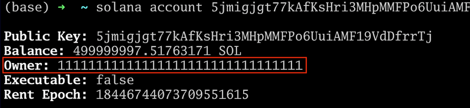
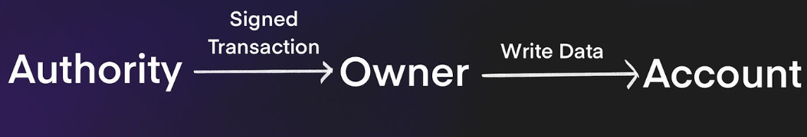
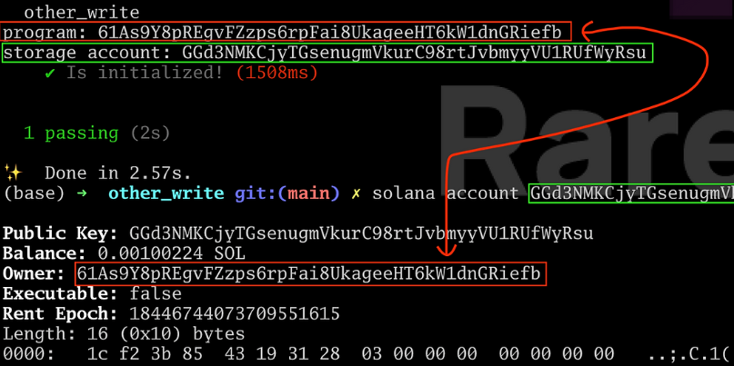
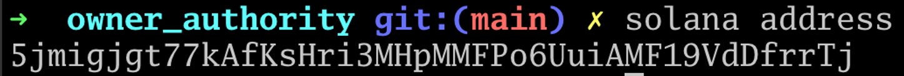
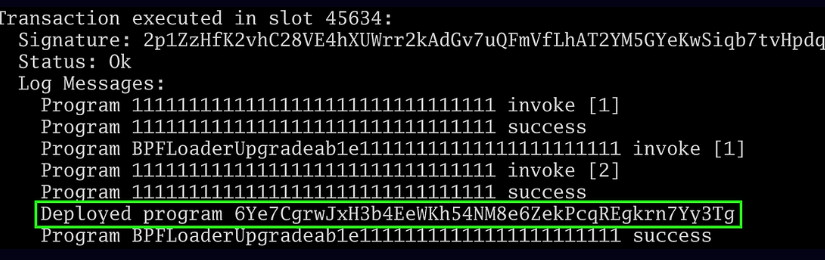

Owner vs Authority
------------------

Only programs can write data to accounts --- specifically, only to accounts they own. A program cannot write data to arbitrary accounts.

Programs of course cannot spontaneously write data to accounts. They need to receive an instruction to do so from a wallet. However, programs will generally only accept write instructions for a particular account from a privileged wallet: the *authority*.

An owner of an account is a program. An authority is a wallet. An authority sends a transaction to a program and that program can write to the account.

All accounts in Solana have the following fields, which are mostly self-explanatory:

-   Public Key
-   lamport balance
-   owner
-   executable (a boolean flag)
-   rent\_epoch (can be ignored for rent-exempt accounts)
-   data

We can see these by running `solana account <our wallet address>` in the terminal (with the Solana validator running in the background):



Note something interesting: **we are not the owner of our wallet!** The address `111...111` is the **system program**.

Why does the system program own wallets, instead of wallets owning themselves?

**Only the owner of an account can modify the data in it.**

The implication is that we are not able to modify our balance directly. Only the system program can do that. To transfer SOL out of our account, we send a signed transaction to the system program. The system program verifies we own the private key to the account, and then it modifies the balance on our behalf.

This is a pattern you will frequently see in Solana: only the owner of the account can modify the data in the account. The program will modify the data in the account if it sees a valid signature from a predesignated address: an authority.

**An authority is an address from which a program will accept instructions if it sees a valid signature. An authority cannot modify an account directly. It needs to work through a program that owns the account it is trying to modify.**




However the owner is always a program, and that program will modify the account on behalf of someone else if the signature for the transaction is valid.

We saw this for example, in our tutorial on [modifying accounts with different signers].

**Exercise**: Create a program that initializes a storage account. You will want to have the address of the program and storage accounts handy. Consider adding the following code to the tests:

```
console.log(`program: ${program.programId.toBase58()}`);
console.log(`storage account: ${myStorage.toBase58()}`);

```

Then run `solana account <storage account>` on the account that got initialized. You should see the owner being the program.

Here is a screenshot of the exercise being run:




When we look at the metadata of the storage account, we see the program is the owner.

**Because the program owns the storage account, it is able to write to it**. Users cannot write to the storage account directly, they sign a transaction and ask the program to write the data.

The owner in Solana is very different from the owner in Solidity
----------------------------------------------------------------

In Solidity, we usually refer to the owner as a special address with admin privileges over the smart contract. The "owner" is not a concept that exists at the Ethereum runtime level, it is a design pattern applied to Solidity contracts. An owner in Solana is much more fundamental. In Ethereum, a smart contract can only write to its own storage slots. Imagine we had a mechanism to allow an Ethereum smart contract to be able to write to some other storage slot. In Solana terms, it would become the *owner* or those storage slots.

Authority can mean who deployed a contract and who can send write transactions for a particular account
-------------------------------------------------------------------------------------------------------

An *authority* can be a construct at the program level. In our tutorial on [Anchor signers], we made a program where Alice could deduct points from her account to transfer to someone else. To know that only Alice can send a deduction transaction for that account, we stored her address in the account:

```
`#[account]
pub struct Player {
    points: u32,
    authority: Pubkey
}
`
```

Solana uses a similar mechanism to remember who deployed a program. In our tutorial on [Anchor deploy], we noted that the wallet that deployed a program is also able to upgrade it.

"Upgrading" a program is the same as writing new data to it --- i.e. new bytecode. Only the owner of the program can write to it (this program is `BPFLoaderUpgradeable` as we will see soon).

Therefore, how does Solana know how to give upgrade privileges to the wallet that deployed a certain program?

Viewing the authority of a program from the command line
--------------------------------------------------------

Before we deploy the program, let's see what wallet anchor is using by running `solana address` in the terminal:



Take note that our address is `5jmi...rrTj`. Now let's create a program.

Be sure `solana-test-validator` and `solana logs` are running in the background, then deploy the Solana program:

```
`anchor init owner_authority
cd owner_authority
anchor build
anchor test --skip-local-validator
`
```

When we look at the logs, we see the address of the program we just deployed:


Remember, everything is an account on Solana, including programs. Now let's inspect this account using the `solana account 6Ye7CgrwJxH3b4EeWKh54NM8e6ZekPcqREgkrn7Yy3Tg`. We get the following result:
