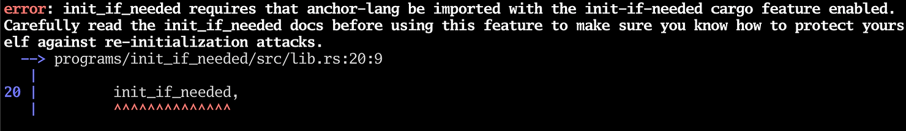

In previous tutorials, we've had to initialize an account in a separate transaction before we can write data to it. We may wish to be able to initialize an account and write data to it in one transaction to simplify things for the user.

Anchor provides a handy macro called `init_if_needed` which, as the name suggests, will initialize the account if it does not exist.

The example counter below does not need a separate initialize transaction, it will start adding "1" to the `counter` storage right away.

Rust:

```
`use anchor_lang::prelude::*;
use std::mem::size_of;

declare_id!("9DbiqCqtqgP3NYufxBakbeRd7JyNpNYbsm6Jqrn8Z2Hn");

#[program]
pub mod init_if_needed {
    use super::*;

    pub fn increment(ctx: Context<Initialize>) -> Result<()> {
        let current_counter = ctx.accounts.my_pda.counter;
        ctx.accounts.my_pda.counter = current_counter + 1;
        Ok(())
    }
}

#[derive(Accounts)]
pub struct Initialize<'info> {
    #[account(
        init_if_needed,
        payer = signer,
        space = size_of::<MyPDA>() + 8,
        seeds = [],
        bump
    )]
    pub my_pda: Account<'info, MyPDA>,

    #[account(mut)]
    pub signer: Signer<'info>,
    pub system_program: Program<'info, System>,
}

#[account]
pub struct MyPDA {
    pub counter: u64,
}
`
```

Typescript:

```
`import * as anchor from "@coral-xyz/anchor";
import { Program } from "@coral-xyz/anchor";
import { InitIfNeeded } from "../target/types/init_if_needed";

describe("init_if_needed", () => {
  // Configure the client to use the local cluster.
  anchor.setProvider(anchor.AnchorProvider.env());

  const program = anchor.workspace.InitIfNeeded as Program<InitIfNeeded>;

  it("Is initialized!", async () => {
    const [myPda, _bump] = anchor.web3.PublicKey.findProgramAddressSync([], program.programId);
    await program.methods.increment().accounts({myPda: myPda}).rpc();
    await program.methods.increment().accounts({myPda: myPda}).rpc();
    await program.methods.increment().accounts({myPda: myPda}).rpc();

    let result = await program.account.myPda.fetch(myPda);
    console.log(`counter is ${result.counter}`);
  });
});
`
```

When we try to build this program with `anchor build`, we will get the following error:


To make the error `init_if_needed requires that anchor-lang be imported with the init-if-needed cargo feature enabled` go away, we can open the `Cargo.toml` file in `programs/<anchor_project_name>` and add the following line:
```
[dependencies]
anchor-lang = { version = "0.29.0", features = ["init-if-needed"] }

```

But before we just silence the error, we should understand what a re-initialization attack is and how it can occur.