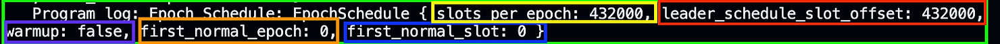

### EpochSchedule sysvar

An epoch in Solana is a period of time that is approximately two days long. SOL can only be staked or unstaked at the start of an epoch. If you stake (or unstake) SOL before the end of an epoch, the SOL is marked as "activating" or "deactivating" while waiting for the epoch to end.

Solana describes this more in their description of [delegating SOL](https://solana.com/id/staking#overview/delegation-timing-considerations).

We can access the EpochSchedule sysvar using the `get` method, similar to the Clock sysvar.

Update the initialize function with the following code:

```rust
pub fn initialize(ctx: Context<Initialize>) -> Result<()> {
    // Get the EpochSchedule sysvar
    let epoch_schedule = EpochSchedule::get()?;

    msg!(
        "epoch schedule: {:?}",
        // Retrieve all the details of the EpochSchedule sysvar
        epoch_schedule
    );

    Ok(())
}
```

After running the test again, the following log will be generated:


From the log, we can observe that the EpochSchedule sysvar contains the following fields:

-   **slots\_per\_epoch** highlighted in yellow holds the number of slots in each epoch, which is 432,000 slots here.
-   **leader\_schedule\_slot\_offset** highlighted in red determines the timing for the next epoch's leader schedule (we had previously talked about this in day 11). It's also set to 432,000.
-   **warmup** highlighted in purple is a boolean that indicates whether Solana is in the warm-up phase. During this phase, epochs start smaller and gradually increase in size. This helps the network start smoothly after a reset or during its early days.
-   **first\_normal\_epoch** highlighted in orange identifies the first epoch that can have its slot count, and first\_normal\_slot highlighted in blue is the slot that starts this epoch. In this case both are 0 (zero).