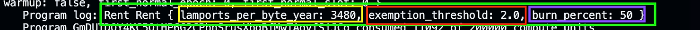

Once again, we use the `get` method to access the Rent sysvar.

We update the initialize function with the following code:

```rust
pub fn initialize(ctx: Context<Initialize>) -> Result<()> {
    // Previous code...

    // Get the Rent sysvar
    let rent_var = Rent::get()?;
    msg!(
        "Rent {:?}",
        // Retrieve all the details of the Rent sysvar
        rent_var
    );

    Ok(())
}
```

Run the test, we get this log:


The Rent sysvar in Solana has three key fields:

-   **lamports\_per\_byte\_year**
-   **exemption\_threshold**
-   **burn\_percent**

The lamports\_per\_byte\_year highlighted in yellow indicates the number of lamports required per byte per year for rent exemption.

The exemption\_threshold highlighted in red is a multiplier used to calculate the minimum balance needed for rent exemption. In this example, we see we need to pay 3480×2\=6960 lamports per byte to create a new account.

50% of that is burned (burn\_percent highlighted in purple) to manage Solana inflation.