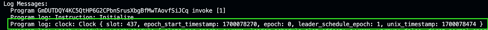
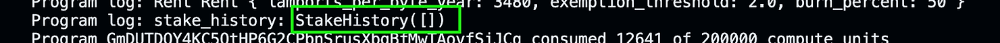

sysvars are read-only system accounts that give Solana programs access to the blockchain state as well as network information. They are similar to Ethereum global variables, which also enable smart contracts to access network or blockchain state information, but they have unique public addresses like the Ethereum precompiles.

In Anchor programs, you can access sysvars in two ways: either by using the anchor's get method wrapper, or by treating it as an account in your `#[Derive(Accounts)]`, using its public address.

Not all sysvars support the `get` method, and some are deprecated (information on deprecation will be specified in this guide). For those sysvars that don't have a `get` method, we will access them using their public address.

-   **Clock:** Used for time-related operations like getting the current time or slot number.
-   **EpochSchedule:** Contains information about epoch scheduling, including the epoch for a particular slot.
-   **Rent:** Contains the rental rate and information like the minimum balance requirements to keep an account rent exempt.
-   **Fees:** Contains the fee calculator for the current slot. The fee calculator provides information on how many lamports are paid per signature in a Solana transaction.
-   **EpochRewards:** The EpochRewards sysvar holds a record of epoch rewards distribution in Solana, including block rewards and staking rewards.
-   **RecentBlockhashes:** Contains the active recent block hashes.
-   **SlotHashes:** Contains history of recent slot hashes.
-   **SlotHistory:** Holds an array of slots available during the most recent epoch in Solana, and it is updated every time a new slot is processed.
-   **StakeHistory:** maintains a record of stake activations and deactivations for the entire network on a per-epoch basis, which is updated at the beginning of each epoch.
-   **Instructions:** To get access to the serialized instructions that are part of the current transaction.
-   **LastRestartSlot:** Contains the slot number of the last restart (the last time Solana restarted ) or zero if none ever happened. If the Solana blockchain were to crash and restart, an application can use this information to determine if it should wait until things stabilize.

Differentiating between Solana slots and blocks.
------------------------------------------------

A slot is a window of time (about 400ms) where a designated leader can produce a block. A slot contains a block (the same kind of block on Ethereum, i.e a list of transactions). However, a slot might not contain a block if the block leader failed to produce a block during that slot. Their relationship is illustrated below:


Although every block maps to exactly one slot, the block hash is not the same as the slot hash. This distinction is evident when clicking on a slot number in an explorer, it opens up the details of a block with a different hash.

Let's take an example from the image below from the Solana block explorer:


The highlighted green number in the image is the slot number **237240962**, and the highlighted yellow text is the slot hash **DYFtWxEdLbos9E6SjZQCMq8z242Yv2bVoj6dzwskd5vZ**. The block hash highlighted in red below is **FzHwFHDAXJBc55rpjShznGCBnC7DsTCjxf3KKAk6hk9T**.

We can distinguish between a block and a slot by their unique hashes, even though they have the same numbers.

As a test, click on any slot number in the explorer [here](https://explorer.solana.com/address/SysvarS1otHashes111111111111111111111111111/slot-hashes?cluster=testnet) and you will notice that a block page will open. This block will have a different hash from the slot hash.


Solana Sysvars in Anchor, using the get method
-----------------------------------------------

As mentioned earlier, not all sysvars can be accessed using Anchor's `get` method. Sysvars such as Clock, EpochSchedule, and Rent can be accessed using this method.

While the Solana documentation includes Fees and EpochRewards as sysvars that can be accessed with the `get` method, these are deprecated in the latest version of Anchor. Therefore, they cannot be called using the `get` method in Anchor.


### Clock sysvar

To utilize the Clock sysvar, we can invoke the `Clock::get()` (we did something similar in a previous tutorial) method as demonstrated below.

Add the following code in the initialize function of our project:

```rust
pub fn initialize(ctx: Context<Initialize>) -> Result<()> {
    // Get the Clock sysvar
    let clock = Clock::get()?;

    msg!(
        "clock: {:?}",
        // Retrieve all the details of the Clock sysvar
        clock
    );

    Ok(())
}
```

Now, run the test on a local Solana node and check the log:



-------

Sysvars in Anchor Using Sysvar Public Address
----------------------------------------------

For sysvars that don't support the `get` method, we can access them using their public addresses. Any exceptions to this will be specified.

### StakeHistory sysvar

Recall that we previously mentioned that this sysvar keeps a record of stake activations and deactivations for the entire network on a per-epoch basis. However, since we are running a local validator node, this sysvar will return empty data.

We will access this sysvar using its public address 
**SysvarStakeHistory1111111111111111111111111**.

First, we modify the `Initialize` account struct in our project as follows:

```
#[derive(Accounts)]
pub struct Initialize<'info> {
    /// CHECK:
    pub stake_history: AccountInfo<'info>, // We create an account for the StakeHistory sysvar
}
```

We ask the reader to treat the new syntax as boilerplate for now. The `/// CHECK:` and `AccountInfo` will be explained in a later tutorial. For the curious, the `<'info>` token is a [Rust lifetime](https://web.mit.edu/rust-lang_v1.25/arch/amd64_ubuntu1404/share/doc/rust/html/book/first-edition/lifetimes.html).

Next, we add the following code to the `initialize` function.

(The reference to the sysvar account will be passed in as part of the transaction in our test. The previous examples had them built into the Anchor framework).

```
pub fn initialize(ctx: Context<Initialize>) -> Result<()> {
    // Previous code...

    // Accessing the StakeHistory sysvar
    // Create an array to store the StakeHistory account
    let arr = [ctx.accounts.stake_history.clone()];

    // Create an iterator for the array
    let accounts_iter = &mut arr.iter();

    // Get the next account info from the iterator (still StakeHistory)
    let sh_sysvar_info = next_account_info(accounts_iter)?;

    // Create a StakeHistory instance from the account info
    let stake_history = StakeHistory::from_account_info(sh_sysvar_info)?;

    msg!("stake_history: {:?}", stake_history);

    Ok(())
}
```

We are not importing the StakeHistory sysvar because we can access it through the use of the `super::*; import`. If this is not the case, we will import the specific sysvar.

And update the test:

```rust
import * as anchor from "@coral-xyz/anchor";
import { Program } from "@coral-xyz/anchor";
import { Sysvars } from "../target/types/sysvars";

describe("sysvars", () => {
  // Configure the client to use the local cluster.
  anchor.setProvider(anchor.AnchorProvider.env());

  const program = anchor.workspace.Sysvars as Program<Sysvars>;

  // Create a StakeHistory PublicKey object
  const StakeHistory_PublicKey = new anchor.web3.PublicKey(
    "SysvarStakeHistory1111111111111111111111111"
  );

  it("Is initialized!", async () => {
    // Add your test here.
    const tx = await program.methods
      .initialize()
      .accounts({
        stakeHistory: StakeHistory_PublicKey,
      })
      .rpc();
    console.log("Your transaction signature", tx);
  });
});
```

Now, we re-run our test:



Just as mentioned earlier, it returns empty data for our local validator.

We can also obtain the public key of the StakeHistory sysvar from the Anchor Typescript client by replacing our `StakeHistory_PublicKey` variable with `anchor.web3.SYSVAR_STAKE_HISTORY_PUBKEY`.

