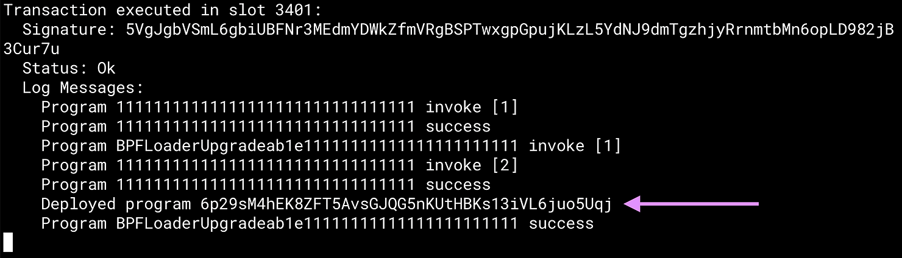
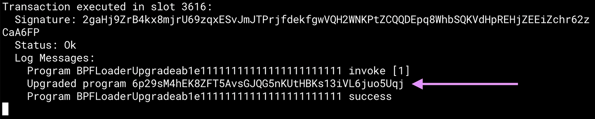

Solana programs do not have constructors
----------------------------------------
```
anchor deploy
```



Run `anchor deploy` again:

The program was deployed to the same address, but this time it was upgraded, not deployed.

The program id has not changed, the program got overwritten.