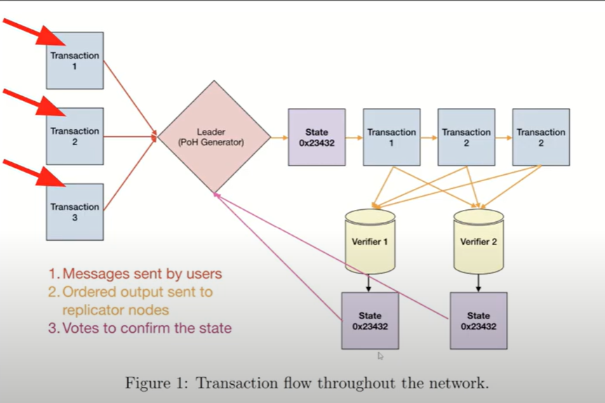

---

### **Solana Architecture**
#### *Network Overview*

- **Key Components**:
  - **Clusters**: Groups of nodes processing transactions.
  - **Leader Node**: Facilitates transactions using "proof of history."
  - **Verifier Nodes**: Validate blocks generated by the leader node to ensure no malicious activity.

#### *Transaction Flow*
1. Users send transactions to a Solana cluster.
2. Leader node generates "hashes" (transactions) and combines them into blocks.
3. **Verifier** nodes validate the blocks and send the "end state" back to the leader.
4. The **leader** decides whether to **commit** the block to the ledger.

---

### **Leader Node Selection**
#### *How Leaders Are Selected*
- Election occurs when a current "proof of history generator" fails.
- **Criteria**:
  - Validator with the largest voting power (most Sol staked) is chosen.
  - In case of a tie, the validator with the highest public key address is selected.

#### *Leader Schedule*
- A predefined schedule determines which node serves as the leader during specific time intervals (epochs).
- Nodes are sorted based on staked Solana, and a random seed is used to assign leadership within epochs.

---

### **Proof of History**
#### *What It Is*
- **Purpose**: Create a time ordering of transactions to enable validators to determine the sequence of incoming blocks.
- **Type**:
  - Not a consensus mechanism like proof of work (PoW) or proof of stake (PoS).
  - Enhances PoS consensus by adding time order.

#### *Comparison with Proof of Work*
- Bitcoin PoW requires miners to guess a hash to create a block.
- PoW imposes a time delay to ensure blocks are validated and ordered properly.
- Proof of History **bypasses** time delays using verifiable time ordering.

---

#### *How Proof of History Works*
1. **Hashing Process**:
   - A starting input (seed phrase) is hashed to create a unique output (e.g., hash1).
   - The output becomes the input for the next hash (e.g., hash2), creating a chain of hashes.
   - This sequential hashing establishes a concept of time, as hash2 must follow hash1.

2. **Transaction Integration**:
   - When a transaction occurs, its hash is combined with the current hash to generate a new hash (e.g., hash3).
   - This process ensures transactions are timestamped within the hash sequence.

---

#### *Validation by Verifier Nodes*
- **Parallel Processing**:
  - Verifiers re-compute the hash chain to validate the leader's work.
  - GPU cores enable parallel processing of thousands of hashes, making validation efficient.
- **Key Principle**: Hash generation is sequential, but validation can be parallelized.

---

### **Consensus Mechanism**
#### *Byzantine Fault Tolerance*
- Cryptocurrencies must account for nodes that may act maliciously or fail.
- Validators must reach a "supermajority" (two-thirds of staked Sol) to agree on block legitimacy.

#### *Handling Malicious Nodes*
- **Slashing**: Penalizes nodes for invalid votes or attempts to cheat the system.
- **Fake Hashes**: Leader nodes periodically send fake hashes to test validator integrity.

---

### **CAP Theorem**
#### *What It Is*
- Distributed systems must balance:
  1. **Consistency**: Users always see the same data.
  2. **Availability**: Users can access data even if some nodes fail.
  3. **Partition Tolerance**: System continues functioning despite network failures.
- Systems can only optimize two of the three.

#### *Solana’s Approach*
- Claims to prioritize consistency and partition tolerance (CP).
- Josh questions this claim, suggesting Solana may lean more toward availability and partition tolerance (AP).

---

### **Network Outages**
#### *Handling Node Failures*
1. **> Two-thirds Nodes Available**:
   - Quick unstaking process to remove failing nodes.
2. **Between One-half and Two-thirds Nodes**:
   - Longer timeout periods to allow nodes to recover.
3. **< One-half Nodes Available**:
   - Extended wait times, but nodes may ultimately be removed if they do not recover.

---

### **Scaling Solana**
#### *Vertical Scaling*
- Adds more hardware (RAM, CPU, GPU) to increase capacity.
- **Pros**:
  - Simpler implementation.
  - Benefits from technological advancements.
- **Cons**:
  - Expensive hardware.
  - Limited by physical hardware capabilities.

#### *Horizontal Scaling (Proposed Solution)*
- Adds more leader nodes to process transactions in parallel.
- **Challenges**:
  - Breaks proof of history’s sequential ordering.
  - Requires synchronization between leaders to maintain transaction order.

---

### **Key Takeaways**
#### *Josh’s Reflection*
- Initially skeptical about cryptocurrency, viewing it as a glorified public database.
- The deep dive into Solana’s architecture and proof of history changed his perspective.
- Recognizes the importance of decentralized systems in solving complex problems like Byzantine fault tolerance.

#### *Bullish Outlook*
- Proof of history is a game-changing innovation that enhances transaction speed and reduces gas fees.
- Horizontal scaling provides a theoretical solution for future growth.

#### *Final Thoughts*
- Solana’s architecture is sound, but Josh acknowledges there’s much more to learn.
- Encourages viewers to continue exploring the technology and engage with the community.

---

### **Conclusion**
#### *Call to Action*
- Josh invites viewers to like and subscribe for more content.
- Promises future videos exploring Solana and other related topics.

--- 

This breakdown organizes the content into digestible sections, highlighting key points and providing clarity on technical concepts.