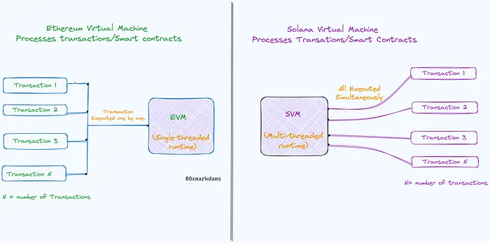
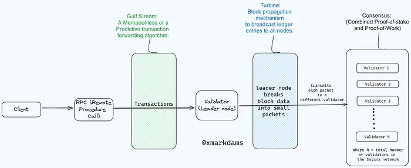

**Why Build on Solana?**
========================

Solana is a leading blockchain platform that offers developers **high speed** (currently capable of processing [2000--3000 TPS](https://explorer.solana.com/)), **low fees** (which can be as low as **$0.00025 per transaction**), and flexible tools for building decentralized applications (dApps). This exceptional performance stems from Solana's innovative architecture, which utilizes a **Solana Virtual MachineSVM**** *that is built upon* ***Sealevel*** and ***Proof of History (PoH)*** algorithm*.*

Sealevel:
---------------------------------------------------------------------------

**Sealevel** Multi-threaded runtime maximizes performance by efficiently utilizing hardware through parallel processing across validator cores. This enables better scalability as hardware advances. Unlike EVM chains with global fees, Sealevel facilitates localized fee markets, allowing fees to be tailored per smart contract, preventing unrelated transactions (like NFT minting) from impacting swap or DeFi fees.

**Gulfstream:**
---------------

A mempool-less transaction forwarding protocol that optimizes network load and allows validators to begin executing transactions ahead of time (*Since every validator knows the order of upcoming leaders*), further boosting speed and efficiency.

[**Turbine:**]
--------------------------------------------------------------------------------------------------------------------------------------

Think of Turbine as a block propagation mechanism. It efficiently broadcasts ledger entries to all nodes by breaking down transaction data into smaller packets. These packets are then propagated across the network by nodes, with each node in a layer responsible for forwarding data to a small set of nodes in the subsequent downstream layer. This approach minimizes communication overhead and facilitates faster transaction processing and network scalability within the Solana ecosystem.

