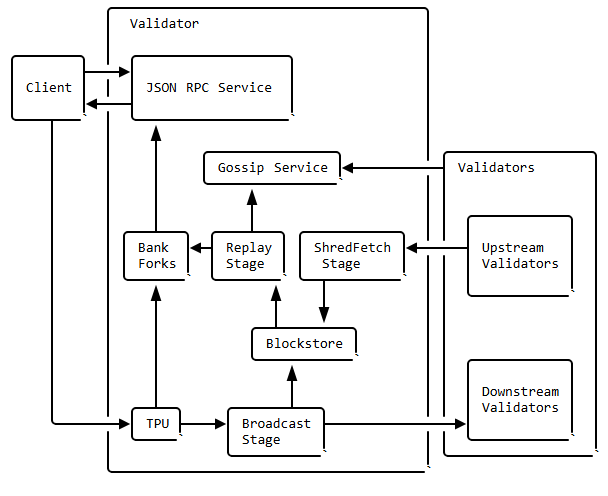

---

## Anatomy of a Validator

### Pipelining

* **Concept**: Like a washer → dryer → folder setup, pipelining processes a continuous stream efficiently by overlapping stages.
* **Outcome**: When optimized, throughput matches the pace of the slowest stage.

---

### Pipelining in the Validator

* Two separate pipelines depending on role:

  * **TPU** (Transaction Processing Unit): operates in *leader mode*, focused on creating ledger entries.
  * **TVU** (Transaction Validation Unit): operates in *validator mode*, focused on validating those entries.
* Both utilize the same hardware stack: network input, GPUs, CPU cores, disk writes, and network output — but apply them for different purposes.

---

## Overview of Core Components

### 1. **TPU** *(Transaction Processing Unit)*

Handles **block production** via a multi-stage pipeline:

```text
QUIC streamer ➔ sigverify ➔ banking ➔ forwarding ➔ broadcast
```

* **QUIC streamer**: Coalesces packets, applies rate limits based on stake, and rejects excess streams.
* **sigverify**: Deduplicates, filters invalid signatures.
* **banking**: Buffers when nearing leadership role; processes transactions when leader.
* **forwarding**: Shares packets to future leader nodes based on priority.
* **broadcast**: Packages valid transactions into "shreds," applies erasure coding, and sends through the Turbine network.

---

### 2. **Blockstore**

A storage layer that manages data before final block confirmation:

* Captures **all observed shreds**, regardless of order, as long as from correct leader and slot.

* Uses a **skip-list keying** of `leader slot + shred index` to handle forks flexibly.

* **Features**:

  1. **Persistence**: Immediately stores valid shreds.
  2. **Repair**: Serves recent or archived shreds upon request.
  3. **Fork handling**: Supports rollback and replay from checkpoints.
  4. **Restart capability**: Can replay entries from genesis with pruning strategies.

* **Design Details**:

  * Shreds stored as key–value pairs.
  * Maintains `SlotMeta` with metadata like `num_blocks`, `received`, `is_connected`.
  * Chains via metadata to link slots.
  * Publishes updates and supports subscription-based APIs for consuming entries (e.g., `get_slots_since(...)`, `get_slot_entries(...)`).

---

### 3. **TVU** *(Transaction Validation Unit)*

Ensures blocks are propagated and validated across the network:

* Interfaces via the **turbine protocol** for retrieving shreds and entries.
* Employs both **UDP and QUIC sockets**, using OS-level mechanisms (`SO_REUSEPORT`) for load distribution across multiple threads.
* Advertises its socket info via **Gossip**, enabling peer discovery and efficient communication.

---

### 4. **Gossip Service**

⚡ Responsible for propagating node information across the cluster using a gossip protocol — ensuring all nodes stay informed.

---

### 5. **Runtime**

Manages concurrent transaction processing with strict rules:

* Transactions outline dependencies upfront; read-only ones run in parallel, write ones sequentially.

* **Rules enforced**:

  1. Only owning program can modify account data.
  2. Account balances remain consistent pre- and post-transaction.
  3. Read-only accounts remain unchanged.
  4. Transactions execute atomically — if one instruction fails, everything rolls back.

* **System Program Interface** includes instructions like:

  * `CreateAccount`, `CreateAccountWithSeed`, `Assign`, `Transfer`.

* **Security considerations**:

  * Memory must be zeroed upon account assignment.
  * No dynamic memory allocation allowed; must be pre-allocated.
  * Once assigned, accounts cannot be reassigned.

---

### 6. **Geyser Plugins**

Enable streaming of validator data to external systems (databases, search indices, etc.):

* Useful to offload **RPC load** and facilitate flexible, high-performance querying.

* Plugins implement a `GeyserPlugin` trait and expose `_create_plugin()`.

* Configure via JSON5 file (`--geyser-plugin-config`) specifying `libpath`, storage targets, filtering, etc.

* **Notification hooks** include:

  * `on_load`, `on_unload`, `update_account(...)`, `notify_end_of_startup()`, `update_slot_status(...)`, `notify_transaction(...)`.

* Example: PostgreSQL plugin via provided crate; supports bulk inserts, thread pooling, account/transaction filtering, and schema setup.

---

✨ *That’s the core structure and flow of a Solana validator's internal components and how they interconnect.*
