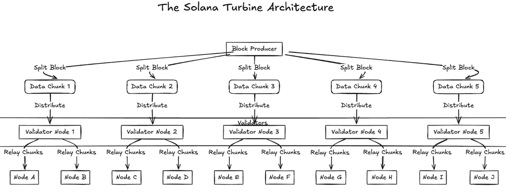
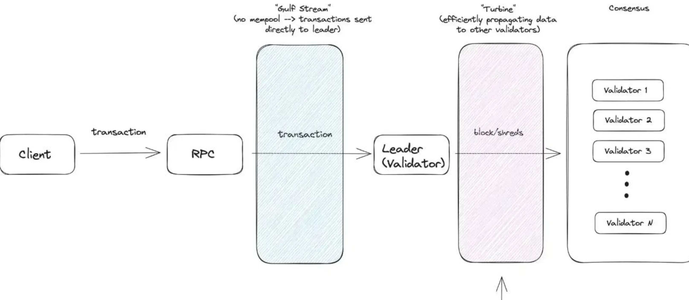

## Solana’s Turbine: Fixing the Block Propagation Bottleneck

### 🛑 1. The Problem: Heavy Data Load

* In typical blockchains, the **leader must send the full block** to every validator.
* Example: A **128 MB block × 35,000 validators = 4.69 TB** of redundant data.
* This overwhelms bandwidth and slows down block finalization.

---

### ⚡ 2. The Turbine Solution: Shred & Stream

* Inspired by **BitTorrent**:

  * Blocks are broken into **small shreds**.
  * Sent over **UDP** for low-latency transfer.
  * Delivered using **randomized paths** to avoid congestion.

---

### 🔧 3. How Turbine Works

#### A. Shredding + Erasure Coding

* Blocks split into **shreds** (atomic units).
* Enhanced with **Reed-Solomon erasure coding**:

  * Common setup: **32:32 FEC** → Even if 32 of 64 packets are lost, data is recoverable.
* FEC can adjust dynamically depending on network conditions.

#### B. Turbine Tree Topology

* Validators form a **tree network** with 2–3 hops (fanout ≈ 200).
* Each validator knows exactly who to forward shreds to.
* If shreds are missing:

  1. Try **gossip/repair** from peers.
  2. If still missing, request from the **leader** or nearby nodes.
* Validators that already have the full block can send **repair shreds**, reducing leader workload.

---

### 📦 4. Block Flow Overview

```text
Leader builds block
     ↓
Block shredded + erasure coded
     ↓
Shreds distributed via Turbine Tree (UDP)
     ↓
Validators reassemble using gossip/repair
     ↓
Full block reconstructed across the network
```

---

### 🚀 5. Why Turbine Works

* **Bandwidth-efficient** → no duplicate block sending.
* **High throughput** → parallel, UDP-based propagation.
* **Resilient** → erasure coding handles packet loss.
* **Scalable** → tree distribution avoids bottlenecks.

---
