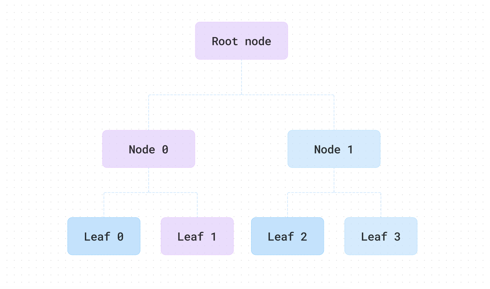

# 🌲 State Trees – ZK Compression

> **Merkle trees** on steroids, living **inside Solana blocks**.

---

## 1️⃣ What Is a State Tree?

- **Binary Merkle tree**  
  - Each parent = `hash(left || right)`  
  - One **root hash** = fingerprint of **all** leaves.

- **Depth 2 example**  
  ```
        Root
       /    \
     H12    H34
    /  \    /  \
  L1  L2  L3  L4
  ```

---

## 2️⃣ How Compressed Accounts Fit

- **Every compressed account hash** = **leaf** in a tree.
- **Leaf value** =  
  `hash(stateTreePubkey || leafIndex || accountDataHash)`  
  → **globally unique** across **all trees**.

---

## 3️⃣ On-Chain Footprint

| Stored On-Chain | Stored Off-Chain |
|-----------------|------------------|
| ✅ **Root hash** (32 B) | 🗃️ **Full tree data** (ledger calldata) |
| ✅ **Tree metadata** | 🚫 **Zero rent cost** |

> Verifiers only need the **root** + **Merkle proof**.

---

## 4️⃣ Mental Snapshot

> 🧩 **Account Data** → **Leaf Hash** → **Inserted into Tree** → **Root Updated**  
> Users keep the **proof**, chain keeps the **root**.