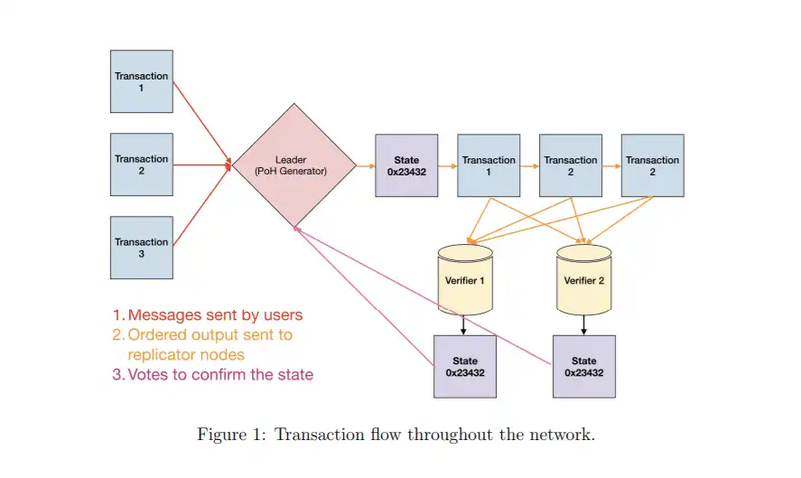
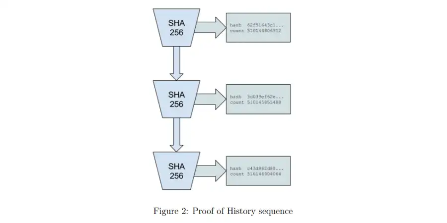
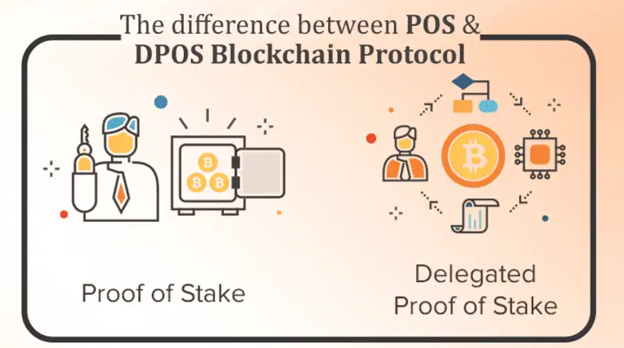

What is Solana?
---------------

[Solana](https://solana.com/) is a high-performance cryptocurrency blockchain which supports smart contracts and decentralized applications. It uses a proof of stake consensus mechanism with a low barrier to entry along with timestamped transactions to maximize efficiency.

This allows Solana to process up to 65000 transactions per second (TPS). Compared to Bitcoin's 7 TPS and Ethereum's 30 TPS. Solana is super fast and only getting faster with innovations such as Firedancer (more on that later). In contrast to other similar projects such as [Polkadot](https://coinbureau.com/review/polkadot-dot/) and Ethereum, Solana is a single blockchain (layer 1) and does not delegate operations to other attached chains (layer 2).

How Does Solana Work? 
----------------------

Disclaimer: Solana is incredibly complex. Let us start with a term you may have heard if you have looked at the project before: [Proof of History] (PoH). PoH is not a consensus mechanism. Rather, it is a component in Solana's [Proof of Stake](https://coinbureau.com/analysis/proof-of-work-vs-proof-of-stake/) consensus.

 

Proof-of-history (PoH) involves timestamping transactions when they are added to a Solana block. A new block on Solana is generated every 400ms (compared to Ethereum's roughly 30 seconds and Bitcoin's 10 minutes). Without getting into too much detail, the [decentralized clock](https://www.youtube.com/watch?v=50XwCYD3idY) which is used as a reference for the timestamps is the SHA256 hash function. SHA256 may sound familiar because it is used in Bitcoin's Proof of Work consensus mechanism.

SHA256's repetitive outputs. 

However, instead of working to "solve" the hash functions to produce a new block, Solana instead uses SHA256's repetitive outputs as reference -- timestamps. This produces a sort of "clock tick" where each clock tick is 400ms (instead of one second like a regular clock).

Next, let us clear up a few misconceptions about Solana. Many sources label Solana's consensus as Delegated Proof of Stake DPoS. This is not accurate, and the Solana team [has noted this](https://www.youtube.com/watch?v=wSAq1J_MJQQ) many times. It is an easy mistake to make because there are various roles on the Solana blockchain (leaders, validators, archivers, etc.).

Whereas DPoS cryptocurrencies will essentially delegate these roles among network participants, Solana does not. Simply put, all nodes on Solana play a part in fulfilling all network roles.