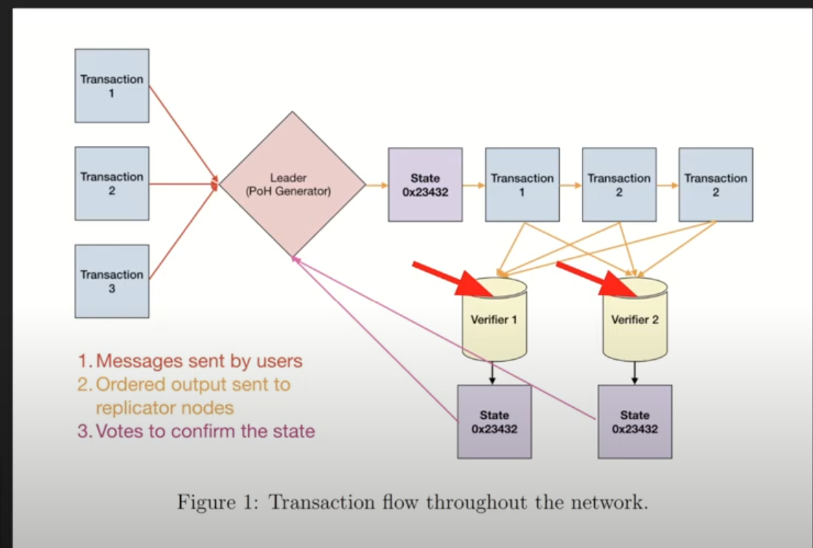
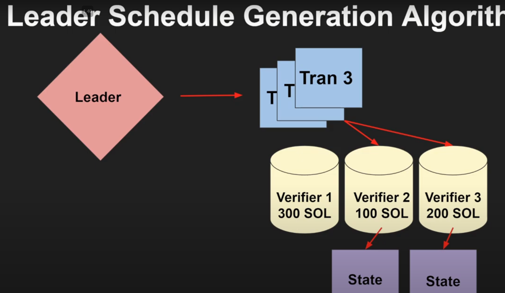
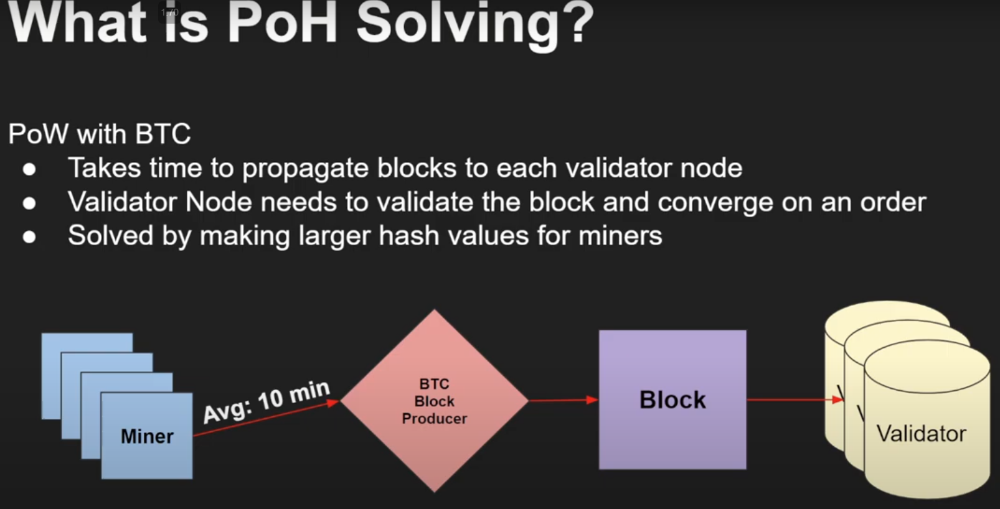
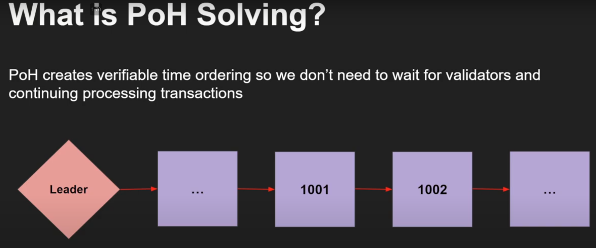
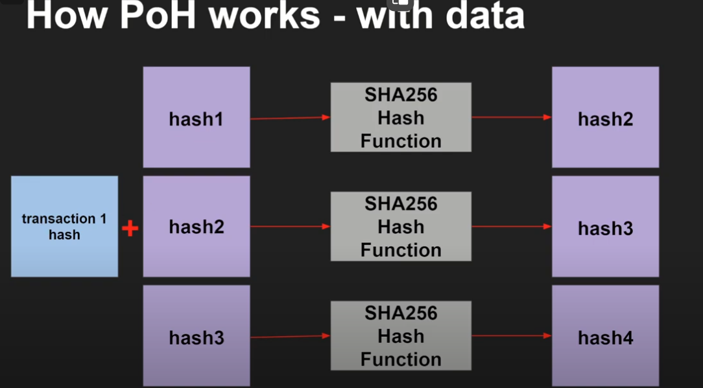
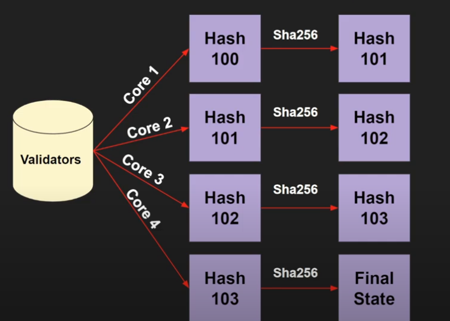

**Solana Architecture Overview:**
---------------------------------

### **Leader Node:**

-   **Role:** Processes transactions from users.
-   **Process:**
    -   Leader node generates hashes (or transactions) and forms them into blocks.
    -   Verifier nodes ensure the blocks are valid and not malicious.
    -   Once verified, the block is committed to the ledger.

### **Leader Selection:**

-   **How is a leader selected?**
    -   **Election Process:** A new leader (Proof of History generator) is chosen when a failure is detected.
    -   **Criteria:** Validator with the largest voting power or highest public key is selected.
    -   **Leader Schedule:** A schedule is created where nodes take turns being the leader during a specific period (epoch).

* * * *

**Proof of History (PoH):**
---------------------------

### **What is Proof of History?**

-   **Purpose:** Creates a time ordering for validator nodes to determine the order of blocks generated by the leader.
-   **Clarification:** PoH is not a consensus protocol like Proof of Work (PoW) or Proof of Stake (PoS). Instead, it enhances these protocols by providing time ordering.

### **Comparison with Bitcoin:**

-   **Bitcoin's PoW:** Miners guess a hash to generate a block, which takes time to propagate across the network.
-   **PoH Advantage:** Solana's PoH allows continuous processing of transactions without waiting for block propagation.

### **How PoH Works:**

-   **Process:**
    1.  Start with a seed phrase (e.g., "Solana").
    2.  Run it through a hash function to generate a hash (hash 1).
    3.  Use the output of hash 1 as the input for the next hash (hash 2), and so on.
    4.  This creates a chain of hashes that acts as a verifiable timeline.

### **Transactions and PoH:**

-   **Transaction Handling:** When the leader node receives a transaction, it combines the transaction hash with the current hash to generate the next hash.
-   **Result:** This ensures that transactions are time-ordered, even if they are received out of order by validator nodes.

* * * *

**Validator Nodes and Block Validation:**
-----------------------------------------

### **Parallel Processing:**

-   **Validation Process:** Validator nodes recompute the hashes to verify the legitimacy of the block.
-   **Optimization:** Validators can process hashes in parallel using **GPUs**, which speeds up the validation process significantly.

### **Super Majority Consensus:**

-   **Requirement:** Two-thirds of all staked Solana must agree on the final state for the block to be committed to the ledger.
-   **Example:**
    -   If there are 300 staked Sol, 200 Sol must support the final state for consensus.

### **Handling Malicious Nodes:**

-   **Slashing:** Malicious nodes (e.g., those voting for multiple states) are penalized by having their staked Sol confiscated.
-   **Fake Hashes:** Solana periodically sends fake hashes to ensure validators are doing the work and not just returning the final state without recalculating.

* * * *

**CAP Theorem and Network Partitioning:**
-----------------------------------------

### **CAP Theorem:**

-   **Definition:** In distributed systems, you can choose two out of three properties: Consistency, Availability, and Partition Tolerance.
-   **Solana's Choice:** The white paper claims Solana prioritizes consistency in the event of a partition.

### **Handling Network Outages:**

-   **Three States:**
    1.  **More than Two-Thirds of Validators Available:** Quick unstaking of unresponsive nodes.
    2.  **Between One-Half and Two-Thirds Available:** Longer timeouts to allow nodes to recover.
    3.  **Less than One-Half Available:** Even longer timeouts before unstaking nodes.

* * * *

**Scaling Solana:**
-------------------

### **Vertical Scaling:**

-   **Definition:** Adding more CPU, RAM, and GPU to existing nodes to handle more transactions.
-   **Pros:**
    -   Simpler than horizontal scaling.
    -   Takes advantage of technological advancements.
-   **Cons:**
    -   Expensive.
    -   Eventually hits hardware limits.

### **Horizontal Scaling (Hypothetical Solution):**

-   **Definition:** Adding more servers (nodes) to handle increased transaction load.
-   **Challenge:** Synchronizing the time ordering of blocks across multiple leader nodes.
-   **Proposed Solution:**
    -   Leaders periodically synchronize with each other by sharing their current hash and time state.
    -   This allows reasoning about the order of events across different leaders.