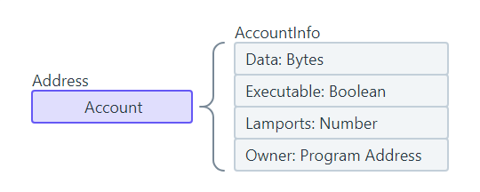

Accounts have a [max size of 10MB](https://github.com/solana-labs/solana/blob/27eff8408b7223bb3c4ab70523f8a8dca3ca6645/sdk/program/src/system_instruction.rs#L85) (10 Mega Bytes) and the data stored on every account on Solana has the following structure known as the [AccountInfo](https://github.com/solana-labs/solana/blob/27eff8408b7223bb3c4ab70523f8a8dca3ca6645/sdk/program/src/account_info.rs#L19).

### Rent
To store data on-chain, a certain amount of SOL must be transferred to an account. The amount transferred is proportional to the size of the data stored on the account. This concept is commonly referred to as "rent". However, you can think of "rent" more like a "deposit" because the SOL allocated to an account can be fully recovered when the account is closed.