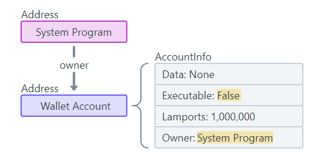

Solana contains a small handful of native programs that are part of the validator implementation and provide various core functionalities for the network. You can find the full list of native programs here.

When developing custom programs on Solana, you will commonly interact with two **native programs**, the System Program and the BPF Loader.

## System Program 
By default, all new accounts are owned by the System Program. The System Program performs several key tasks such as:

**New Account Creation**: Only the System Program can create new accounts.
Space Allocation: Sets the byte capacity for the data field of each account.
Assign Program Ownership: Once the System Program creates an account, it can reassign the designated program owner to a different program account. This is how custom programs take ownership of new accounts created by the System Program.

On Solana, a "wallet" is simply an account owned by the System Program. The lamport balance of the wallet is the amount of SOL owned by the account.


```
Only accounts owned by the System Program can be used as transaction fee payers.
```

### BPFLoader Program [#](https://solana.com/docs/core/accounts#bpfloader-program)

The [BPF Loader](https://github.com/solana-labs/solana/tree/27eff8408b7223bb3c4ab70523f8a8dca3ca6645/programs/bpf_loader/src) is the program designated as the "owner" of all other programs on the network, excluding Native Programs. It is responsible for deploying, upgrading, and executing custom programs.