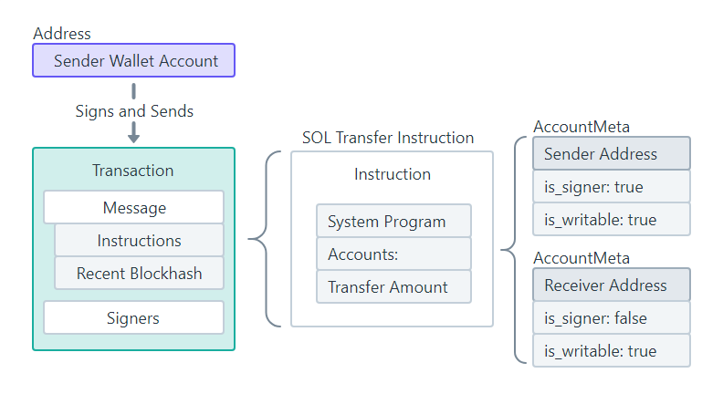
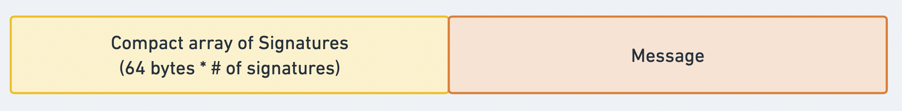
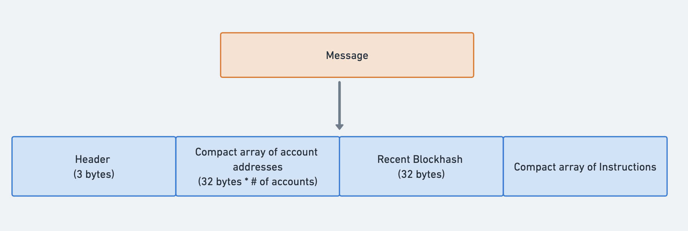

Individual "wallets" on Solana are accounts owned by the [System Program](https://solana.com/docs/core/accounts#system-program). As part of the [Solana Account Model](https://solana.com/docs/core/accounts), only the program that owns an account is allowed to modify the data on the account.

Therefore, transferring SOL from a "wallet" account requires sending a transaction to invoke the transfer instruction on the System Program.

Transaction [#](https://solana.com/docs/core/transactions#transaction)
----------------------------------------------------------------------

A Solana [transaction](https://github.com/solana-labs/solana/blob/27eff8408b7223bb3c4ab70523f8a8dca3ca6645/sdk/src/transaction/mod.rs#L173) consists of:

1.  [Signatures](https://github.com/solana-labs/solana/blob/27eff8408b7223bb3c4ab70523f8a8dca3ca6645/sdk/src/signature.rs#L27): An array of signatures included on the transaction.
2.  [Message](https://github.com/solana-labs/solana/blob/27eff8408b7223bb3c4ab70523f8a8dca3ca6645/sdk/program/src/message/legacy.rs#L110): List of instructions to be processed atomically.

The structure of a transaction message comprises of:

-   [Message Header](https://solana.com/docs/core/transactions#message-header): Specifies the number of signer and read-only account.
-   [Account Addresses](https://solana.com/docs/core/transactions#array-of-account-addresses): An array of account addresses required by the instructions on the transaction.
-   [Recent Blockhash](https://solana.com/docs/core/transactions#recent-blockhash): Acts as a timestamp for the transaction.
-   [Instructions](https://solana.com/docs/core/transactions#array-of-instructions): An array of instructions to be executed.
-   
