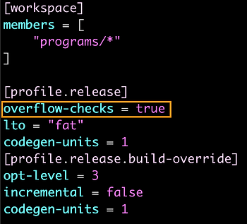
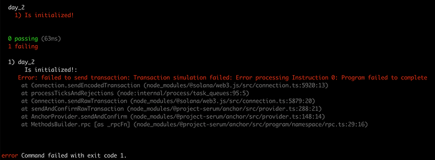

### Convert this Solidity to Solana:

```Solidity
contract Day2 {

	event Result(uint256);
	event Who(string, address);
	
	function doSomeMath(uint256 a, uint256 b) public {
		uint256 result = a + b;
		emit Result(result);
	}

	function sayHelloToMe() public {
		emit Who("Hello World", msg.sender);
	}
}


```
---------

### Passing a string
Rust

```rust
pub fn initialize(ctx: Context<Initialize>,
                  a: u64,
                  b: u64,
                  message: String) -> Result<()> {
    msg!("You said {:?}", message);
    msg!("You sent {} and {}", a, b);
    Ok(())
}

// added this function
pub fn array(ctx: Context<Initialize>,
             arr: Vec<u64>) -> Result<()> {
    msg!("Your array {:?}", arr);
    Ok(())
}

```
TS
```ts
it("Is initialized!", async () => {
  // Add your test here.
  const tx = await program.methods.initialize(new anchor.BN(777), new anchor.BN(888), "hello").rpc();
  console.log("Your transaction signature", tx);
});

// added this test
it("Array test", async () => {
  const tx = await program.methods.array([new anchor.BN(777), new anchor.BN(888)]).rpc();
  console.log("Your transaction signature", tx);
});

```

Logs
```bash
Transaction executed in slot 368489:
  Signature: 3TBzE3NddEY8KREv1FSXnieoyT6G6iNxF1n4hJHCeeWhAsUward3MEKm9WJHV4PMjPxeN2jRSRC9Rq8FUKjXoBQR
  Status: Ok
  Log Messages:
    Program 8o3ehd3XnyDocd9hG1uz5trbmSRB7gaLaE9BCXDpEnMY invoke [1]
    Program log: Instruction: Initialize
    Program log: You said [777, 888]
    Program 8o3ehd3XnyDocd9hG1uz5trbmSRB7gaLaE9BCXDpEnMY consumed 1587 of 200000 compute units
    Program 8o3ehd3XnyDocd9hG1uz5trbmSRB7gaLaE9BCXDpEnMY success


```

### overflow-checks = true in Cargo.toml

If the key `overflow-checks` is set to `true` in the Cargo.toml file, then Rust will add overflow checks at the compiler level. See the screenshot of Cargo.toml next:



If the Cargo.toml file is configured in this manner, you don't need to worry about overflow.

However, adding overflow checks increases the compute cost of the transaction (we will revisit this shortly). So under some circumstances where compute cost is an issue, you may wish to set `overflow-checks` to `false`. To strategically check for overflows, you can use the Rust `checked_*` operators in Rust.

---------
### Method 2: using `checked_*` operators.

Let's look at how overflow checks are applied to arithmetic operations within Rust itself. Consider the snippet of Rust below.

-   On line 1, we do arithmetic using the usual `+` operator, which overflows silently.
-   On line 2, we use `.checked_add`, which will throw an error if an overflow happens. Note that we have `.checked_*` available for other operations, like `checked_sub` and `checked_mul`.

```rust
let x: u64 = y + z; // will silently overflow
let xSafe: u64 = y.checked_add(z).unwrap(); // will panic if overflow happens

// checked_sub, checked_mul, etc are also available

```

**Exercise 1**: Set `overflow-checks = true` create a test case where you underflow a `u64` by doing `0 - 1`. You will need to pass those numbers in as arguments or the code won't compile. What happens?

You'll see the transaction fails (with a rather cryptic error message shown below) when the test runs. That's because Anchor turned on overflow protection:


**Exercise 2**: Now change `overflow-checks` to `false`, then run the test again. You should see an underflow value of 18446744073709551615.

**Exercise 3**: With overflow protection disabled in Cargo.toml, do **`let result = a.checked_sub(b).unwrap();`** with `a = 0` and `b = 1`. What happens?

Should you just leave `overflow-checks = true` in the Cargo.toml file for your Anchor project? Generally, yes. But if you are doing some intensive calculations, you might want to set `overflow-checks` to `false` and strategically defend against overflows in key junctures to save compute cost, which we will demonstrate next.