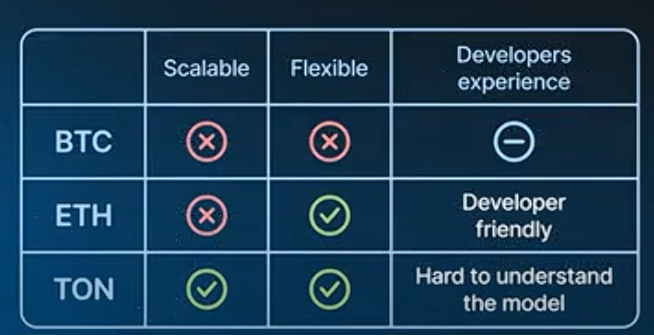

2\. Ethereum (Second Generation)
--------------------------------

### Key Improvements:

-   Generalizes Bitcoin's concept
-   More flexible for developers

### Account Structure:

-   Accounts can have arbitrary internal storage
-   Transactions can transition account state

### Smart Contract Capability:

-   Accounts can communicate synchronously
-   Functions as a "Global computer"

### Developer Experience:

-   Familiar programming paradigm
-   Compatible with known tools

### Scalability Issues:

-   Requires storing entire blockchain state on each node
-   Sequential transaction processing
-   

3\. TON (Third Generation)
--------------------------

### Design Philosophy:

-   Aims for infinite flexibility and scalability

### Key Features:

-   Individual accounts with own state (like Ethereum)
-   Asynchronous message passing between contracts

### Scalability Approach:

-   Contracts cannot access global state
-   Independent transaction processing (similar to Bitcoin)

### Transaction Model:

-   Takes input state of contract
-   Produces new state of contract
-   Recorded on blockchain

### Smart Contract Capability:

-   Contracts can be sharded
-   Inter-contract communication managed by system

### Trade-offs:

-   Optimized for flexibility and scalability
-   Less familiar model for developers
-   
